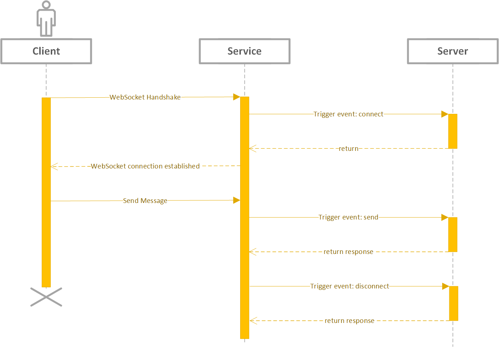
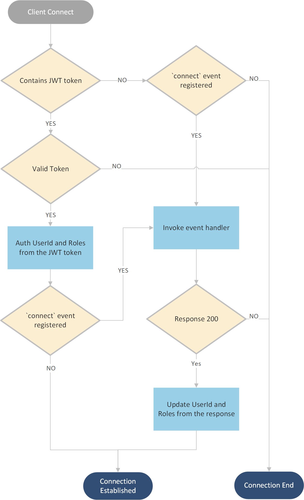
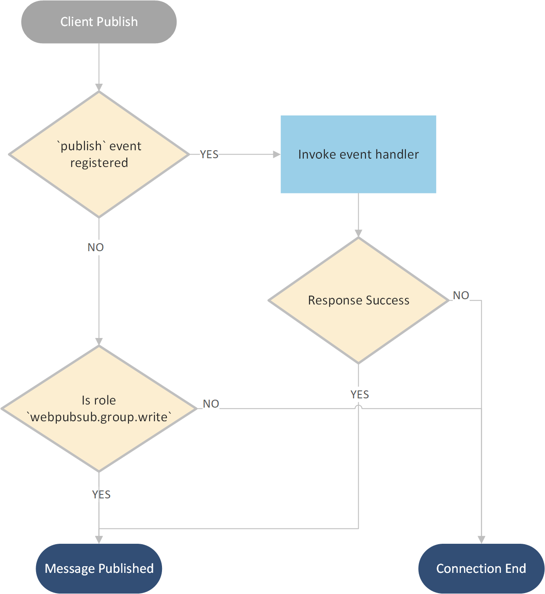

## Overview

Azure Web PubSub Service provides an easy way to publish/subscribe messages using simple [WebSocket](https://tools.ietf.org/html/rfc6455) connections.
1. Client can be written in any language having WebSocket support
1. Both text and binary messages are supported within one connection
1. A simple protocol for clients to do publish directly
1. The service manages the WebSocket connections for you

## Table of Content

- [Terms](#terms)
- [Client protocol](#client_protocol)
    - [Simple WebSocket connection](#simple_client)
    - [Client with `json.webpubsub.azure.v1` subprotocol](#command_subprotocol)
    - [Client message limit](#client_message_limit)
    - [Client Auth](#client_auth)
- [Server protocol](#server_protocol)
    - [Event handler](#event_handler)
        - [Connect](#event_handler_protocol_connect)
    - [Connection manager](#connection_manager)
    - [Group manager](#group_manager)

## Terms
* **Service**: Azure Web PubSub Service.

* **Hub**: A logic isolation for one application. Different applications can share one Azure Web PubSub service by using different hub names.

* **Group**: Clients can join a group, leave a group, or publish messages to a group. A client can join multiple groups, and a group can contain multiple clients.

* **Client Connection** and **ConnectionId**: A client connects to the `/client` endpoint, when connected, an unique `connectionId` is generated by the service as the unique identity of the client connection. Users can then manage the client connection using this `connectionId`. Details are described in [Client Protocol](#client_protocol) section.

* **Client Events**: Events are created during the lifecycle of a client connection. For example, a simple WebSocket client connection creates a `connect` event when it tries to connect to the service, a `send` event when it tries the send messages to the service, and a `disconnect` event when it disconnects from the service. Details about *client events* are illustrated in [Client Protocol](#client_protocol) section.

* **Event Handler**: The event handler contains the logic to handle the client events. Event handler needs to be registered and configured in the service through the portal or Azure CLI beforehand. Details are described in [Event Handler](#event_handler) section. The place to host the event handler logic is generally considered as the server-side.

* **Server**: The server can handle client events, manage client connections, monitor group messages, and publish messages to groups. The server, comparing to the client, is trustworthy. Details about **server** are described in [Server Protocol](#server_protocol) section.

<a name="event_handler"></a>
Service provides two modes for the event handlers to be invoked. One is called `PUSH` mode, that the event handlers expose public endpoints for the service to call, as can be considered as a *webhook*. The other mode is called `LISTEN` mode, in which the event handler connects to the `/server` endpoint the service exposes.

<a name="client_protocol"></a>

## Client Protocol

A client connection connects to the `/client` endpoint of the service. It can be a [simple WebSocket connection](#simple_client), or a WebSocket connection having [json.webpubsub.azure.v1](#command_subprotocol) subprotocol which enables client to do publish/subscribe directly. 

<a name="simple_client"></a>

### Simple WebSocket connection
A simple WebSocket client follows a client<->server architecture, as the below sequence diagram shows:


1. When the client starts WebSocket handshake, the service tries to invoke the `connect` event handler (the server) for WebSocket handshake.
2. When the client sends messages, the services triggers the `send` event to the event handler (the server) to handle the messages sent.
3. When the client disconnects, the service tries to trigger the `disconnect` event to the event handler (the server) once it detects the disconnect.

#### Scenarios:
Such connection can be used in a typical client-server architecture, that the client sends messages to the server, and the server handles incoming messages using [Event Handlers](#event_handler). A typical usage would be [GraphQL Subscriptions](https://dgraph.io/docs/graphql/subscriptions/), and a sample can be found [here](). It can also be used when customers leverage existing [subprotocols](https://www.iana.org/assignments/websocket/websocket.xml) in their application logic, for example, `wamp` subprotocol. A sample usage can be found [here]().

You may have noticed that with such a simple WebSocket Connection, the *server* is a MUST HAVE role to handle the events from clients, to do advanced operations for the clients such as join the clients to some groups, or to publish messages to the connected clients. We introduced in a simple [json.webpubsub.azure.v1](#command_subprotocol) to empower clients to do publish and subscribe more conveniently and efficiently.

<a name="command_subprotocol"></a>

### Client with `json.webpubsub.azure.v1` subprotocol
As described in the earlier section, a simple WebSocket connection always triggers a `send` event when it sends messages, and always relies on the server-side to process messages and do other operations. With the help of the `json.webpubsub.azure.v1` subprotocol, an authorized client can join a group and publish messages to a group directly. It can also route messages to different upstreams (event handlers) by customizing the *event* the message belongs to. 

protocol: `json.webpubsub.azure.v1`

Join a group:
```json
{
    "event": "_join",
    "group": "group_name"
}
```

Leave a group:
```json
{
    "event": "_leave",
    "group": "group_name"
}
```

Publish message to a group:

```json
{
    "event": "_publish",
    "group": "group_name",
    "data": {},
}
```
`data` can be object or array or string.

Custom events:
```json
{
    "event": "<event_name>",
    "data": {},
}
```
`data` can be object or array or string.

Custom event `<event_name>` will always be handled by the event handler registered. `<event_name>` should not start with `_`, events starting with `_` are preserved as a system event. If no such event handler registered, the connection will be declined. Such custom event can be helpful if you want messages to be dispatched to different servers having different event handlers.

These keywords start the message frame, they can be `text` format for text message frames or UTF8 encoded binaries for binary message frames.

Service declines the client if the message does not match the described format.

Messages received by the client follows the following format:
```json

{
    "metadata": {
        "type" : "management|group",
        "from" : "group_name",
    },
    "data": {}
}
```
`data` can be object or array or string.

#### Scenarios:
Such clients can be used when clients want to talk to each other. Messages are sent from `client1` to the service and the service delivers the message directly to `client2` if the clients are authorized.

Client1:

```js
var client1 = new WebSocket("wss://xxx.webpubsub.azure.com/client", "json.webpubsub.azure.v1");
client1.onmessage = e => {
    if (e.data) {
        console.log(e.data);
    }
};

client1.onopen = e => {
    client1.send(JSON.stringify({
        event: "_leave",
        group: "Group1"
    }));
    client1.send(JSON.stringify({
        event: "_publish",
        group: "Group2",
        data: "Hello Client2"
    });
};
```

Client2:

```js
var client2 = new WebSocket("wss://xxx.webpubsub.azure.com/client", "json.webpubsub.azure.v1");
client2.onmessage = e => {
    if (e.data) {
        console.log(e.data);
    }
};

client2.onopen = e => {
    client1.send(JSON.stringify({
        event: "_leave",
        group: "Group2"
    }));
    client1.send(JSON.stringify({
        event: "_publish",
        group: "Group1",
        data: "Hello Client1"
    });
};
```

<a name="client_message_limit"></a>

### Client message limit
The maximum allowed message size for one WebSocket frame is **1MB**. If there are requirements for larger messages, consider using a streaming protocol in the application layer.

<a name="client_auth"></a>

### Client Auth

#### Auth workflow
When a client starts a connection to the service, there are 2 ways to do authentication:

1. One way is that the client connects to the service with a JWT token signed by the server. 
2. The other way is when there is a `connect` event handler registered for this client. The service then redirects the auth workflow to the `connect` event handler. The response of the event handler can specify the `userId` and the `role`s the client has, and can decline the client with 401, [Connect event handler protocol](#event_handler_protocol_connect) contains the details.

The below graph describes the workflow in detail.



#### Client roles

Client roles only applies for the [`json.webpubsub.azure.v1` subprotocol](#command_subprotocol). When the client is authed and connected, the roles of the client determine the actions the client has permissions to do:

| Role | Permission |
|---|---|
| Not specified | The client can send custom events.
| `webpubsub.group.join` | The client can join any group
| `webpubsub.group.leave` | The client can leave its groups
| `webpubsub.group.write` | The client can publish messages to any group
| `webpubsub.group.joined.write` | The client can publish messages to groups it is in.
| `webpubsub.group.pattern.<a*>.join` | The client can join the groups that the group names match pattern `a*`..
| `webpubsub.group.pattern.<a*>.write` | The client can publish messages to the groups that the group names match pattern `a*`.

#### Client publish
The below graph describes the workflow when the client tries to publish messages to the group:



When the client tries to publish messages to a group: 
1. The service checks if the `publish` event is registered for the client,
2. If not, a client with the role `webpubsub.group.write` can publish.
3. If the event is registered, the service invokes the event handler and respect the response of the event handler to decide if the action is allowed.

Please note that **ONLY** **METADATA** for the `Publish` is sent to the event handler, the actual message to be published is not sent to the event handler.

When the client tries to join a group, the workflow is similar:
1. The service checks if the `join` event is registered for the client
2. If not, a client with the role `webpubsub.group.join` can join the group.
3. If the event is registered, the service invokes the event handler and respect the response of the event handler to decide if the action is allowed.

## Server Protocol

Server protocol provides the functionality for the user to manage the client connections and the groups.

In general, server protocol contains three roles:
1. [Event handler](#event_handler)
2. [Connection manager](#connection_manager)
3. [Group manager](#group_manager)

<a name="event_handler"></a>
### Event handler
The event handler handles the upcoming client events. Event handlers need to be registered and configured in the service through portal or Azure CLI beforehand so that when a client event is triggered, the service can identify if the event is expected to be handled. 

There are two ways for the service to invoke the event handler:
1. One way is called `PUSH` mode, that the event handler as the server side, exposes public accessible endpoint for the service to invoke when the event is triggered. It acts as similar to a **webhook**. It leverages HTTP protocol and the detailed protocol is described in [webpubsub.event.handler.http](./webpubsub.event.handler.http.md).
2. The other way is called `LISTEN` mode, that the event handler starts a duplex connection to the service when the event handler is available so that the service can invoke the event handler through this duplex connection when the event is triggered. The service exposes the `/server` endpoint for the event handler to connect to using a WebSocket connection, following the message protocol defined in [webpubsub.server.events.proto](./protocols/webpubsub.server.events.proto).

<a name="connection_manager"></a>
### Connection manager

The server is by nature an authorized user. With the help of *event handler role*, the server knows the metadata of the clients, for example, `connectionId` and `userId`, so it can:
   1. Close a client connection
   2. Add a client to a group
   3. Add clients authed as the same user to a group
   4. Remove a client from a group
   5. Remove clients authed as the same user from a group
   6. Send messages to a client
   7. Send messages to clients that belong to the same user

The service also provides two ways for the server to do connection management:
1. One way is through REST API as defined in [WebPubSub Swagger File](./protocols/webpubsub.json).

2. Another way is through the WebSocket connection `/server` endpoint. You may have noticed that the *event handler role* handles communication from the service to the server while *the manager role* handles communication from the server to the service, it is bi-directional and is a perfect fit for the duplex WebSocket connection to `/server` endpoint. The message protocol is defined in [webpubsub.server.manage.proto](./protocols/webpubsub.server.manage.proto). 

<a name="group_manager"></a>
### Group Manager
    1. Publish messages to group
    2. Subscribe to group messages

The service provides two ways to publish to the group, one is through REST API as defined in [WebPubSub Swagger File](./protocols/webpubsub.json), the other is through the WebSocket connection `/server` endpoint with message protocol defined in [webpubsub.manage.proto](./protocols/webpubsub.manage.proto).

Subscribe to group messages, though, requires a persistent connection from server to service, so that whenever a message publish happens, the server can receive the message immediately. That said, when implementing the server protocol, the implementation can choose to only establish the WebSocket connection when the **Subscribe** feature is used.

## Remaining work items
1. Change from Upstream to Event Handler
    1. Portal
    2. RP Swagger 
    3. RP<->Service data contract
    
2. Add client message limit for one WebSocket frame
3. Runtime to support `subscribe` server connection
4. SDK to support server `subscribe`