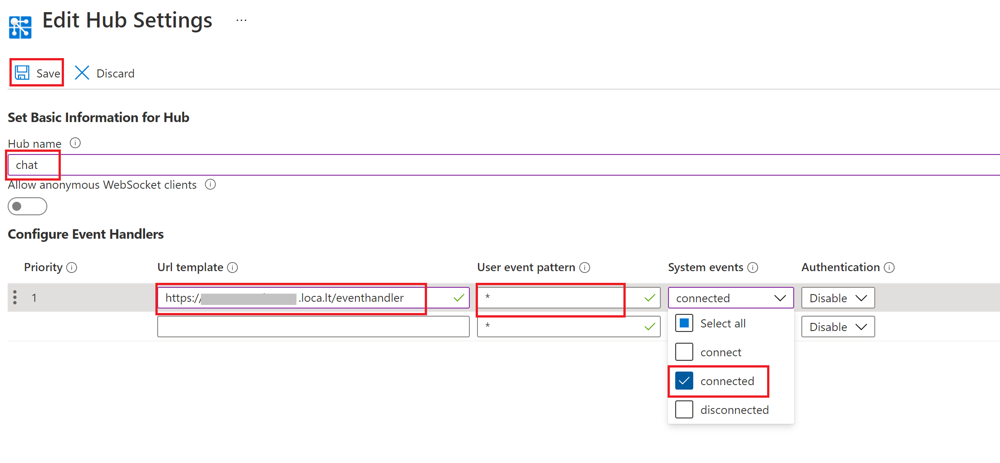

# Handle events

In last tutorial you have learned the basics of publishing and subscribing messages with Azure Web PubSub. In this tutorial you'll learn the event system of Azure Web PubSub so use it to build a complete web application with real time communication functionality. 

The complete code sample of this tutorial can be found [here][code]

## Prerequisites

1. [ASP.NET Core 3.1 or above](https://docs.microsoft.com/en-us/aspnet/core)
2. Create an Azure Web PubSub resource

## Create a server

In Azure Web PubSub, there're two roles, server and client. This is similar to the sever and client roles in a web application. Server is responsible for managing the clients, listen and respond to client messages, while client's role is send user's message to server, and receive messages from server and visualize them to end user.

In this tutorial, we will build a real time chat web application. In a real web application, server's responsibility also includes authenticating clients and serving static web pages for the application UI. We will use [ASP.NET Core](https://docs.microsoft.com/en-us/aspnet/core/) to host the web pages and handle incoming requests.

First let's create an empty ASP.NET Core app.

1.  Create web app

    ```bash
    dotnet new web
    dotnet add package Azure.Messaging.WebPubSub --version 1.0.0-beta.1 --source https://www.myget.org/F/azure-webpubsub-dev/api/v3/index.json
    ```

2.  Then add `app.UseStaticFiles();` before `app.UseRouting();` in `Startup.cs` to support static files. Remove the default `endpoints.MapGet` inside `app.UseEndpoints`.

    ```csharp
    public void Configure(IApplicationBuilder app, IWebHostEnvironment env)
    {
        if (env.IsDevelopment())
        {
            app.UseDeveloperExceptionPage();
        }

        app.UseStaticFiles();

        app.UseRouting();

        app.UseEndpoints(endpoints =>
        {
        });
    }
    ```

3.  Also create an HTML file and save it as `wwwroot/index.html`, we will use it for the UI of the chat app later.

    ```html
    <html>
    <body>
      <h1>Azure Web PubSub Chat</h1>
    </body>

    </html>
    ```

You can test the server by running `dotnet run` and access `http://localhost:5000/index.html` in browser.

You may remember in last tutorial the subscriber uses an API in Web PubSub SDK to generate an access token from connection string and use it to connect to the service. This is usually not safe in a real world application as connection string has high privilege to do any operation to the service so you don't want to share it with any client. Let's change this access token generation process to a REST API at server side, so client can call this API to request an access token every time it needs to connect, without need to hold the connection string.

1.  Install Azure Web PubSub SDK

    ```bash
    dotnet add package Microsoft.Extensions.Azure
    dotnet add package Azure.Messaging.WebPubSub --version 1.0.0-beta.1 --source https://www.myget.org/F/azure-webpubsub-dev/api/v3/index.json
    ```
2. DI the service client inside `ConfigureServices` and don't forget to replace `<connection_string>` with the one of your service.

    ```csharp
    public void ConfigureServices(IServiceCollection services)
    {
        services.AddAzureClients(builder =>
        {
            builder.AddWebPubSubServiceClient("<connection_string>", "chat");
        });
    }
    ```
2.  Add a `/negotiate` API to the server inside `app.UseEndpoints` to generate the token

    ```csharp
    app.UseEndpoints(endpoints =>
    {
        endpoints.MapGet("/negotiate", async context =>
        {
            var id = context.Request.Query["id"];
            if (id.Count != 1)
            {
                context.Response.StatusCode = 400;
                await context.Response.WriteAsync("missing user id");
                return;
            }
            var serviceClient = context.RequestServices.GetRequiredService<WebPubSubServiceClient>();
            await context.Response.WriteAsync(serviceClient.GetClientAccessUri(id).AbsoluteUri);
        });
    });
    ```

    This token generation code is very similar to the one we used in the last tutorial, except we pass one more argument (`userId`) when generating the token. User ID can be used to identify the identity of client so when you receive a message you know where the message is coming from.

    You can test this API by running `dotnet run` and accessing `http://localhost:5000/negotiate?id=<user-id>` and it will give you the full url of the Azure Web PubSub with an access token.

3.  Then update `index.html` with the following script to get the token from server and connect to service
 
    ```html
    <script>
      (async function () {
        let id = prompt('Please input your user name');
        let res = await fetch(`/negotiate?id=${id}`);
        let url = await res.text();
        let ws = new WebSocket(url);
        ws.onopen = () => console.log('connected');
      })();
    </script>
    ```

    You can test it by open the home page, input your user name, then you'll see `connected` being printed out in browser console.

## Handle events

In Azure Web PubSub, when there are certain activities happening at client side (for example a client is connected or disconnected), service will send notifications to sever so it can react to these events.

Events are delivered to server in the form of Webhook. Webhook is a set of REST APIs exposed by server and registered at service side, so service will callback these APIs whenever an event happens.

Azure Web PubSub follows [CloudEvents](https://cloudevents.io/) to describe event data. The format of the Web PubSub CloudEvents events follow exactly the [Web PubSub CloudEvents protocol](../references/protocol-cloudevents.md). For now, you need to implement the event handler by your own in C#, the steps are pretty straight forward following the protocol spec as well as illustrated below.

1. Add event handlers inside `UseEndpoints`. Specify the endpoint path for the events, let's say `/eventhandler`. 

2. First we'd like to handle the abuse protection OPTIONS requests, we check if the header contains `WebHook-Request-Origin` header, and we return the header `WebHook-Allowed-Origin`. For simplicity for demo purpose, we return `*` to allow all the origins.
    ```csharp
    app.UseEndpoints(endpoints =>
    {
        // abuse protection
        endpoints.Map("/eventhandler", async context =>
        {
            if (context.Request.Method == "OPTIONS")
            {
                if (context.Request.Headers["WebHook-Allowed-Origin"].Count > 0)
                {
                    context.Response.Headers["WebHook-Allowed-Origin"] = "*";
                    context.Response.StatusCode = 200;
                    return;
                }
            }
        });
    });
    ```

3. Then we'd like to check if the incoming requests are the events we expects. Let's say we now cares about the system `connected` event, which should contains the header `ce-type` as `azure.webpubsub.sys.connected`. We add the logic after abuse protection:
    ```csharp
    app.UseEndpoints(endpoints =>
    {
        // abuse protection
        endpoints.Map("/eventhandler", async context =>
        {
            if (context.Request.Method == "OPTIONS")
            {
                ...
            }
            else if (context.Request.Method == "POST")
            {
                // get the userId from header
                var userId = context.Request.Headers["ce-userId"];
                if (context.Request.Headers["ce-type"] == "azure.webpubsub.sys.connected")
                {
                    // the connected event
                    Console.WriteLine($"{userId} connected");
                    context.Response.StatusCode = 200;
                    return;
                }
            }
        });
    });
    ```

In the above code we simply print a message to console when a client is connected. You can see we use `context.Request.Headers["ce-userId"]` so we can see the identity of the connected client.

Then we need to set the Webhook url in the service so it can know where to call when there is a new event. But there is a problem that our server is running on localhost so does not have an internet accessible endpoint. Here we use [ngrok](https://ngrok.com/) to expose our localhost to internet.

1.  First download ngrok from https://ngrok.com/download, extract the executable to your local folder or your system bin folder.
2.  Start ngrok
    ```bash
    ngrok http 8080
    ```

nrgok will print out an url (`https://<domain-name>.ngrok.io`) that can be accessed from internet.

Then open Azure portal and go to the settings tab to configure the event handler.

1. Type the hub name (chat) and click "Add".

2. Set URL Pattern to `https://<domain-name>.ngrok.io/eventhandler` and check "connected" in System Event Pattern, click "Save".



After the save is completed, open the home page, input your user name, you'll see the connected message printed out in the server console.

### Message events

Besides system events like `connected` or `disconnected`, client can also send messages through the WebSocket connection and these messages will be delivered to server as a special type of event called `message` event. We can use this event to receive messages from one client and broadcast them to all clients so they can talk to each other. The `ce-type` of `message` event is always `azure.webpubsub.user.message`, details please see [Event message](./../references/protocol-cloudevents.md#message).

1. Handle message event

    ```csharp
    app.UseEndpoints(endpoints =>
    {
        // abuse protection
        endpoints.Map("/eventhandler", async context =>
        {
            var serviceClient = context.RequestServices.GetRequiredService<WebPubSubServiceClient>();
            if (context.Request.Method == "OPTIONS")
            {
                ...
            }
            else if (context.Request.Method == "POST")
            {
                // get the userId from header
                var userId = context.Request.Headers["ce-userId"];
                if (context.Request.Headers["ce-type"] == "azure.webpubsub.sys.connected")
                {
                    // the connected event
                    Console.WriteLine($"{userId} connected");
                    context.Response.StatusCode = 200;
                    return;
                }
                else if (context.Request.Headers["ce-type"] == "azure.webpubsub.user.message")
                {
                    using var stream = new StreamReader(context.Request.Body);
                    await serviceClient.SendToAllAsync($"[{userId}] {stream.ReadToEnd()}");
                    context.Response.StatusCode = 200;
                    return;
                }
            }
        });
    });
    ```

    This event handler uses `WebPubSubServiceClient.sendToAll()` to broadcast the received message to all clients.

2.  Then go to the event handler settings in Azure portal and add `message` to User Event Pattern, and save.

3.  Update `index.html` to add the logic to send message from user to server and display received messages in the page.

    ```html
    <html>

    <body>
      <h1>Azure Web PubSub Chat</h1>
      <input id="message" placeholder="Type to chat..."></input>
      <div id="messages"></div>
      <script>
        (async function () {
          ...

          let messages = document.querySelector('#messages');
          ws.onmessage = event => {
            let m = document.createElement('p');
            m.innerText = event.data;
            messages.appendChild(m);
          };

          let message = document.querySelector('#message');
          let send = document.querySelector('#send');
          message.addEventListener('keypress', e => {
            if (e.charCode !== 13) return;
            ws.send(message.value);
            message.value = '';
          });
        })();
      </script>
    </body>

    </html>
    ```

    You can see in the above code we use `WebSocket.send()` to send message and `WebSocket.onmessage` to listen to message from service.

4.  Finally let's also update the `onConnected` handler to broadcast the connected event to all clients so they can see who joined the chat room.

    ```csharp
    app.UseEndpoints(endpoints =>
    {
        // abuse protection
        endpoints.Map("/eventhandler", async context =>
        {
            if (context.Request.Method == "OPTIONS")
            {
                ...
            }
            else if (context.Request.Method == "POST")
            {
                // get the userId from header
                var userId = context.Request.Headers["ce-userId"];
                if (context.Request.Headers["ce-type"] == "azure.webpubsub.sys.connected")
                {
                    // the connected event
                    Console.WriteLine($"{userId} connected");
                    await serviceClient.SendToAllAsync($"[SYSTEM] {userId} joined.");
                    context.Response.StatusCode = 200;
                    return;
                }
            }
        });
    });
    ```

Now run the server and open multiple browser instances, then you can chat with each other.

The complete code sample of this tutorial can be found [here][code].

[code]: https://github.com/Azure/azure-webpubsub/tree/main/samples/csharp/chatapp/
