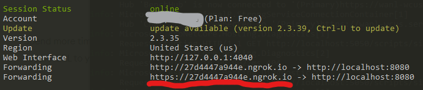
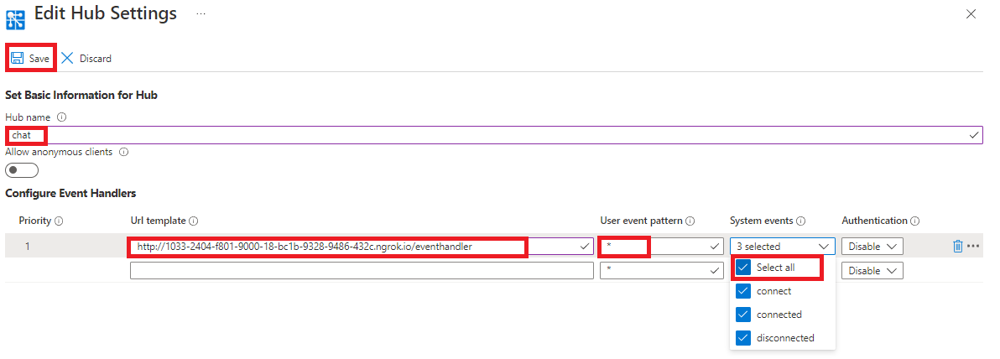

# Quick start: publish and subscribe messages in Azure Web PubSub

In this tutorial you'll learn how to create a sample to publish messages and subscribe them using Azure Web PubSub with Java.

## Prerequisites

1. [IntelliJ IDEA](https://www.jetbrains.com/idea/)
2. [Maven](https://maven.apache.org/)
3. [ngrok](https://ngrok.com/)
4. Create an Azure Web PubSub resource

## Create the sample step by step

### Create a Maven project
1. Open _InteliJ IDEA_, click _File/New/Project..._ in the menu, select _Maven_, then type your _GroupId_ and _ArtifactId_, and setup other options to cerate a Maven project.
2. add dependencies to the `pom.xml`
```
    <dependencies>
        <dependency>
            <groupId>com.azure</groupId>
            <artifactId>azure-messaging-webpubsub</artifactId>
            <version>1.0.0-beta.2</version>
        </dependency>

        <!-- https://mvnrepository.com/artifact/io.javalin/javalin -->
        <dependency>
            <groupId>io.javalin</groupId>
            <artifactId>javalin</artifactId>
            <version>3.13.6</version>
        </dependency>

        <dependency>
            <groupId>org.slf4j</groupId>
            <artifactId>slf4j-simple</artifactId>
            <version>1.7.30</version>
        </dependency>
    </dependencies>
```

>    * azure-messaging-webpubsub: Web PubSub service SDK for Java
>    * Java-WebSocket: WebSocket client SDK for Java
>    * slf4j-simple: Logger for Java
>    * javalin: simple web framework for Java

### Use ngrok to make the local server publicly available
Run the script `ngrok http 8080`, then copy the URL above the red line.


## Setup event handler settings
1. Navigate to `settings` in portal.
2. Make a new hub setting for `chat`.
3. Fill in the URL copied from the previous step to `URL template`.
4. Fill in `*` to `User Event Pattern` and select all the system events.
5. Click `Save` button to update the settings, wait until the settings are updated successfully.


### Server

In Azure Web PubSub, there're two roles, server and client. This is similar to the sever and client roles in a web application. Server is responsible for managing the clients, listen and respond to client messages, while client's role is send user's message to server, and receive messages from server and visualize them to end user.

In this tutorial, we will build a real time chat web application. In a real web application, server's responsibility also includes authenticating clients and serving static web pages for the application UI. We will use [Javalin](https://javalin.io/) to host the web pages and handle incoming requests.

Create `Server.java` to create a server for handling events:

```java
import com.azure.messaging.webpubsub.WebPubSubClientBuilder;
import com.azure.messaging.webpubsub.WebPubSubServiceClient;
import com.azure.messaging.webpubsub.models.GetAuthenticationTokenOptions;
import com.azure.messaging.webpubsub.models.WebPubSubAuthenticationToken;
import com.azure.messaging.webpubsub.models.WebPubSubContentType;
import io.javalin.Javalin;
import io.javalin.http.staticfiles.Location;

public class Server {
    public static String hubName = "chat";
    public static String connectedEvent = "azure.webpubsub.sys.connected";
    public static String messageEvent = "azure.webpubsub.user.message";
    public static String eventHandler = "/eventhandler/";
    public static String connectionString = "<connection-string>";

    public static void main(String[] args) {
        WebPubSubServiceClient client = new WebPubSubClientBuilder()
                .connectionString(connectionString)
                .hub(hubName)
                .buildClient();

        // start a server
        Javalin app = Javalin.create(config -> {
            config.addStaticFiles("public/", Location.CLASSPATH);
        }).start(8080);

        // handle events: https://azure.github.io/azure-webpubsub/references/protocol-cloudevents#events
        app.post(eventHandler, ctx -> {
            String event = ctx.header("ce-type");
            if (connectedEvent.equals(event)) {
                String id = ctx.header("ce-userId");
                client.sendToAll(String.format("[SYSTEM] %s joined", id), WebPubSubContentType.TEXT_PLAIN);
            } else if (messageEvent.equals(event)) {
                String id = ctx.header("ce-userId");
                String message = ctx.body();
                client.sendToAll(String.format("[%s] %s", id, message), WebPubSubContentType.TEXT_PLAIN);
            }
            ctx.status(200);
        });

        // negotiation: redirect client to Web PubSub service
        app.get("/negotiate", ctx -> {
            String id = ctx.queryParam("id");
            if (id == null) {
                ctx.status(400);
                ctx.result("missing user id");
                return;
            }
            GetAuthenticationTokenOptions option = new GetAuthenticationTokenOptions();
            option.setUserId(id);
            WebPubSubAuthenticationToken token = client.getAuthenticationToken(option);
            ctx.result("{ \"url\": \"" + token.getUrl() + "\"}");
            return;
        });

        // validation: https://azure.github.io/azure-webpubsub/references/protocol-cloudevents#validation
        app.options(eventHandler, ctx -> {
            ctx.header("WebHook-Allowed-Origin", "*");
        });
    }
}

```

#### Steps to create a server to handle events:

1. In the `Server.java`, the below code is used to start a server on port 8080
    ```java
    // start a server
    Javalin app = Javalin.create(config -> {
        config.addStaticFiles("public/", Location.CLASSPATH);
    }).start(8080);
    ```

2. The below code is used to generate client URL with valid access token to Web PubSub service. 

    ```java
    // negotiation: redirect client to Web PubSub service
    app.get("/negotiate", ctx -> {
        String id = ctx.queryParam("id");
        if (id == null) {
            ctx.status(400);
            ctx.result("missing user id");
            return;
        }
        GetAuthenticationTokenOptions option = new GetAuthenticationTokenOptions();
        option.setUserId(id);
        WebPubSubAuthenticationToken token = client.getAuthenticationToken(option);
        ctx.result("{ \"url\": \"" + token.getUrl() + "\"}");
        return;
    });
    ```

    > Although you can use connection string to generate client URL with valid access token to the Web PubSub service, this is usually not safe in a real world application, as connection string has high privilege to do any operation to the service, so you shouldn't make it available in any client to avoid connection string leaking. Therefore, it's recommended to make access token generation process to a REST API at server side, so client can call this API to request an access token every time it needs to connect, without need to hold the connection string.

3. Handle events
    
    In Azure Web PubSub, when there are certain activities happening at client side (for example a client is connected or disconnected), service will send notifications to sever so it can react to these events.

    Events are delivered to server in the form of Webhook. Webhook is a set of REST APIs exposed by server and registered at service side, so service will callback these APIs whenever an event happens.

    Azure Web PubSub follows [CloudEvents](https://cloudevents.io/) to describe event data. The format of the Web PubSub CloudEvents events follow exactly the [Web PubSub CloudEvents protocol](../references/protocol-cloudevents.md). For now, you need to implement the event handler by your own in C#, the steps are pretty straight forward following the protocol spec as well as illustrated below.

    Add event handlers inside `UseEndpoints`. Specify the endpoint path for the events, let's say `/eventhandler`.

    1) First we'd like to handle the abuse protection OPTIONS requests, we check if the header contains `WebHook-Request-Origin` header, and we return the header `WebHook-Allowed-Origin`. For simplicity for demo purpose, we return `*` to allow all the origins.

        ```java
        // validation: https://azure.github.io/azure-webpubsub/references/protocol-cloudevents#validation
        app.options(eventHandler, ctx -> {
            ctx.header("WebHook-Allowed-Origin", "*");
        });
        ```

    2) Then we'd like to check if the incoming requests are the events we expects. Let's say we now cares about the system `connected` event, which should contains the header `ce-type` as `azure.webpubsub.sys.connected`. We add the logic after abuse protection:

        ```java
        // handle events: https://azure.github.io/azure-webpubsub/references/protocol-cloudevents#events
        app.post(eventHandler, ctx -> {
            String event = ctx.header("ce-type");
            if (connectedEvent.equals(event)) {
                String id = ctx.header("ce-userId");
                client.sendToAll(String.format("[SYSTEM] %s joined", id), WebPubSubContentType.TEXT_PLAIN);
            } else if (messageEvent.equals(event)) {
                String id = ctx.header("ce-userId");
                String message = ctx.body();
                client.sendToAll(String.format("[%s] %s", id, message), WebPubSubContentType.TEXT_PLAIN);
            }
            ctx.status(200);
        });
        ```
        In the above code we broadcast a message that new client is joined when a client is connected. You can see we use `context.Request.Headers["ce-userId"]` so we can see the identity of the connected client.

        Besides system events like `connected` or `disconnected`, client can also send messages through the WebSocket connection and these messages will be delivered to server as a special type of event called `message` event. We can use this event to receive messages from one client and broadcast them to all clients so they can talk to each other. The `ce-type` of `message` event is always `azure.webpubsub.user.message`, details please see [Event message](./../references/protocol-cloudevents.md#message).

        This event handler uses `WebPubSubServiceClient.sendToAll()` to broadcast the received message to all clients.

### Client

Create `/public/index.html` in `resources` folder, to add the logic to send message from user to server and display received messages in the page.

```html
<html>
<body>
  <h1>Azure Web PubSub Chat</h1>
  <input id="message" placeholder="Type to chat..."></input>
  <div id="messages"></div>
  <script>
    (async function () {
      let id = prompt('Please input your user name');
      let res = await fetch(`/negotiate?id=${id}`);
      let data = await res.json();
      let ws = new WebSocket(data.url);
      ws.onopen = () => console.log('connected');

      let messages = document.querySelector('#messages');
      ws.onmessage = event => {
        let m = document.createElement('p');
        m.innerText = event.data;
        messages.appendChild(m);
      };

      let message = document.querySelector('#message');
      let send = document.querySelector('#send');
      message.addEventListener('keypress', e => {
        if (e.charCode !== 13) return;
        ws.send(message.value);
        message.value = '';
      });
    })();
  </script>
</body>
</html>
```
You can see in the above code we use `WebSocket.send()` to send message and `WebSocket.onmessage` to listen to message from service.


### Run sample 

1. Change the `<connection-string>` with your own (`<connection-string>` can be found in "Keys" tab in Azure portal, `<hub-name>` can be any alphabetical string you like). Click the green triangle on the left of the `main` function in `PubSub.java` to run the sample.
2. Open a browser in and visit `http:localhost:8080`.
3. Input your user name, and click `OK` button to attend the chat.
4. You will get welcome message `[SYSTEM] <user-name> is joined`.
5. Input a message to send, press `Enter` key to publish. 
6. You will see the message in the chat room.
7. Repeat the above steps in a window, you can see messages broadcast to all the windows.


Since the message is sent to all clients, you can open multiple browser instances, then you can chat with each other.

The complete code sample of this tutorial can be found [here](../../../samples/java/chatapp/Readme.md).
