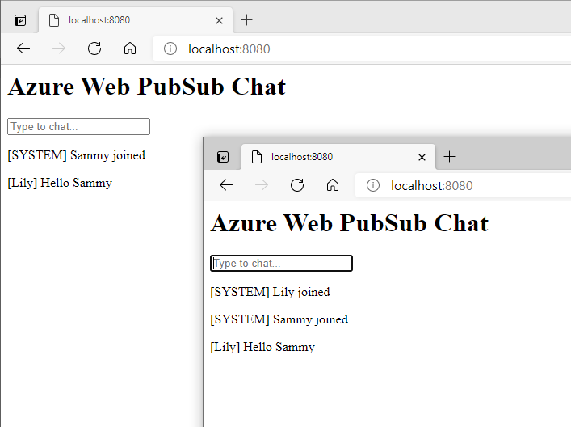

# Walk-through&#58; Create a chat app

In [last tutorial](../publish-messages/js-publish-message.md) you have learned the basics of publishing and subscribing messages with Azure Web PubSub. In this tutorial you'll learn the event system of Azure Web PubSub so use it to build a complete web application with real time communication functionality. 

The complete code sample of this tutorial can be found [here][code]



## Prerequisites

1. [Node.js](https://nodejs.org)
2. Create an Azure Web PubSub resource

## Create a server

In Azure Web PubSub, there're two roles, server and client. This is similar to the sever and client roles in a web application. Server is responsible for managing the clients, listen and respond to client messages, while client's role is send user's message to server, and receive messages from server and visualize them to end user.

In this tutorial, we will build a real time chat web application. In a real web application, server's responsibility also includes authenticating clients and serving static web pages for the application UI. We will use [express.js](https://expressjs.com/), a popular web framework for node.js to achieve this job.

First let's create an empty express app.

1.  Install express.js

    ```bash
    npm init -y
    npm install --save express
    ```

2.  Then create an express server and save it as `server.js`

    ```javascript
    const express = require('express');

    const app = express();
    app.use(express.static('public'));
    app.listen(8080, () => console.log('server started'));
    ```

3.  Also create an HTML file and save it as `public/index.html`, we will use it for the UI of the chat app later.

    ```html
    <html>

    <body>
      <h1>Azure Web PubSub Chat</h1>
    </body>

    </html>
    ```

You can test the server by running `node server` and access `http://localhost:8080` in browser.

You may remember in last tutorial the subscriber uses an API in Web PubSub SDK to generate an access token from connection string and use it to connect to the service. This is usually not safe in a real world application as connection string has high privilege to do any operation to the service so you don't want to share it with any client. Let's change this access token generation process to a REST API at server side, so client can call this API to request an access token every time it needs to connect, without need to hold the connection string.

1.  Install Azure Web PubSub SDK

    ```bash
    npm install --save @azure/web-pubsub
    ```

2.  Add a `/negotiate` API to the server to generate the token

    ```javascript
    const express = require('express');
    const { WebPubSubServiceClient } = require('@azure/web-pubsub');

    const app = express();
    const hubName = 'chat';

    let serviceClient = new WebPubSubServiceClient(process.argv[2], hubName);

    app.get('/negotiate', async (req, res) => {
      let id = req.query.id;
      if (!id) {
        res.status(400).send('missing user id');
        return;
      }
      let token = await serviceClient.getAuthenticationToken({ userId: id });
      res.json({
        url: token.url
      });
    });

    app.use(express.static('public'));
    app.listen(8080, () => console.log('server started'));
    ```

    This token generation code is very similar to the one we used in the last tutorial, except we pass one more argument (`userId`) when generating the token. User ID can be used to identify the identity of client so when you receive a message you know where the message is coming from.

    You can test this API by running `node server "<connection-string>"` and accessing `http://localhost:8080/negotiate?id=<user-id>` and it will give you the full url of the Azure Web PubSub with an access token.

3.  Then update `index.html` with the following script to get the token from server and connect to service
 
    ```html
    <script>
      (async function () {
        let id = prompt('Please input your user name');
        let res = await fetch(`/negotiate?id=${id}`);
        let data = await res.json();
        let ws = new WebSocket(data.url);
        ws.onopen = () => console.log('connected');
      })();
    </script>
    ```

    You can test it by open the home page, input your user name, then you'll see `connected` being printed out in browser console.

## Handle events

In Azure Web PubSub, when there are certain activities happening at client side (for example a client is connected or disconnected), service will send notifications to sever so it can react to these events.

Events are delivered to server in the form of Webhook. Webhook is a set of REST APIs exposed by server and registered at service side, so service will callback these APIs whenever an event happens.

Azure Web PubSub follows [CloudEvents](https://cloudevents.io/) to describe event data. If you use Web PubSub SDK, there is already an implementation to parse and process CloudEvents schema so you don't need to deal with these details.

Add the following code to expose a REST API at `/eventhandler` (which is done by the express middleware provided by Web PubSub SDK) to handle the client connected event:

```bash
npm install --save @azure/web-pubsub-express
```

```javascript
const { WebPubSubEventHandler } = require('@azure/web-pubsub-express');

let handler = new WebPubSubEventHandler(hubName, ['*'], {
  path: '/eventhandler',
  onConnected: async req => {
    console.log(`${req.context.userId} connected`);
  }
});

app.use(handler.getMiddleware());
```

In the above code we simply print a message to console when a client is connected. You can see we use `req.context.userId` so we can see the identity of the connected client.

Then we need to set the Webhook url in the service so it can know where to call when there is a new event. But there is a problem that our server is running on localhost so does not have an internet accessible endpoint. Here we use [ngrok](https://ngrok.com/) to expose our localhost to internet.

1.  First download ngrok from https://ngrok.com/download, extract the executable to your local folder or your system bin folder.
2.  Start ngrok
    ```bash
    ngrok http 8080
    ```

nrgok will print out an url (`https://<domain-name>.ngrok.io`) that can be accessed from internet.

Then open Azure portal and go to the settings tab to configure the event handler.

1. Type the hub name (chat) and click "Add".

2. Set URL Pattern to `https://<domain-name>.ngrok.io/eventhandler/{event}` and check "connected" in System Event Pattern, click "Save". `{event}` is a pattern supported by the service that the service will help replace with the actual event name.


After the save is completed, open the home page, input your user name, you'll see the connected message printed out in the server console.

### Message events

Besides system events like connected or disconnected, client can also send messages through the WebSocket connection and these messages will be delivered to server as a special type of event called message event. We can use this event to receive messages from one client and broadcast them to all clients so they can talk to each other.

1. Add a new `handleUserEvent` handler

    ```javascript
    let handler = new WebPubSubEventHandler(hubName, ['*'], {
      path: '/eventhandler',
      onConnected: async req => {
        ...
      },
      handleUserEvent: async (req, res) => {
        if (req.context.eventName === 'message') await serviceClient.sendToAll(`[${req.context.userId}] ${req.data}`, { contentType: 'text/plain' });
        res.success();
      }
    });
    ```

    This event handler uses `WebPubSubServiceClient.sendToAll()` to broadcast the received message to all clients.

    You can see `handleUserEvent` also has a `res` object where you can send message back to the event sender. Here we simply call `res.success()` to make the WebHook return 200 (please note this is required even you don't want to return anything back to client, otherwise the WebHook will never return and client connection will be closed).

2.  Then go to the event handler settings in Azure portal and add `message` to User Event Pattern, and save.

3.  Update `index.html` to add the logic to send message from user to server and display received messages in the page.

    ```html
    <html>

    <body>
      <h1>Azure Web PubSub Chat</h1>
      <input id="message" placeholder="Type to chat...">
      <div id="messages"></div>
      <script>
        (async function () {
          ...

          let messages = document.querySelector('#messages');
          ws.onmessage = event => {
            let m = document.createElement('p');
            m.innerText = event.data;
            messages.appendChild(m);
          };

          let message = document.querySelector('#message');
          message.addEventListener('keypress', e => {
            if (e.charCode !== 13) return;
            ws.send(message.value);
            message.value = '';
          });
        })();
      </script>
    </body>

    </html>
    ```

    You can see in the above code we use `WebSocket.send()` to send message and `WebSocket.onmessage` to listen to message from service.

4. `sendToAll` accepts object as an input and send JSON text to the clients. In real scenarios, we probably need complex object to carry more information about the message. Finally let's also update the handlers to broadcast JSON objects to all clients: .

    ```javascript
    let handler = new WebPubSubEventHandler(hubName, ['*'], {
      path: '/eventhandler',
      onConnected: async req => {
        console.log(`${req.context.userId} connected`);
        await serviceClient.sendToAll({
          type: "system",
          message: `${req.context.userId} joined`
        });
      },
      handleUserEvent: async (req, res) => {
        if (req.context.eventName === 'message') {
          await serviceClient.sendToAll({
            from: req.context.userId,
            message: req.data
          });
        }
        res.success();
      }
    });
    ```

5. And update the client to parse JSON data:
    ```javascript
    ws.onmessage = event => {
      let m = document.createElement('p');
      let data = JSON.parse(event.data);
      m.innerText = `[${data.type || ''}${data.from || ''}] ${data.message}`;
      messages.appendChild(m);
    };
    ```

Now run the server and open multiple browser instances, then you can chat with each other.

The complete code sample of this tutorial can be found [here][code].

[code]: https://github.com/Azure/azure-webpubsub/tree/main/samples/javascript/chatapp/
