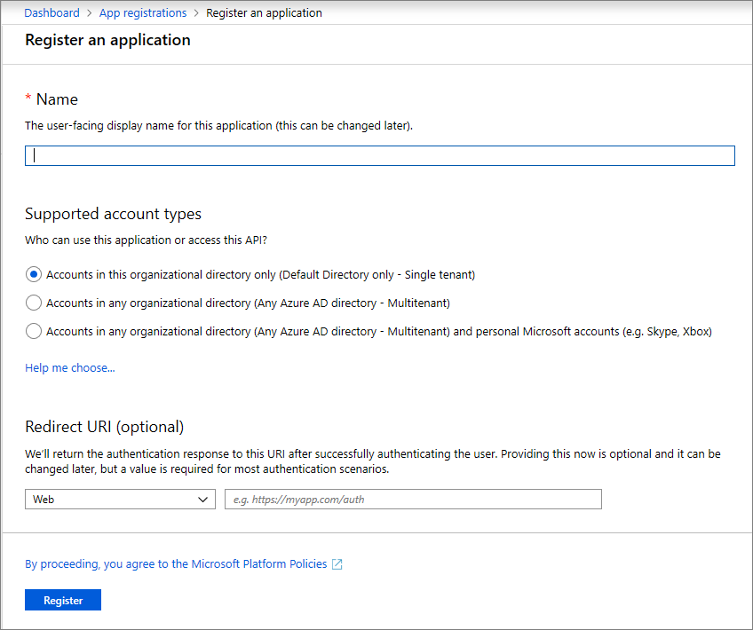
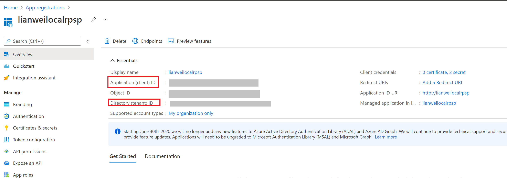
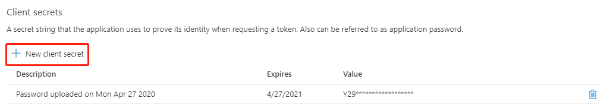
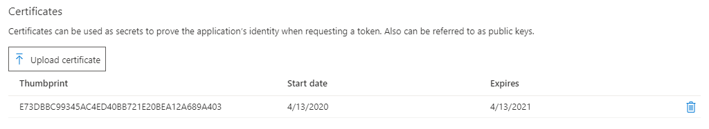
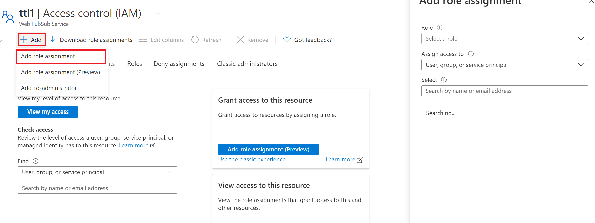
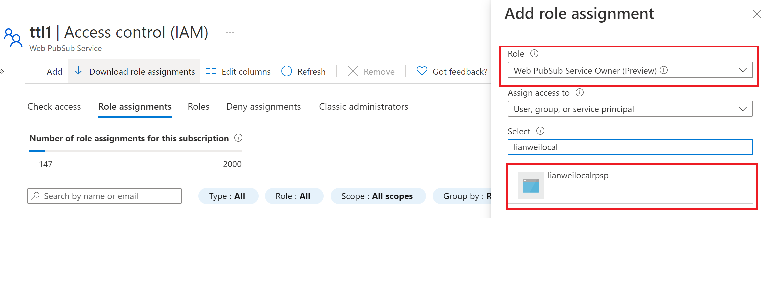
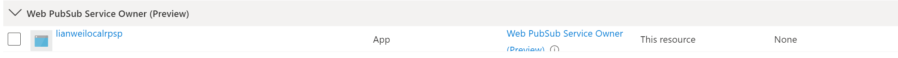

# Authenticate an application with Azure Active Directory to access Azure Web PubSub Service
Microsoft Azure provides integrated access control management for resources and applications based on Azure Active Directory (Azure AD). A key advantage of using Azure AD with Azure Web PubSub Service is that you don't need to store your credentials in the code anymore. Instead, you can request an OAuth 2.0 access token from the Microsoft Identity platform. The resource name to request a token is `https://webpubsub.azure.com/`. Azure AD authenticates the security principal (an application, resource group, or service principal) running the application. If the authentication succeeds, Azure AD returns an access token to the application, and the application can then use the access token to authorize request to Azure Web PubSub Service resources.

When a role is assigned to an Azure AD security principal, Azure grants access to those resources for that security principal. Access can be scoped to the level of subscription, the resource group, or the Azure Web PubSub resource. An Azure AD security can assign roles to a user, a group, an application service principal, or a [managed identity for Azure resources](https://docs.microsoft.com/en-us/azure/active-directory/managed-identities-azure-resources/overview). 

> [!NOTE]
> A role definition is a collection of permissions. Role-based access control (RBAC) controls how these permissions are enforced through role assignment. A role assignment consists of three elements: security principal, role definition, and scope. For more information, see [Understanding the different roles](https://docs.microsoft.com/en-us/azure/active-directory/managed-identities-azure-resources/overview).

## Register your application with an Azure AD tenant
The first step in using Azure AD to authorize Azure Web PubSub Service resources is registering your application with an Azure AD tenant from the [Azure portal](https://portal.azure.com/). 
When you register your application, you supply information about the application to AD. Azure AD then provides a client ID (also called an application ID) that you can use to associate your application with Azure AD runtime. 
To learn more about the client ID, see [Application and service principal objects in Azure Active Directory](https://docs.microsoft.com/en-us/azure/active-directory/develop/app-objects-and-service-principals). 

The following images show steps for registering a web application:



> [!Note]
> If you register your application as a native application, you can specify any valid URI for the Redirect URI. For native applications, this value does not have to be a real URL. For web applications, the redirect URI must be a valid URI, because it specifies the URL to which tokens are provided.

After you've registered your application, you'll see the **Application (client) ID** under **Settings**:



For more information about registering an application with Azure AD, see [Integrating applications with Azure Active Directory](https://docs.microsoft.com/en-us/azure/active-directory/develop/quickstart-register-app).


### Create a client secret   
The application needs a client secret to prove its identity when requesting a token. To add the client secret, follow these steps.

1. Navigate to your app registration in the Azure portal.
1. Select the **Certificates & secrets** setting.
1. Under **Client secrets**, select **New client secret** to create a new secret.
1. Provide a description for the secret, and choose the wanted expiration interval.
1. Immediately copy the value of the new secret to a secure location. The fill value is displayed to you only once.



### Upload a certificate

You could also upload a certification instead of creating a client secret.



## Assign Azure roles using the Azure portal  
To learn more on managing access to Azure resources using Azure RBAC and the Azure portal, see [this article](https://docs.microsoft.com/en-us/azure/role-based-access-control/role-assignments-portal). 

After you've determined the appropriate scope for a role assignment, navigate to that resource in the Azure portal. Display the access control (IAM) settings for the resource, and follow these instructions to manage role assignments:

1. In the [Azure portal](https://portal.azure.com/), navigate to your Web PubSub resource.
1. Select **Access Control (IAM)** to display access control settings for the Azure Web PubSub. 
1. Select the **Role assignments** tab to see the list of role assignments. Select the **Add** button on the toolbar and then select **Add role assignment**. 

    

1. On the **Add role assignment** page, do the following steps:
    1. Select the **Web PubSub Service Owner (Preview)** that you want to assign. 
    1. Search to locate the **security principal** (user, group, service principal) to which you want to assign the role.
    1. Select **Save** to save the role assignment. 

        

    1. The identity to whom you assigned the role appears listed under that role. For example, the following image shows that application `Web PubSub-dev` and `Web PubSub-service` are in the Web PubSub App Server role. 
        
        

## Sample usage

```javascript

const { WebPubSubServiceClient } = require('@azure/web-pubsub');
const { DefaultAzureCredential } = require("@azure/identity");
// don't forget to set AZURE_CLIENT_ID, AZURE_TENANT_ID, and AZURE_CLIENT_SECRET to ENV
const env = process.env;
async function main() {
  const client = new WebPubSubServiceClient(
    env.ENDPOINT,
    new DefaultAzureCredential(),
    "simplechat"
  );
    
  function onResponse(rawResponse) {
    console.log(rawResponse);
  }
  var result = await client.sendToAll("hello", { contentType: "text/plain", onResponse});
  console.log(result);
}

main().catch((e) => {
  console.error("Sample encountered an error", e);
  process.exit(1);
});

```