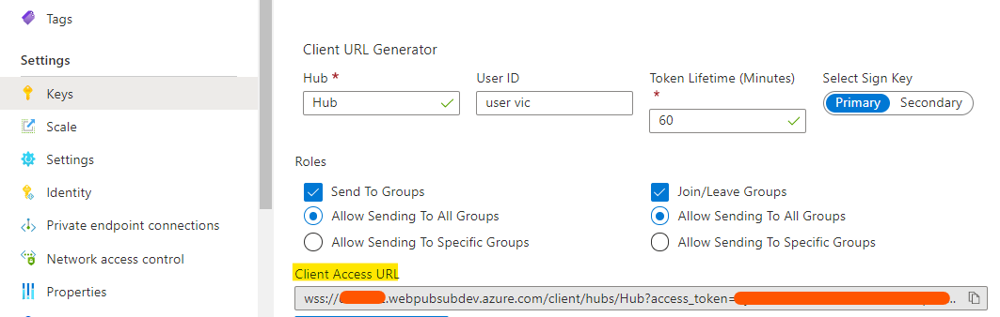

# Quickstart

## Create Your First Instance

Go to Azure Portal and search **Web PubSub** Service. Create your service with several clicks.

## Try A Live Demo

Quick start with this <a href="https://azure.github.io/azure-webpubsub/demos/clientpubsub" target="_blank">Live Demo</a>!

### Some hints

* The **Client Access URL** is copied from **Keys** tab. It is provided for quick test purpose. You can connect to the service using URL generated by this generator, e.g. `new WebSocket({generated_url})`. In real-world applications, SDKs are provided to generate client URLs from **Connection String**.

    

* Don't forget to check the roles of **Send To Groups** and **Join/Leave Groups**, and copy the **Client Access URL**.

* Try different groups to join and different groups to send messages to, and see what messages are received.

* You can also try uncheck **Roles** when generating the **Client URL** to see how sending messages to groups with that goes.

## More samples to try
- Publish messages to WebSocket connections 
    - [JavaScript](./publish-messages/js-publish-message.md)
    - [C#](./publish-messages/csharp-publish-message.md)
    - [Python](./publish-messages/python-publish-message.md)
    - [Java](./publish-messages/java-publish-message.md)
- Create a chat app
    - [JavaScript](./create-a-chat-app/js-handle-events.md)
    - [C#](./create-a-chat-app/csharp-handle-events.md)
    - [Java](./create-a-chat-app/java-handle-events.md)
- Using PubSub WebSocket subprotocol
    - [JavaScript](./using-pubsub-subprotocol/js-work-with-subprotocols.md)
    - [Java](./using-pubsub-subprotocol/java-work-with-subprotocols.md)
    - [Python](./using-pubsub-subprotocol/python-work-with-subprotocols.md)

## Integrate with Azure Function
- Work with Azure Function
    - [JavaScript](./work-with-azure-function/js-work-with-azure-function.md)
    - [C#](./work-with-azure-function/csharp-work-with-azure-function.md)

## References
- Client-side
    - [Client WebSocket APIs](./../references/client-websocket-apis/)
    - [Client PubSub Subprotocol](./../references/pubsub-websocket-subprotocol.md)
- Server-side
    - [Server SDKs](./../references/server-sdks/index.md)
    - [Server CloudEvents protocol](./../references/protocol-cloudevents.md)
    - [Server REST API][rest]

[rest]: https://docs.microsoft.com/rest/api/webpubsub/
