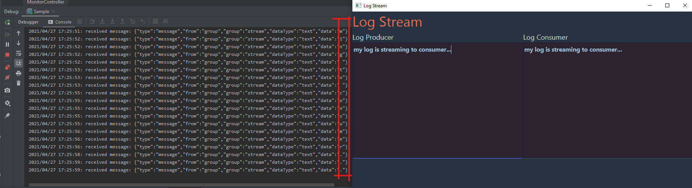

# Work with subprotocols

In previous tutorials you have learned how to use [WebSocketClient APIs](https://github.com/TooTallNate/Java-WebSocket) to send and receive data with Azure Web PubSub. You can see there is no protocol needed when client is communicating with the service. For example, you can use `WebSocketClient.send()` to send any data and server will receive the data as is. This is easy to use, but the functionality is also limited. You cannot, for example, specify the event name when sending the event to server, or publish message to other clients instead of sending it to server. In this tutorial you will learn how to use subprotocol to extend the functionality of client.



## Prerequisites

1. [IntelliJ IDEA](https://www.jetbrains.com/idea/)
2. [Maven](https://maven.apache.org/)
4. Create an Azure Web PubSub resource

## Create the sample step by step

### Create a Maven project
1. Open _InteliJ IDEA_, click _File/New/Project..._ in the menu, select _Maven_, then type your _GroupId_ and _ArtifactId_, and setup other options to cerate a Maven project.
2. add dependencies to the `pom.xml`
    ```xml
    <dependencies>
        <dependency>
            <groupId>com.azure</groupId>
            <artifactId>azure-messaging-webpubsub</artifactId>
            <version>1.0.0-beta.1</version>
        </dependency>

        <!-- https://mvnrepository.com/artifact/io.javalin/javalin -->
        <dependency>
            <groupId>io.javalin</groupId>
            <artifactId>javalin</artifactId>
            <version>3.13.6</version>
        </dependency>

        <dependency>
            <groupId>org.java-websocket</groupId>
            <artifactId>Java-WebSocket</artifactId>
            <version>1.5.1</version>
        </dependency>

        <dependency>
            <groupId>org.slf4j</groupId>
            <artifactId>slf4j-simple</artifactId>
            <version>1.7.30</version>
        </dependency>

        <dependency>
            <groupId>com.alibaba</groupId>
            <artifactId>fastjson</artifactId>
            <version>1.2.47</version>
        </dependency>

        <dependency>
            <groupId>com.jfoenix</groupId>
            <artifactId>jfoenix</artifactId>
            <version>9.0.10</version>
        </dependency>

    </dependencies>
    ```

    * azure-messaging-webpubsub: Web PubSub service SDK for Java
    * Java-WebSocket: WebSocket client SDK for Java
    * slf4j-simple: Logger for Java
    * javalin: simple web framework for Java
    * fastjson: json library for Java
    * jfoenix: GUI library for Java

## Using a subprotocol to handle events

Create `LogStream.java` to handle events from Web PubSub service with a subprotocol.

```java
package microsoft.azure.webpubsub.samples.java.logstream;

import com.alibaba.fastjson.JSONObject;
import org.java_websocket.client.WebSocketClient;
import org.java_websocket.drafts.Draft_6455;
import org.java_websocket.extensions.IExtension;
import org.java_websocket.handshake.ServerHandshake;
import org.java_websocket.protocols.IProtocol;
import org.java_websocket.protocols.Protocol;

import java.io.IOException;
import java.net.URI;
import java.net.URISyntaxException;
import java.net.http.HttpClient;
import java.net.http.HttpRequest;
import java.net.http.HttpResponse;
import java.util.ArrayList;
import java.util.Collections;
import java.util.function.Function;

public class LogStream {
    private static String subProtocol = "json.webpubsub.azure.v1";
    public WebSocketClient webSocketClient;
    private String endpoint;
    private Helper helper;

    public LogStream(String endpoint) {
        this.endpoint = endpoint;
        this.helper = new Helper();
    }

    public void write(String message) {
        JSONObject object = new JSONObject();
        object.put("type", "sendToGroup");
        object.put("group", "stream");
        object.put("dataType", "text");
        object.put("data", message);
        webSocketClient.send(object.toJSONString());
    }

    public void connect(String role, Function<String, Object> updateUI) throws URISyntaxException, InterruptedException, IOException {
        // specify a subprotocol
        ArrayList<IProtocol> protocols = new ArrayList<IProtocol>();
        protocols.add(new Protocol(subProtocol));
        Draft_6455 draft = new Draft_6455(Collections.<IExtension>emptyList(), protocols);


        String url = negotiateToService(endpoint, role);
        webSocketClient = new WebSocketClient(new URI(url), draft) {
            @Override
            public void onMessage(String message) {
                if (updateUI != null) {
                    System.out.println(String.format("%s: received message: %s", helper.getCurrentTime(), message));
                    JSONObject object = JSONObject.parseObject(message);
                    if ("message".equals(object.getString("type")) &&
                            "text".equals(object.getString("dataType"))) {
                        updateUI.apply(object.getString("data"));
                    }
                }
            }

            @Override
            public void onOpen(ServerHandshake handshake) {
                System.out.println(String.format("%s: Connected...", helper.getCurrentTime()));
            }

            @Override
            public void onClose(int code, String reason, boolean remote) {
                System.out.println(String.format("%s: Websocket connection closed...", helper.getCurrentTime()));
            }

            @Override
            public void onError(Exception ex) {
                System.out.println(String.format("%s: Websocket connection get error:", helper.getCurrentTime()));
                ex.printStackTrace();
            }
        };

        System.out.println(String.format("%s: Open websocket connection...", helper.getCurrentTime()));
        webSocketClient.connectBlocking();

        JSONObject object = new JSONObject();
        object.put("type", "joinGroup");
        object.put("group", "stream");
        System.out.println("out:" + object.toJSONString());
        webSocketClient.send(object.toJSONString());
    }

    public void disconnect() {
        System.out.println(String.format("%s: Close websocket connection...", helper.getCurrentTime()));
        webSocketClient.close();
    }

    private String negotiateToService(String endpoint, String role) throws IOException, InterruptedException {
        HttpClient client = HttpClient.newHttpClient();
        HttpRequest request = HttpRequest.newBuilder(
                URI.create(String.format("%s?role=%s", endpoint, role)))
                .header("accept", "application/json")
                .build();
        HttpResponse<String> response = client.send(request, HttpResponse.BodyHandlers.ofString());
        String content = response.body();
        JSONObject object = JSONObject.parseObject(content);
        String url = object.getString("url");
        return url;
    }
}

```

The `LogStream` is used to:
* Establish a websocket connection to Web PubSub service with a custom subprotocol.
* Handle events in custom protocol from Web PubSub service.

To specify a custom subprotocol:

```java
ArrayList<IProtocol> protocols = new ArrayList<IProtocol>();
protocols.add(new Protocol(subProtocol));
Draft_6455 draft = new Draft_6455(Collections.<IExtension>emptyList(), protocols);
```

> Currently Azure Web PubSub only supports one subprotocol: `json.webpubsub.azure.v1`.
> If you use other protocol names, they will be ignored by the service and passthrough to server in the connect event handler, so you can build your own protocols.


To connect to Web PubSub service:

```java
String url = negotiateToService(endpoint, role);
webSocketClient = new WebSocketClient(new URI(url), draft) {
    ...
};

```

`negotiateToService()` function is used to get URL to Web PubSub service with valid access token.

We suggest to use a negotiation server to get client URL instead of using connection string to generate it in client side, which may leak the connection string.

```java
private String negotiateToService(String endpoint, String role) throws IOException, InterruptedException {
    HttpClient client = HttpClient.newHttpClient();
    HttpRequest request = HttpRequest.newBuilder(
            URI.create(String.format("%s?role=%s", endpoint, role)))
            .header("accept", "application/json")
            .build();
    HttpResponse<String> response = client.send(request, HttpResponse.BodyHandlers.ofString());
    String content = response.body();
    JSONObject object = JSONObject.parseObject(content);
    String url = object.getString("url");
    return url;
}
```

To handle events in custom protocol from Web PubSub service, you need to override the `onMessage` function. As you can see, when using a subprotocol, the event handling is easier than without subprotocol, the received message is already a JSON string. You can easily get what you want from the JSON string message. In the below code, we extract the content `data` of the event type `message`, and then update it to UI.

```java
...
@Override
public void onMessage(String message) {
    if (updateUI != null) {
        System.out.println(String.format("%s: received message: %s", helper.getCurrentTime(), message));
        JSONObject object = JSONObject.parseObject(message);
        if ("message".equals(object.getString("type")) &&
                "text".equals(object.getString("dataType"))) {
            updateUI.apply(object.getString("data"));
        }
    }
}
...
```

Create `Helper.java` to store the shared code: 

```java
package microsoft.azure.webpubsub.samples.java.logstream;

import java.time.LocalDateTime;
import java.time.format.DateTimeFormatter;

public class Helper {

    public String negotiationEndpoint = "http://localhost:8080/negotiate";
    public String group = "stream";

    public String getCurrentTime() {
        DateTimeFormatter dtf = DateTimeFormatter.ofPattern("yyyy/MM/dd HH:mm:ss");
        LocalDateTime now = LocalDateTime.now();
        return dtf.format(now);
    }

    public String getSendToGroupRole(String group) {
        return String.format("webpubsub.sendToGroup.%s", group);
    }

    public String getJoinLeaveGroupRole(String group) {
        return String.format("webpubsub.joinLeaveGroup.%s", group);
    }
}

```

### NegotiationServer

We suggest to use a negotiation server to get client URL instead of using connection string to generate it in client side, which may leak the connection string. Let's build a simple negotiation server:
We will use [Javalin](https://javalin.io/) to handle incoming requests.

Create `NegotiationServer.java` to create a server respond negotiation request, which will generate a client URL with valid access token for websocket connection to Web PubSub service:

```java
package microsoft.azure.webpubsub.samples.java.logstream;

import com.azure.messaging.webpubsub.WebPubSubClientBuilder;
import com.azure.messaging.webpubsub.WebPubSubServiceClient;
import com.azure.messaging.webpubsub.models.GetAuthenticationTokenOptions;
import com.azure.messaging.webpubsub.models.WebPubSubAuthenticationToken;
import io.javalin.Javalin;

public class NegotiationServer {
    private String hubName;
    private String connectionString;

    public NegotiationServer(String hubName, String connectionString) {
        this.hubName = hubName;
        this.connectionString = connectionString;
    }

    public void start() {
        WebPubSubServiceClient client = new WebPubSubClientBuilder()
                .connectionString(connectionString)
                .hub(hubName)
                .buildClient();

        // setup a server
        Javalin app = Javalin.create().start(8080);

        // negotiation: redirect client to Web PubSub service
        app.get("/negotiate", ctx -> {
            String role = ctx.queryParam("role");
            GetAuthenticationTokenOptions option = new GetAuthenticationTokenOptions();
            option.addRole(role);
            WebPubSubAuthenticationToken token = client.getAuthenticationToken(option);
            ctx.result("{ \"url\": \"" + token.getUrl() + "\"}");
            return;
        });
    }
}
```

Simply use a `WebPubSubServiceClient` to generate the client URL:

```java
...
WebPubSubServiceClient client = new WebPubSubClientBuilder()
                .connectionString(connectionString)
                .hub(hubName)
                .buildClient();
...
```

Respond to `/negotiate` with client URL to Web PubSub service:
```java
app.get("/negotiate", ctx -> {
            String role = ctx.queryParam("role");
            GetAuthenticationTokenOptions option = new GetAuthenticationTokenOptions();
            option.addRole(role);
            WebPubSubAuthenticationToken token = client.getAuthenticationToken(option);
            ctx.result("{ \"url\": \"" + token.getUrl() + "\"}");
            return;
        });
```

### Build GUI to visualize log stream

#### Define the view of GUI

Create `fxml/monitor.fxml` in the `resources` folder. It contains 2 sections, one is the `Log Producer` on the left, which is used to input logs, and then publish the new logs to a group in Web PubSub service. Another is `Log Consumer` on the right, which will subscribe to the group and receive logs from the group.

```xml
<?xml version="1.0" encoding="UTF-8"?>
<?import javafx.scene.layout.*?>
<?import com.jfoenix.controls.*?>
<?import javafx.scene.control.Label?>
<?import javafx.scene.text.Text?>
<GridPane xmlns="http://javafx.com/javafx/8.0.4"
           xmlns:fx="http://javafx.com/fxml/1"
           fx:controller="microsoft.azure.webpubsub.samples.java.logstream.MonitorController"
           styleClass="app">
    <VBox GridPane.columnIndex="0" GridPane.rowIndex="0">
        <Label text="Log Stream" styleClass="title1"></Label>
    </VBox>
    <VBox GridPane.columnIndex="0" GridPane.rowIndex="1">
    <GridPane>
        <children>
            <VBox styleClass="left" GridPane.columnIndex="0" GridPane.rowIndex="0">
                <Label text="Log Producer" styleClass="title2"></Label>
                <JFXTextArea fx:id="producerTextArea" promptText="Type Something"
                             styleClass="jfx-text-area"></JFXTextArea>
            </VBox>
            <VBox styleClass="right" GridPane.columnIndex="1" GridPane.rowIndex="0">
                <Label text="Log Consumer" styleClass="title2"></Label>
                <JFXTextArea fx:id="consumerTextArea" editable="false" styleClass="jfx-text-area"></JFXTextArea>
            </VBox>
        </children>
        <columnConstraints>
            <ColumnConstraints hgrow="SOMETIMES" minWidth="10.0" percentWidth="50.0"/>
            <ColumnConstraints hgrow="SOMETIMES" minWidth="10.0" percentWidth="50.0"/>
        </columnConstraints>
    </GridPane>
    </VBox>
</GridPane>
```

Create `css/monitor.css` to make a better style to display logs:

```css
.app {
    -fx-background-color: #293241;
    -fx-font-size: 1.5em;
}

.title1 {
    -fx-font-size: 2em;
    -fx-text-fill: #EE6C4D;
}

.title2 {
    -fx-text-fill: #E0FBFC;
    -fx-font-size: 1.5em;
}

.jfx-text-area {
    -fx-text-fill: #98C1D9;
    -fx-fill: #98C1D9;
    -fx-font-size: 1.3em;
    -fx-font-weight: BOLD;
    -fx-border-width: 2 2 2 2;
    -fx-border-color: #22223b;
    -fx-background-color: #2d232e;
}

.left {
    -fx-width: "50%"
}

.right {
    -fx-width: "50%"
}
```

#### Define the controller of GUI

```java
package microsoft.azure.webpubsub.samples.java.logstream;

import java.io.IOException;
import java.net.URISyntaxException;
import java.net.URL;
import java.util.ResourceBundle;

import com.jfoenix.controls.JFXTextArea;
import javafx.beans.value.ChangeListener;
import javafx.beans.value.ObservableValue;
import javafx.event.EventHandler;
import javafx.fxml.FXML;
import javafx.fxml.Initializable;
import javafx.scene.control.Alert;
import javafx.scene.input.KeyCode;
import javafx.scene.input.KeyEvent;

public class MonitorController implements Initializable {
    @FXML
    private JFXTextArea producerTextArea;

    @FXML
    private JFXTextArea consumerTextArea;

    private String content = "";

    public void initialize(URL location, ResourceBundle resources) {
        producerTextArea.setPrefHeight(300);
        consumerTextArea.setPrefHeight(300);

        Helper helper = new Helper();
        LogStream streamProducer = new LogStream(helper.negotiationEndpoint);
        LogStream streamConsumer = new LogStream(helper.negotiationEndpoint);

        try {
            streamConsumer.connect(helper.getJoinLeaveGroupRole(helper.group), message -> {
                consumerTextArea.appendText(message);
                return null;
            });
            streamProducer.connect(helper.getSendToGroupRole(helper.group), null);
        } catch (URISyntaxException e) {
            e.printStackTrace();
        } catch (InterruptedException e) {
            e.printStackTrace();
        } catch (IOException e) {
            e.printStackTrace();
        }

        producerTextArea.addEventFilter(KeyEvent.KEY_PRESSED, new EventHandler<KeyEvent>() {
            public void handle(KeyEvent event) {
                if (event.getCode() == KeyCode.BACK_SPACE || event.getCode() == KeyCode.DELETE) {
                    event.consume(); // to cancel character-removing keys
                }
            }
        });

        producerTextArea.textProperty().addListener(new ChangeListener<String>() {
            @Override
            public void changed(ObservableValue<? extends String> observableValue, String oldValue, String newValue) {
                if (newValue.startsWith(content)) {
                    streamProducer.write(newValue.substring(content.length()));
                    content = newValue;
                }
                else {
                    showAlert();
                    producerTextArea.setText(content);
                }
            }
        });
    }

    private void showAlert() {
        Alert alert = new Alert(Alert.AlertType.INFORMATION);
        alert.setTitle("Invalid Input");
        alert.setHeaderText(null);
        alert.setContentText("Only Allow Appending Texts");
        alert.showAndWait();
    }
}

```

Please notice that the log producer and log consumer use different roles in the access token:
* log producer: uses `webpubsub.sendToGroup.<group>` to allow sending messages to `<group>`
* log consumer: uses `webpubsub.joinLeaveGroup.<group>` to allow join/leave to/from `<group>`

#### Define the startup of the GUI

```java
package microsoft.azure.webpubsub.samples.java.logstream;

import javafx.application.Application;
import javafx.fxml.FXMLLoader;
import javafx.scene.Parent;
import javafx.scene.Scene;
import javafx.stage.Stage;

import java.net.URL;

public class Monitor extends Application {
    @Override
    public void start(Stage primaryStage) throws Exception {
        URL resourceLocation = getClass().getResource("/fxml/monitor.fxml");
        Parent root = FXMLLoader.load(resourceLocation);
        primaryStage.setTitle("Log Stream");
        primaryStage.setMinWidth(900);
        primaryStage.setMaxWidth(900);
        primaryStage.setMinHeight(500);
        primaryStage.setMaxHeight(500);
        Scene scene = new Scene(root, 900, 500);
        scene.getStylesheets().add(getClass().getResource("/css/monitor.css").toExternalForm());
        primaryStage.setScene(scene);
        primaryStage.show();
    }
}
```

#### Complete the sample

Create `Sample.java` to launch the GUI application, start negotiation server and make websocket connections:

```java
package microsoft.azure.webpubsub.samples.java.logstream;

import javafx.application.Application;

public class Sample {
    public static String hubName = "stream";
    public static String connectionString = "<connection-string>";

    public static void main(String[] args) {
        NegotiationServer negotiationServer = new NegotiationServer(hubName, connectionString);
        try {
            negotiationServer.start();
            Application.launch(Monitor.class, args);
        } catch (Exception ex) {
            ex.printStackTrace();
        }
    }
}
```

### Run sample 

1. Change the `<connection-string>` with your own (`<connection-string>` can be found in "Keys" tab in Azure portal, `<hub-name>` can be any alphabetical string you like). Click the green triangle on the left of the `main` function in `Sample.java` to run the sample.
2. Input your anything in the input box in `Log Producer`.
3. Check the console, you will see every character will be published to group `stream`.
5. You will also see the message received and displayed in the `Log Consumer`.


The complete code sample of this tutorial can be found [here](../../../samples/java/logstream/Readme.md).
