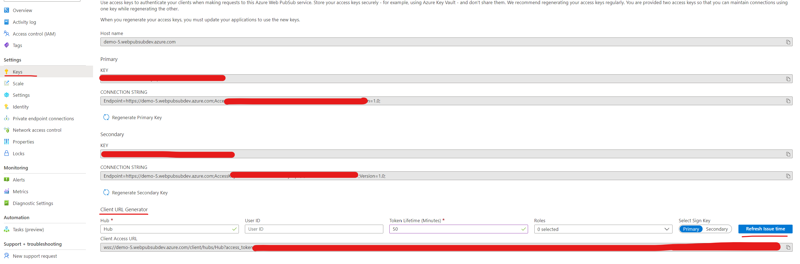
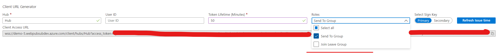

## WebSocket Clients connecting to the service

Clients connect to the Web PubSub service (in below sections we refer it as the service) using [WebSocket](https://tools.ietf.org/html/rfc6455) protocol. So languages having WebSocket client support can be used to write a client for the service. In below sections we show several WebSocket client samples in different languages.

## Auth
The Web PubSub service uses [JWT token](https://tools.ietf.org/html/rfc7519.html) to validate and auth the clients. Clients can either put the token in the `access_token` query parameter, or put it in `Authorization` header when connecting to the service.

A typical workflow is the client communicates with its app server first to get the URL of the service and the token. And then the client opens the WebSocket connection to the service using the URL and token it receives.

The portal also provides a dynamically generated *Client URL* with token for clients to start a quick test:
)
> NOTE
> Make sure to include neccessory roles when generating the token.



To simplify the sample workflow, in below sections, we use this temporarily generated URL from portal for the client to connect, using `<Client_URL_From_Portal>` to represent the value.

### CSharp

#### Dependency
* [.NET Core 3.1 or above](https://dotnet.microsoft.com/download)
* [Websocket.Client](https://github.com/Marfusios/websocket-client)

#### Simple WebSocket Client

```csharp
using System;
using System.IO;
using System.Text;
using System.Threading.Tasks;
using Websocket.Client;

namespace subscriber
{
    class Program
    {
        static async Task Main(string[] args)
        {
            using (var client = new WebsocketClient("<Client_URL_From_Portal>"))
            {
                client.MessageReceived.Subscribe(msg => Console.WriteLine($"Message received: {msg}"));
                await client.Start();
                Console.WriteLine("Connected.");
                Console.Read();
            }
        }
    }
}
```


#### PubSub WebSocket Client

```csharp
using System;
using System.IO;
using System.Net.WebSockets;
using System.Text;
using System.Threading.Tasks;
namespace subscriber
{
    class Program
    {
        static async Task Main(string[] args)
        {
            using (var client = new WebsocketClient("<Client_URL_From_Portal>", () =>
            {
                var inner = new ClientWebSocket();
                inner.Options.AddSubProtocol("json.webpubsub.azure.v1");
                return inner;
            }))
            {
                client.MessageReceived.Subscribe(msg => Console.WriteLine($"Message received: {msg}"));
                await client.Start();
                Console.WriteLine("Connected.");
                Console.Read();
            }
        }
    }
}
```


