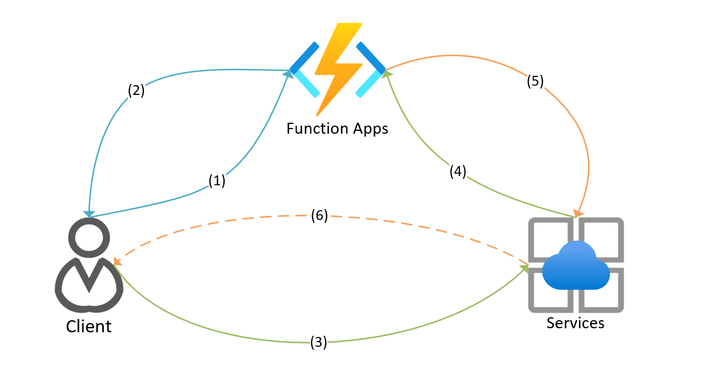

- [Supported scenarios](#supported-scenarios)
- [Development Plan](#development-plan)
- [Bindings and Workflow](#bindings-and-workflow)
  - [`WebPubSubConnection` Input Binding](#webpubsubconnection-input-binding)
  - [`WebPubSubTrigger` Trigger binding](#webpubsubtrigger-trigger-binding)
  - [`WebPubSub` Output Binding](#webpubsub-output-binding)
- [Bindings Usage](#bindings-usage)
  - [Using the WebPubSubConnection input binding](#using-the-webpubsubconnection-input-binding)
  - [Using the WebPubSubTrigger trigger binding](#using-the-webpubsubtrigger-trigger-binding)
  - [Using the WebPubSub output binding](#using-the-webpubsub-output-binding)
  - [Supported object types for Output bindings.](#supported-object-types-for-output-bindings)
    - [WebPubSubEvent](#webpubsubevent)
    - [MessageData](#messagedata)
    - [GroupData](#groupdata)
    - [CloseConnectionData](#closeconnectiondata)
    - [ExistenceData (Limited)](#existencedata-limited)

## Supported scenarios

- Allow clients to connect to a Web PubSub Service hub without a self-host server.
- Use Azure Functions (any language supported by V2) to broadcast messages to all clients connected to a Web PubSub Service hub.
- Use Azure Functions (any language supported by V2) to send messages to a single user/connection, or all the users/connections in a group.
- Use Azure Functions (any language supported by V2) to manage group users like add/remove/check a single user/connection in a group.

## Development Plan

[Azure WebPubSub Development Plan](https://github.com/Azure/azure-webpubsub/blob/main/docs/specs/development-plan.md)

- [ ] **Phase 1** Support simple websocket clients

- [ ] **Phase 2** Support subprotocol websocket clients

- [ ] **Portal Support** Azure Portal integration for an easy working experience to create/configure Azure Functions for Web PubSub service.

> Subprotocol de-serialization is done by service side. Server will have a consistent `Event` property to understand the request. So not much gap between phase 1 & 2 in function side.

## Bindings and Workflow



### `WebPubSubConnection` Input Binding
***Client Negotiation (1)-(2)***

Clients use `HttpTrigger` to request functions return `WebPubSubConnection` input binding which provides service websocket url along with access token. Input binding makes it easy to generate required information to setup websocket connections in client side. This step is optional that if clients already configured with service information, it can skip negotiation and direct raise websocket connection request to service and refer to next step.

### `WebPubSubTrigger` Trigger binding
***Client Websocket requests (3)-(4)***

Clients set up websocket connection to service, and clients can send connect/message/disconnect request through the websocket connection on demand. Service will forward these events to functions by `WebPubSubTrigger` to let function known and do something. Especially, functions can accept/block the request for connect/message(synchronous events), refer to [this](https://github.com/Azure/azure-webpubsub/blob/main/docs/specs/phase-1-simple-websocket-client.md#simple-websocket-connection) for details.

### `WebPubSub` Output Binding 
***Function requests (5)-(6)***

When function is triggered, it can send any messaging request by `WebPubSub` output bindings to service. And service will accordingly do broadcast or managing groups operation regarding the rest api calls.

## Bindings Usage

### Using the WebPubSubConnection input binding

In anonymous mode, `UserId` can be used with {headers.userid} or {query.userid} depends on where the userid is assigned in the negotiate call.

__Optional__ Similarly users can set customers generated JWT accesstoken by assign `AccessToken = {query.accesstoken}` in the input binding property on demand where customized claims are built with. 

* csharp usage:
```cs
[FunctionName("login")]
public static WebPubSubConnection GetClientConnection(
    [HttpTrigger(AuthorizationLevel.Anonymous, "get", "post")] HttpRequest req,
    [WebPubSubConnection(HubName = "simplechat", UserId = "{query.userid}")] WebPubSubConnectioconnection,
    ILogger log)
{
    return connection;
}
```

* javascript usage:
```js
{
    "type": "webpubsubConnection",
    "name": "connection",
    "userId": "{query.userid}",
    "hubName": "chathub",
    "direction": "in"
}
```

```js
module.exports = function (context, req, connection) {
  context.res = { body: connection };
  context.done();
};
```

### Using the WebPubSubTrigger trigger binding

When clients already know Web PubSub service and communication to service, `WebPubSubTrigger` can be used as listener towards all kinds of requests coming from service. Function will use `WebPubSubTrigger` attributes as the **unique** key to map correct function. `EventType` will set to `system` by default.

EventType|(Allowed) Event
--|--
system|connect, connected, disconnect
user|any, e.g. message or defined in subprotocol

For a connect request, server side has some controls to manager user's authentication before connected. Future on-hold messages can also be used like this. Properties available to set will be opened in `InvocationContext` and function extension will help build correct response to service after user actions are done in function.

* csharp usage:
```cs
[FunctionName("connect")]
public static void Connect(
[WebPubSubTrigger(Hub = "simplechat", Event = "connect", EventType = EventType.System)]ConnectInvocationContext context)
{
    Console.WriteLine($"{context.ConnectionId}");
    Console.WriteLine("Connect.");
    if (context.UserId == "abc")
    {
        // return error response
        context.ErrorResponse = new ErrorResponse{ HttpStatusCode = System.Net.HttpStatusCode.Unauthorized, Error = "Invalid User" };
    }
    else {
        // or set properties for good response
        context.SuccessReponse  = new SuccessReponse { Roles = new string[] { "Admin" } };
    }
}
```

* javascript usage:
```js
{
    "type": "webpubsubTrigger",
    "name": "invocation",
    "hub": "simplechat",
    "event": "connect",
    "eventType", "system"
    "direction": "in"
}
```

```js
module.exports = function (context, invocation) {
  context.log('Receive event: ${context.bindingData.event} from connection: ${context.bindingData.connectionId}.');
  context.done();
};
```

### Using the WebPubSub output binding

For single message request, customer could bind to a target operation related data type to send the request.

* csharp usage:
```cs
[FunctionName("broadcast")]
[return: WebPubSub]
public static MessageData Broadcast(
    [WebPubSubTrigger(Hub = "simplechat", Event = "message", EventType = EventType.User)] InvocationContext context)
{
    return new MessageData
    {
        Message = GetString(context.Payload.Span)
    };
}
```
* javascript usage:
```js
{
    "type": "webpubsubTrigger",
    "name": "invocation",
    "hub": "simplechat",
    "event": "message",
    "eventType": "user",
    "direction": "in"
},
{
    "type": "webpubsub",
    "name": "messageData",
    "hubName": "simplechat",
    "direction": "out"
}
```
```js
module.exports = async function (context, invocation) {
    context.bindings.messageData = [{
        "message": invocation.bindingData.payload
    }];
    context.
};
```

To send multiple messages, customer need to work with generic `WebPubSubEvent` and do multiple tasks in order.

* csharp usage:
```cs
[FunctionName("message")]
public static async Task Message(
    [WebPubSubTrigger(Hub = "simplechat", Event = "message", EventType = EventType.User)] InvocationContext context,
    [WebPubSub] IAsyncCollector<WebPubSubEvent> eventHandler)
{
    await message.AddAsync(new GroupData
    {
        Action = GroupAction.Join,
        TargetType = TargetType.Users,
        TargetId = context.UserId,
        GroupId = "group1",
    })
    await message.AddAsync(new MessageData
    {
        Message = GetString(context.Payload.Span)
    });
}
```

> When SDK has better supports, server side could work with server sdk convenience layer methods without output binding data type limited. And method response will have enrich properties.
> ```cs
> [FunctionName("chathub-message")]
> public static async Task Message(
>     [WebPubSubTrigger] InvocationContext context)
> {
>     var server = context.GetWebPubSubServer();
>     await server.AddToGroupAsync(context.UserId, "group1");
>     await server.SendAsync(context.Payload);
> }
> ```

### Supported object types for Output bindings.

#### WebPubSubEvent 
A generic base class to send multiple tasks.

#### MessageData

1. `TargetType`, supports All, Users, Connections, Groups, default as All
2. `TargetId`, use with `TagetType`, where target id should be assigned if `TargetType` is not All.
3. `Excludes`, excludes connection ids
4. `Message`

#### GroupData

1. `GroupAction`, supports Add/Remove
2. `TargetType`, supports Users/Connections
3. `TargetId`
4. `GroupId`

#### CloseConnectionData

1. `ConnectionId`
2. `Reason`

#### ExistenceData (Limited)

1. `TargetType` supports Users/Connections/Groups
2. `TargetId`

> Response result is not able to reflect. May not be supported in the initial version.