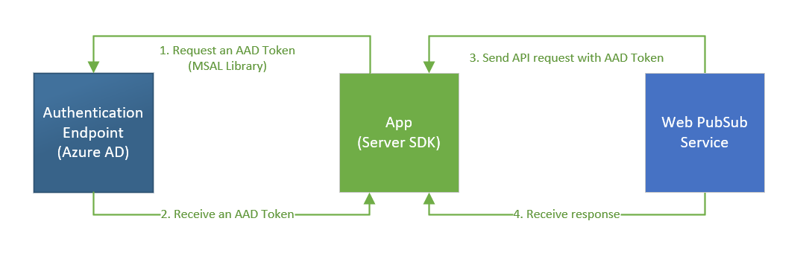
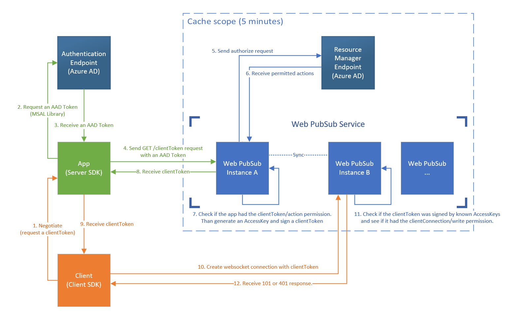

# Auth via Azure Active Directory

In the local auth workflow, we use a permanent `AccessKey` to sign `AccessToken`, which the client uses the `AccessToken` to connect to our service.

Though the `AccessKey` can be regenerated, different service principals share the same `AccessKey` may lead to security issues. And the leak of `AccessKey` (customers have to store the key in their machine or config) is also a problem.

## Supported scenarios

1. Allow servers to call Web PubSub data plane REST API without using local auth methods.

2. Allow clients to connect to Web PubSub Service without using local auth methods.

## Explanation of terms

### `AadToken`

The JWT token signed by _Azure Active Directory_, which could help the service to identify the app server and see if it had permissions to access certain resources.

### `AccessToken (ClientToken)`

The JWT token signed by _app server_, which could help the service to authenticate if the request came from an authorized client.

### `AccessKey`

The key used to sign `AccessToken`.

## Development Plan

- [ ] **Phase 1** Support C# SDK

- [ ] **Phase 2** Support other languages (python/java/golang, etc.)

## Data plane REST API

### Workflow



1. App calls [MSAL library](https://docs.microsoft.com/en-us/azure/active-directory/develop/msal-overview), with credentials in the connection string.

2. App receives the `AadToken` from Azure authentication endpoint.

3. App calls the REST API with the `AadToken` in request headers.

4. Service uses identity info in `AadToken` to authorize the caller, then responses.

### Connection string with AAD credentials

We'd like to encourage our customers to configure their credential in their connection string.

The credential is used to generate `AadToken` from [MSAL library](https://docs.microsoft.com/en-us/azure/active-directory/develop/msal-overview).

#### 1. Managed identity (system-assigned)

> Endpoint=(endpoint);AuthType=aad;Version=1.0;

##### Sample code (C#)

```C#
var credential = new ManagedIdentityCredential();
var context = new TokenRequestContext(new string[] { "https://signalr.azure.com/.default" });
var token = await credential.GetTokenAsync(context);
```

#### 2. Managed identity (user-assigned)

> Endpoint=(endpoint);AuthType=aad;ClientId=(managed identity client id);Version=1.0;

##### Sample code (C#)

```C#
var credential = new ManagedIdentityCredential(clientId);
var context = new TokenRequestContext(new string[] { "https://signalr.azure.com/.default" });
var token = await credential.GetTokenAsync(context);
```

#### 3. Azure application 

> Endpoint=(endpoint);AuthType=aad;ClientId=(application client id);TenantId=(application tenant id);ClientSecret=(application client secret);Version=1.0;

##### Sample code (C#)

```C#
var credential = new ClientSecretCredential(tenantId, clientId, clientSecret);
var context = new TokenRequestContext(new string[] { "https://signalr.azure.com/.default" });
var token = await credential.GetTokenAsync(context);
```

## Websocket connection

For short, instead of generating an `AccessToken` with `AccessKey` while processing negotiation requests,
the server could request an `AccessToken (ClientToken)` from the Web PubSub service with an `AadToken`.

### Workflow



1. Client sends a negotiate request to App to get a `AccessToken`.

2. **App calls [MSAL library](https://docs.microsoft.com/en-us/azure/active-directory/develop/msal-overview), with credentials in the connection string.**

3. **App receives the `AadToken` from Azure authentication endpoint.**

    _The ADD Token contains identity info of the service principal such as objectId, tenantId, groups._

4. **App calls GET `AccessToken` API, align with the `AadToken`.**

5. Service sends a request to Azure resource manager endpoint _(rbac)_.

6. Service receive permitted actions.

7. Service check if the service principal had the _clientToken/action_ permission. If so, get or generate a temporary `AccessKey`, then sign a `AccessToken` with the `AccessKey`.

    _The key id of AccessKey will be associated with the objectId, which means we have the ability to know from which service principal the AccessToken has been signed._

8. **App receives the `AccessToken`.**

9. Client receives the `AccessToken`.

10. Client creates WebSocket connection with the `AccessToken`.

11. Service check if the `AccessToken` was signed by known `AccessKeys` and check if the service principal had the _clientConection/write_ permission.

12. Client receive 101 or 401 response.

### REST API design (ClientToken)

#### GET /auth/clientToken

##### URL

`https://<service endpoint>/api/v1/auth/clientToken`

##### Request

| Name | Type | Required | Sample | Description |
|---|---|---|---|---|
| `hub` | string | \* | chat | The hub name |
| `userId` | string | | foo | The userId for the client |
| `roles` | string | | webpubsub.joinLeaveGroup,webpubsub.sendToGroup | The roles that the client will have, separated by comma. |
| `ttl` | integer | | 5 | The time-to-live minutes for the access token. If not set, the default value is 60 minutes. |

##### Request Sample

```url
GET https://<endpoint>/api/v1/auth/clientToken?hub=chat&userId=foo&roles=webpubsub.joinLeaveGroup,webpubsub.sendToGroup
```

##### Response

Response will be a json object, which contains following properties.

```json
{
    "AccessToken": "<JWT Token>, see https://jwt.io for detailed information.",
}
```

| Name | Description |
|---|---|
| `AccessToken` | The client token that can be used to connect to Web PubSub service. |