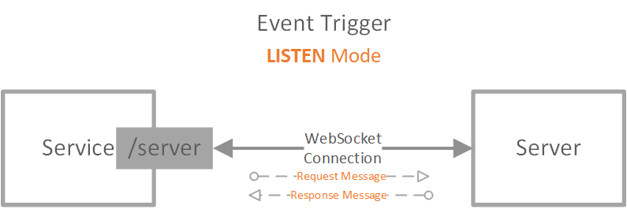
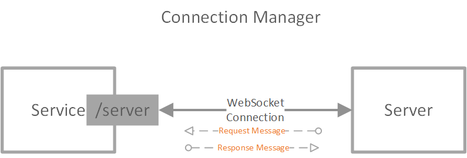
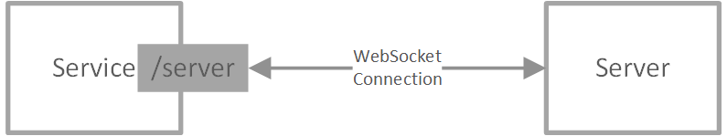

## Azure Web PubSub Service Design Spec [Phase 1]

Azure Web PubSub Service provides an easy way to publish/subscribe messages using simple [WebSocket](https://tools.ietf.org/html/rfc6455) connections.
1. Client can be written in any language having WebSocket support
1. Both text and binary messages are supported within one connection
1. A simple protocol for clients to do publish directly
1. The service manages the WebSocket connections for you

## Table of Content

- [Terms](#terms)
- [Client protocol](#client_protocol)
    - [Simple WebSocket connection](#simple_client)
    - [Client message limit](#client_message_limit)
    - [Client Auth](#client_auth)
- [Server protocol](#server_protocol)
    - [Event handler](#event_handler)
    - [Connection manager](#connection_manager)

## Terms
* **Service**: Azure Web PubSub Service.

* **Hub**: A logic isolation for one application. Different applications can share one Azure Web PubSub service by using different hub names.

* **Group**: Clients can join a group, leave a group, or publish messages to a group. A client can join multiple groups, and a group can contain multiple clients.

* **Client Connection** and **ConnectionId**: A client connects to the `/client` endpoint, when connected, an unique `connectionId` is generated by the service as the unique identity of the client connection. Users can then manage the client connection using this `connectionId`. Details are described in [Client Protocol](#client_protocol) section.

* **Client Events**: Events are created during the lifecycle of a client connection. For example, a simple WebSocket client connection creates a `connect` event when it tries to connect to the service, a `send` event when it tries the send messages to the service, and a `disconnect` event when it disconnects from the service. Details about *client events* are illustrated in [Client Protocol](#client_protocol) section.

* **Event Handler**: The event handler contains the logic to handle the client events. Event handler needs to be registered and configured in the service through the portal or Azure CLI beforehand. Details are described in [Event Handler](#event_handler) section. The place to host the event handler logic is generally considered as the server-side.

* **Server**: The server can handle client events, manage client connections, monitor group messages, and publish messages to groups. The server, comparing to the client, is trustworthy. Details about **server** are described in [Server Protocol](#server_protocol) section.

## Client Protocol

A client connection connects to the `/client` endpoint of the service. In phase 1, it is a [simple WebSocket connection](#simple_client). 

### Simple WebSocket connection
A simple WebSocket client follows a client<->server architecture, as the below sequence diagram shows:

1. When the client starts WebSocket handshake, the service tries to invoke the `connect` event handler (the server) for WebSocket handshake.
2. When the client sends messages, the services triggers the `send` event to the event handler (the server) to handle the messages sent.
3. When the client disconnects, the service tries to trigger the `disconnect` event to the event handler (the server) once it detects the disconnect.

#### Scenarios:
Such connection can be used in a typical client-server architecture, that the client sends messages to the server, and the server handles incoming messages using [Event Handlers](#event_handler). A typical usage would be [GraphQL Subscriptions](https://dgraph.io/docs/graphql/subscriptions/), and a sample can be found [here](). It can also be used when customers leverage existing [subprotocols](https://www.iana.org/assignments/websocket/websocket.xml) in their application logic, for example, `wamp` subprotocol. A sample usage can be found [here]().

### Client message limit
The maximum allowed message size for one WebSocket frame is **1MB**.

### Client Auth

#### Auth workflow
When a client starts a connection to the service, there are 2 ways to do authentication:

1. One way is that the client connects to the service with a JWT token signed by the server. 
2. The other way is when there is a `connect` event handler registered for this client. The service then redirects the auth workflow to the `connect` event handler. The response of the event handler can specify the `userId` and the `role`s the client has, and can decline the client with 401. [Event handler](#event_handler) section contains the details.

The below graph describes the workflow in detail.

## Server Protocol

Server protocol provides the functionality for the user to manage the client connections and the groups.

In general, server protocol contains three roles:
1. [Event handler](#event_handler)
2. [Connection manager](#connection_manager)
3. [Group manager](#group_manager)

### Event handler
The event handler handles the upcoming client events. Event handlers need to be registered and configured in the service through portal or Azure CLI beforehand so that when a client event is triggered, the service can identify if the event is expected to be handled. 

There are two modes for the service to deal with the events that are not registered.
1. One is the `strict` mode: that if the event handler is not configured, the service declines the client triggering the event and declines the service when the service tries to register the event handler through the persistent connection in `Listen` mode described below. This is the recommended mode when the service is running in PRODUCTION.
2. The other is the `loose` mode, that if the event handler is not configured, the service checks if there are connected event handlers. If there exists such an event handler, that event handler is triggered. There is a chance that the behavior can be inconsistent when event handlers are disconnected due to network issues. This mode can make the development experience much easier that users do not need to configure through the portal when adding or modifying events.

There are two ways for the service to invoke the event handler:
1. One way is called `PUSH` mode, that the event handler as the server side, exposes public accessible endpoint for the service to invoke when the event is triggered. It acts as similar to a **webhook**. It It leverages HTTP protocol and the detailed protocol is described in [webpubsub.event.handler.http](./protocols/webpubsub.event.handler.http.md), for every event, it formulates an HTTP POST request to the registered upstream and expects an HTTP response.

2. The other way is called `LISTEN` mode, that the event handler starts a duplex connection to the service when the event handler is available so that the service can invoke the event handler through this duplex connection when the event is triggered. The service exposes the `/server` endpoint for the event handler to connect to using a WebSocket connection, following the message protocol defined in [webpubsub.server.events.proto](./protocols/v1/webpubsub.server.events.proto). The server sends a request message and expects a response message from the duplex connections.

### Connection manager

The server is by nature an authorized user. With the help of the *event handler role*, the server knows the metadata of the clients, for example, `connectionId` and `userId`, so it can:
   1. Close a client connection
   1. Send messages to a client
   1. Send messages to clients that belong to the same user
   1. Add a client to a group
   1. Add clients authed as the same user to a group
   1. Remove a client from a group
   1. Remove clients authed as the same user from a group
   1. Publish messages to a group

The service also provides two ways for the server to do connection management:
1. One way is through REST API as defined in [WebPubSub Swagger File](./protocols/webpubsub.json).

2. Another way is through the WebSocket connection `/server` endpoint. The message protocol is defined in [Protocol Buffers](https://developers.google.com/protocol-buffers/) format as described in [webpubsub.server.manage.proto](./protocols/v1/webpubsub.server.manage.proto). The server implementation can use those available [protobuf serializers](https://developers.google.com/protocol-buffers/docs/tutorials) to send request messages and parse incoming response messages.

You may have noticed that the *event handler role* handles communication from the service to the server while *the manager role* handles communication from the server to the service, it is bi-directional and is a perfect fit for the duplex WebSocket connection to `/server` endpoint. So combing the two roles, the data flow between service and server looks as similar to below:
1. Through HTTP protocol:

2. Through WebSocket connection and protobuf protocol

## Remaining work items
1. Add client message limit for one WebSocket frame
1. Change from Upstream to Event Handler
    1. Portal update
    1. RP Swagger 
    1. RP<->Service data contract
1. Support `strict` and `loose` mode
    1. Portal UI
    1. Configuration
1. Server protocol
    1. Server SDK support
        1. HTTP protocol support targeting 4 languages: C#, JS, Java, and Python
        2. Protobuf over WebSocket protocol targeting 1 language: C# or JS
    1. Service: Service protocol converter
