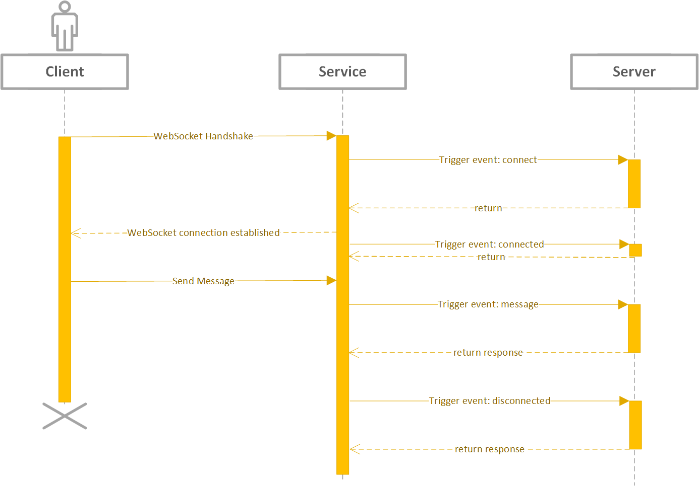
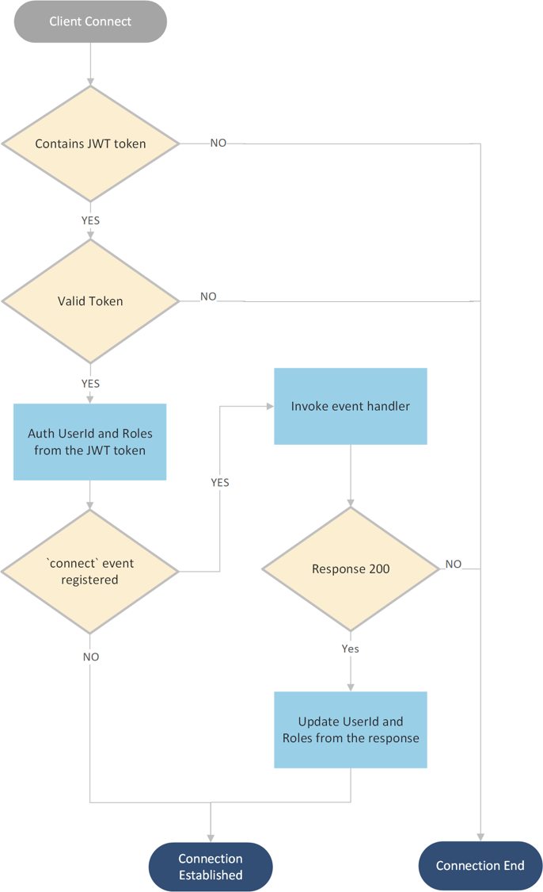

## Azure Web PubSub Service Design Spec [Phase 1]

Azure Web PubSub Service provides an easy way to publish/subscribe messages using simple [WebSocket](https://tools.ietf.org/html/rfc6455) connections.
1. Client can be written in any language having WebSocket support
1. Both text and binary messages are supported within one connection
1. A simple protocol for clients to do publish directly (covered in [Phase 2](./phase-2-subprotocol.md))
1. The service manages the WebSocket connections for you

## Table of Content

- [Terms](#terms)
- [Client protocol](#client_protocol)
    - [Simple WebSocket connection](#simple_client)
    - [Client message limit](#client_message_limit)
    - [Client Auth](#client_auth)
- [Server protocol](#server_protocol)
    - [Event handler](#event_handler)
        - [CloudEvents HTTP protocol](./protocol-cloudevents.md)
    - [Connection manager](#connection_manager)
        - [REST API protocol](./protocol-rest-api.md)

## Terms
* **Service**: Azure Web PubSub Service.

* **Hub**: A logic isolation for one application. Different applications can share one Azure Web PubSub service by using different hub names.

* **Group**: Clients can join a group, leave a group, or publish messages to a group. A client can join multiple groups, and a group can contain multiple clients.

* **Client Connection** and **ConnectionId**: A client connects to the `/client` endpoint, when connected, an unique `connectionId` is generated by the service as the unique identity of the client connection. Users can then manage the client connection using this `connectionId`. Details are described in [Client Protocol](#client_protocol) section.

* **Client Events**: Events are created during the lifecycle of a client connection. For example, a simple WebSocket client connection creates a `connect` event when it tries to connect to the service, a `connected` event when it successfully connected to the service, a `message` event when it sends messages to the service, and a `disconnected` event when it disconnects from the service. Details about *client events* are illustrated in [Client Protocol](#client_protocol) section.

* **Event Handler**: The event handler contains the logic to handle the client events. Event handler needs to be registered and configured in the service through the portal or Azure CLI beforehand. Details are described in [Event Handler](#event_handler) section. The place to host the event handler logic is generally considered as the server-side.

* **Server**: The server can handle client events, manage client connections, monitor group messages, and publish messages to groups. The server, comparing to the client, is trustworthy. Details about **server** are described in [Server Protocol](#server_protocol) section.

## Client Protocol

A client connection connects to the `/client` endpoint of the service. In phase 1, it is a [simple WebSocket connection](#simple_client). 

### Simple WebSocket connection
A simple WebSocket client follows a client<->server architecture, as the below sequence diagram shows:

1. When the client starts WebSocket handshake, the service tries to invoke the `connect` event handler (the server) for WebSocket handshake. Users can use this handler to interpret the WebSocket handshake, determine the subprotocol to use, auth the client, and join the client to some groups.
2. When the client is succuessfully connected, the service invokes a `connected` event handler. It works as some notification and does not block the client from sending messages. Users can use this handler to do some data storage, and can response with messages sending to the client.
2. When the client sends messages, the services triggers the `message` event to the event handler (the server) to handle the messages sent. This is a general event containing the messages sent in a WebSocket frame. User needs to dispatch the messages by their own inside this event handler.
3. When the client disconnects, the service tries to trigger the `disconnected` event to the event handler (the server) once it detects the disconnect.

The events fall into 2 categories:
* synchronous events (blocking)
    Synchronous events block the client workflow. When such event trigger fails, the service drops the clients.
    * `connect`
    * `message`
* asynchronous events (un-blocking)
    Asynchronous events do not block the client workflow, it acts as some notification to the upstream event handler. When such event trigger fails, the service logs the error detail.
    * `connected`
    * `disconnected`
    
#### Scenarios:
Such connection can be used in a typical client-server architecture, that the client sends messages to the server, and the server handles incoming messages using [Event Handlers](#event_handler). A typical usage would be [GraphQL Subscriptions](https://dgraph.io/docs/graphql/subscriptions/), and a sample can be found [here](). It can also be used when customers leverage existing [subprotocols](https://www.iana.org/assignments/websocket/websocket.xml) in their application logic, for example, `wamp` subprotocol. A sample usage can be found [here]().

### Client message limit
The maximum allowed message size for one WebSocket frame is **1MB**.

### Client Auth

#### Auth workflow
When a client starts a connection to the service, there are 2 ways to do authentication:

1. One way is that the client connects to the service with a JWT token signed by the server. 
2. The other way is when there is a `on-connect` event handler registered for this client. The service then redirects the auth workflow to the `on-connect` event handler. The response of the event handler can specify the `userId` and the `role`s the client has, and can decline the client with 401. [Event handler](#event_handler) section contains the details.

The below graph describes the workflow in detail.

## Server Protocol

Server protocol provides the functionality for the user to manage the client connections and the groups.

In general, server protocol contains 2 roles:
1. [Event handler](#event_handler)
2. [Connection manager](#connection_manager)

### Event handler
The event handler handles the upcoming client events. Event handlers need to be registered and configured in the service through portal or Azure CLI beforehand so that when a client event is triggered, the service can identify if the event is expected to be handled. In Phase 1, we use `PUSH` mode to invoke the event handler: that the event handler as the server side, exposes public accessible endpoint for the service to invoke when the event is triggered. It acts as a **webhook**. It leverages [CloudEvents HTTP protocol binding](https://github.com/cloudevents/spec/blob/v1.0.1/http-protocol-binding.md) and the detailed protocol is described in [WebPubSub CloudEvents Protocol](./protocol-cloudevents.md), for every event, it formulates an HTTP POST request to the registered upstream and expects an HTTP response.

### Connection manager

The server is by nature an authorized user. With the help of the *event handler role*, the server knows the metadata of the clients, for example, `connectionId` and `userId`, so it can:
   1. Close a client connection
   1. Send messages to a client
   1. Send messages to clients that belong to the same user
   1. Add a client to a group
   1. Add clients authed as the same user to a group
   1. Remove a client from a group
   1. Remove clients authed as the same user from a group
   1. Publish messages to a group

In Phase 1, the service provides REST APIs as defined in [WebPubSub Swagger File](./protocol-rest-api.md) for the server to do connection management:

You may have noticed that the *event handler role* handles communication from the service to the server while *the manager role* handles communication from the server to the service. So combing the two roles, the data flow between service and server looks as similar to below leveraging HTTP protocol:

## Remaining work items
1. Add client message limit for one WebSocket frame
1. Change from Upstream to Event Handler
    1. Portal update
    1. RP Swagger 
    1. RP<->Service data contract
1. [CloudEvents](https://github.com/cloudevents/spec) support for event handlers