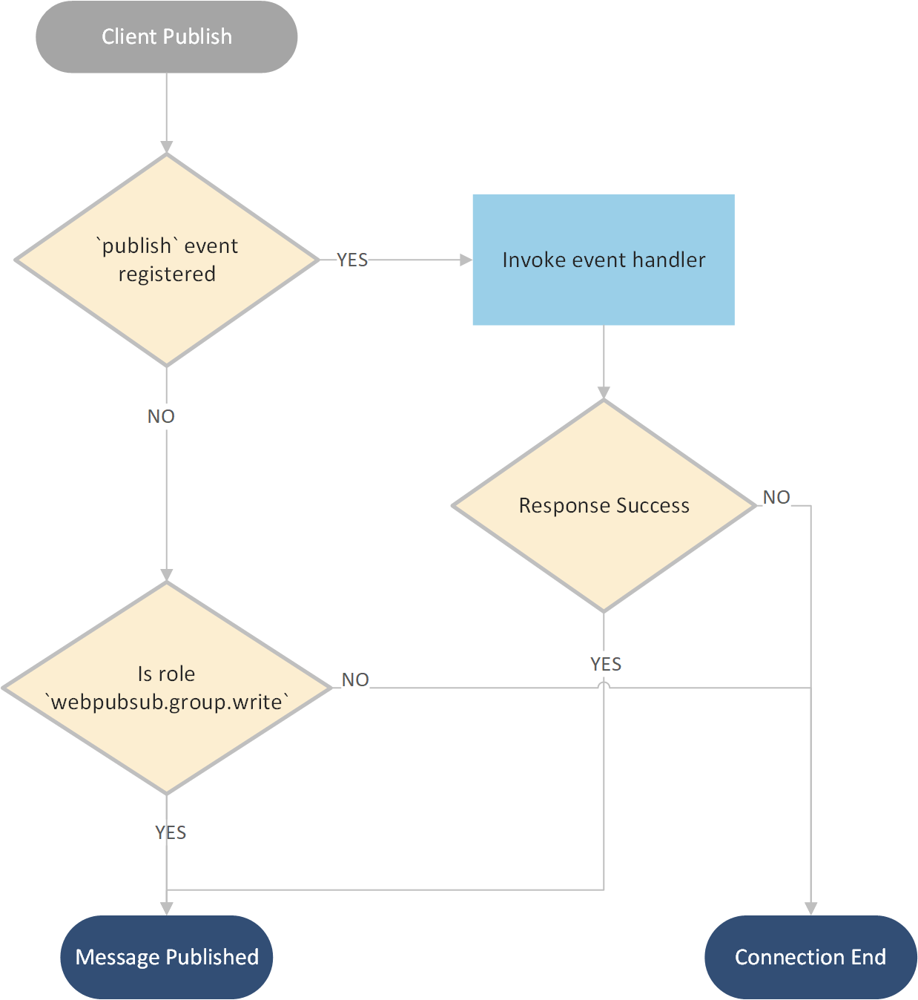

## Azure Web PubSub Service Design Spec [Phase 2]

Based on the concepts and architecture described in [Phase 1](./phase-1-simple-websocket-client.md), Phase 2 introduces a new client subprotocol that the service natively supports to enable a more convenient development experience for some typical scenarios. 

Please note that the development of phase 2 does not have many dependencies on phase 1, and can be developed simultaneously.

## Table of Content
- [Client protocol](#client_protocol)
    - [Client with `json.webpubsub.azure.v1` subprotocol](#command_subprotocol)
    - [Client Auth](#client_auth)
- [Server protocol](#server_protocol)

## Terms

Terms are the same as [Terms in Phase 1](./phase-1-simple-websocket-client.md#terms)

<a name="client_protocol"></a>

## Client Protocol

A client connection connects to the `/client` endpoint of the service. It can be a [simple WebSocket connection](./phase-1-simple-websocket-client.md#simple_client), or a WebSocket connection having [json.webpubsub.azure.v1](#command_subprotocol) subprotocol which enables the client to do publish/subscribe directly. 

You may have noticed that with a simple WebSocket Connection [described in phase 1](./phase-1-simple-websocket-client.md#simple_client), the *server* is a MUST HAVE role to handle the events from clients, to do advanced operations for the clients such as join the clients to some groups or to publish messages to the connected clients. We introduced in a simple [json.webpubsub.azure.v1](#command_subprotocol) to empower clients to do publish and subscribe more conveniently and efficiently.

<a name="command_subprotocol"></a>

### Client with `json.webpubsub.azure.v1` subprotocol
As described in the earlier section, a simple WebSocket connection always triggers a `send` event when it sends messages, and always relies on the server-side to process messages and do other operations. With the help of the `json.webpubsub.azure.v1` subprotocol, an authorized client can join a group and publish messages to a group directly. It can also route messages to different upstreams (event handlers) by customizing the *event* the message belongs. 

protocol: `json.webpubsub.azure.v1`

Join a group:
```json
{
    "type": "join",
    "group": "group_name",
    "ack_id" : 1 // optional
}
```
`ack_id` is an incremental integer for this command message, it is also optional. When the "ack_id" is specified, the service sends a [ack response message](#ack_response) back to the client when the command is executed.

Leave a group:
```json
{
    "type": "leave",
    "group": "group_name",
    "ack_id" : 1 // optional
}
```
`ack_id` is an incremental integer for this command message, it is also optional. When the "ack_id" is specified, the service sends a [ack response message](#ack_response) back to the client when the command is executed.

Publish message to a group:

```json
{
    "type": "publish",
    "group": "<group_name>",
    "data": {}, // or string or array
    "ack_id" : 1 // optional
}
```

Custom events:
```json
{
    "type": "event",
    "event": "<event_name>",
    "data": {}, // or string or array
}
```

`ack_id` is an incremental integer for this command message, it is also optional. When the "ack_id" is specified, the service sends a [ack response message](#ack_response) back to the client when the command is executed.

Custom event `<event_name>` will always be handled by the event handler registered. If no such event handler is registered, the connection will be declined. Such custom events can be helpful if you want messages to be dispatched to different servers having different event handlers.

These keywords start the message frame, they can be `text` format for text message frames or UTF8 encoded binaries for binary message frames.

Service declines the client if the message does not match the described format.

Messages received by the client can be several types: `ack`, `message`, and `system`: 
1. Ack message, if the request contains `ack_id`, the service will return an ack response for this request. The client implementation should handle this ack mechanism, including waiting for the ack response for an `async` `await` operation, and having a timeout check when the ack response is not received during a certain period.
    ```json
    {
        "type": "ack",
        "ack_id": 1, // The ack id for the request to ack
        "code": 0, // 0 as "success", 1 as "error"
        "error": "<error_detail>"
    }
    ```
    The client implementation should always first check if the `code` is `0` or `1`. Only when `code` is `1` should the client reads from `error`.

1. When the message is from a group `publish`
    ```json
    {
        "type": "message",
        "from": "group",
        "group": "<group_name>",
        "data" : {} // or string or array
    }
    ```

1. The message is from the server. As described in [server protocol](#server_protocol), the server can send messages to a client as a [connection manager](#connection_manager) role.
    ```json
    {
        "type": "message",
        "from": "server",
        "data": {} // or string or array
    }
    ```

1. The message is from a system event, for example, when the server closes the connection, or when the service declines the client.

    ```json
    {
        "type": "system",
        "event": "close",
        "message": "reason"
    }
    ```

#### Scenarios:
Such clients can be used when clients want to talk to each other. Messages are sent from `client1` to the service and the service delivers the message directly to `client2` if the clients are authorized.

Client1:

```js
var client1 = new WebSocket("wss://xxx.webpubsub.azure.com/client", "json.webpubsub.azure.v1");
client1.onmessage = e => {
    if (e.data) {
        var message = JSON.parse(e.data);
        if (message.type === "message" 
        && message.group === "Group1"){
            // Only print messages from Group1
            console.log(message.data);
        }
    }
};

client1.onopen = e => {
    client1.send(JSON.stringify({
        type: "join",
        group: "Group1"
    }));
    client1.send(JSON.stringify({
        type: "publish",
        group: "Group2",
        data: "Hello Client2"
    });
};
```

Client2:

```js
var client2 = new WebSocket("wss://xxx.webpubsub.azure.com/client", "json.webpubsub.azure.v1");
client2.onmessage = e => {
    if (e.data) {
        var message = JSON.parse(e.data);
        if (message.type === "message" 
        && message.group === "Group2"){
            // Only print messages from Group2
            console.log(message.data);
        }
    }
};

client2.onopen = e => {
    client1.send(JSON.stringify({
        type: "join",
        group: "Group2"
    }));
    client1.send(JSON.stringify({
        type: "publish",
        group: "Group1",
        data: "Hello Client1"
    });
};
```

<a name="client_auth"></a>

### Client Auth

<a name="client_roles"></a>

#### Client roles

Client roles only applies for the [`json.webpubsub.azure.v1` subprotocol](#command_subprotocol). When the client is authed and connected, the roles of the client determine the actions the client has permissions to do:

| Role | Permission |
|---|---|
| Not specified | The client can send events.
| `wps.group.join` | The client can join/leave any group
| `wps.group.write` | The client can publish messages to any group
| `wps.joined.write` | The client can publish messages to groups it already **joined in**.
| `wps.group.join.<group>` | The client can join/leave the groups that the group name is `<group>`.
| `wps.group.write.<group>` | The client can publish messages to the groups that the group name is `<group>`.

Client roles can be assigned:
1. when the client connects with an auth token, and 
2. can be granted with the `connect` event handler, and also, 
3. can be granted through [server protocol](#connection_manager).

#### Client publish
The below graph describes the workflow when the client tries to publish messages to the group:



When the client tries to publish messages to a group: 
1. The service checks if the `publish` event is registered for the client,
2. If not, a client with the role `wps.group.write` can publish.
3. If the event is registered, the service invokes the event handler and respect the response of the event handler to decide if the action is allowed.

Please note that **ONLY** **METADATA** for the `Publish` is sent to the event handler, the actual message to be published is not sent to the event handler.

When the client tries to join/leave a group, the workflow is similar:
1. The service checks if the `join`/`leave` event is registered for the client
2. If not, a client with the role `wps.group.join` can join/leave the group.
3. If the event is registered, the service invokes the event handler and respect the response of the event handler to decide if the action is allowed.

## Server Protocol
To support the subprotocol `json.webpubsub.azure.v1`, the service provides 3 more functionalities to control client roles dynamically:
1. Grant [client roles](#client_roles) to a client
1. Revoke roles from a client
1. Get current roles of a client

 [WebPubSub Swagger File](./protocols/webpubsub.json).
 
 [webpubsub.server.manage.proto](./protocols/v1/webpubsub.server.manage.proto)

## Remaining work items
1. Service: support client subprotocol `json.webpubsub.azure.v1`
    1. C->S: Parse and dispatch protocol messages
    1. S->C: Ack message handler
    1. Support Client Role control flow
    1. Client Role CRUD