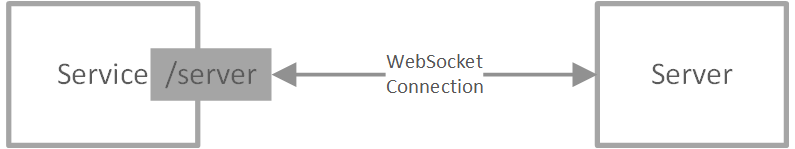

## Azure Web PubSub Service Design Spec [Phase 3]

In phase 3, we add a `LISTEN` mode for event handlers with protobuf protocol to describe the event messages. Meanwhile, the *connection manager* role of the server protocol also supports protobuf protocol to manage the service. Combining the *event handler* role and the *connection manager* role, the server protocol supports protobuf protocol over WebSocket connection to do duplex communication between the service and server. Details to be illustrated below.

## Table of Content

- [Server protocol](#server_protocol)
    - [Event handler](#event_handler)
    - [Connection manager](#connection_manager)

## Background

This spec follows the terms and concepts described in [Phase 1](./phase-1-simple-websocket-client.md) and [Phase 2](./phase-2-subprotocol.md).

## Server Protocol

### Event handler
In [Phase 1](./phase-1-simple-websocket-client.md#server_protocol) we described the `PUSH` mode event handler that works as a Webhook.

Here we introduce in another mode called `LISTEN` mode, that the event handler starts a duplex connection to the service when the event handler is available so that the service can invoke the event handler through this duplex connection when the event is triggered. The service exposes the `/server` endpoint for the event handler to connect to using a WebSocket connection, following the message protocol defined in [webpubsub.server.events.proto](./protocols/v1/webpubsub.server.events.proto). The server sends a request message and expects a response message from the duplex connections.

When service handles upcoming events, it also has two modes to deal with the events that are not registered.
1. One is the `strict` mode: that if the event handler is not configured, the service declines the client triggering the event and declines the service when the service tries to register the event handler through the persistent connection in `LISTEN` mode described below. This is the recommended mode when the service is running in PRODUCTION.
2. The other is the `loose` mode, that if the event handler is not configured, the service checks if there is any connected event handler. If there exists such an event handler, that event handler is triggered. There is a chance that the behavior can be inconsistent when event handlers are disconnected due to network issues. This mode can make the development experience much easier that users do not need to configure through the portal when adding or modifying events.

### Connection manager
In [Phase 1](./phase-1-simple-websocket-client.md#connection_manager) we provide REST APIs for server to manage the connections. 

Here we provide another way to send management messages through the WebSocket connection `/server` endpoint. The message protocol is defined in [Protocol Buffers](https://developers.google.com/protocol-buffers/) format as described in [webpubsub.server.manage.proto](./protocols/v1/webpubsub.server.manage.proto). The server implementations can use those available [protobuf serializers](https://developers.google.com/protocol-buffers/docs/tutorials) to send request messages and parse incoming response messages.

You may have noticed that the *event handler role* handles communication from the service to the server while *the manager role* handles communication from the server to the service, it is bi-directional and is a perfect fit for the duplex WebSocket connection to `/server` endpoint. 

So we can say that the functionalities this spec adds is actually providing a protobuf over WebSocket protocol binding for the server protocol:

## Remaining work items
1. Service: support server connections `/server`
1. Service: support client routing
1. Support `LISTEN` mode
    1. Portal UI
    1. Configuration
1. Support `strict` and `loose` mode
    1. Portal UI
    1. Configuration
1. Server protocol
    1. Server SDK support
        1. Protobuf over WebSocket protocol targeting 1 language: C# or JS
    1. Service: Service protocol converter
