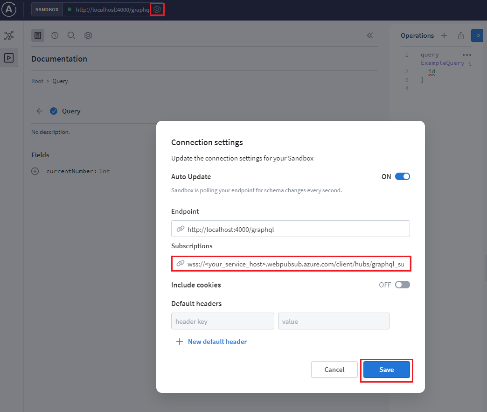
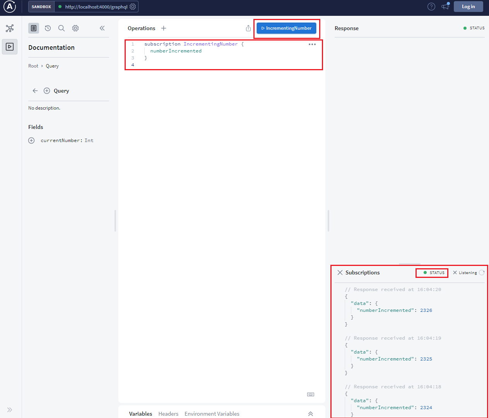

# webpubsub-apollo-experimental

## Introduction
[Microsoft Azure Web PubSub](https://docs.microsoft.com/en-us/azure/azure-web-pubsub/overview) is a real-time messaging cloud service.

In GraphQL, `subscriptions` are long-lasting GraphQL read operations that can update their result whenever a particular server-side event occurs. And it is usually implemented with WebSocket protocol. 

This package helps developers use Microsoft Azure WebPub service to avoid server-side maintenance of WebSocket connections between users clients and GraphQL server caused by `subscriptions` query from clients.

<!-- TO ADD
Secondly, this package provides a replacement for `PubSub` using Azure Web PubSub service. [PubSub](https://www.apollographql.com/docs/apollo-server/data/subscriptions/#the-pubsub-class) is an in-memory event-publishing system provided by [Apollo server](https://www.apollographql.com/docs/apollo-server/data/subscriptions/).
-->

Let's show how to apply the package into [the subscription sample provided by Apollo GraphQL](https://github.com/apollographql/docs-examples/tree/50808f11c5cfeaf029422dee3a3b324a6e93783e/apollo-server/v3/subscriptions).

## Get the subscription sample

> [!NOTE]
>
> Please Note that this document is based on [sample commit 50808f11c5](https://github.com/apollographql/docs-examples/tree/50808f11c5cfeaf029422dee3a3b324a6e93783e/apollo-server/v3/subscriptions), the latest version as of the time of writing the document.

```batch
git clone https://github.com/apollographql/docs-examples
cd docs-examples
git checkout 50808f11c5cfeaf02
cd apollo-server/v3/subscriptions
yarn install
```

## Add the `webpubsub-apollo-subscription` package

Since the original sample uses yarn, to keep consistency, we use `yarn` to add the package.

```batch
yarn add webpubsub-apollo-subscription
```

## Update `index.js` to use the package

1. import `WebPubSubServerAdapter`:

  ```javascript
  const { WebPubSubServerAdapter } = require("webpubsub-apollo-subscription");
  ```

2. Update `SubscriptionServer.create` to use a `WebPubSubServerAdapter` instance
    Note that we read the connection string from environment. Connection string is used to connect to Azure Web PubSub and we will get the value in later steps.
    
    ```javascript
    const serverAdapter = new WebPubSubServerAdapter(
      {
        connectionString: process.env.WebPubSubConnectionString,
        hub: "graphql_subscription",
        path: "/graphql_subscription",
      },
      app
    );
    SubscriptionServer.create({ schema, execute, subscribe }, serverAdapter);
    ```

3. Also print out subscription endpoint and event handler endpoint
    Add the logs after httpServer starts. These endpoints will be used in later setup.
    
    ```javascript
    serverAdapter.getSubscriptionPath().then((v) => {
      console.log(`🚀 Subscription endpoint ready at ${v}`);
      console.log(
        `🚀 Event handler listens at http://localhost:${PORT}${serverAdapter.path}`
      );
    });
    ```

The complete code change can be found [here](./demos/client-websockets/demo-awps.ts).

## Setup the Azure Web PubSub resource and configurations

### 1. Create a Azure Web PubSub service

Follow the [instruction](https://docs.microsoft.com/en-us/azure/azure-web-pubsub/quickstart-cli-create) to create an Azure Web PubSub service.

Get the ConnectionString of the service for later use:

```azurecli
az webpubsub key show --name "<your-unique-resource-name>" --resource-group "myResourceGroup" --query primaryConnectionString
```

Copy the fetched ConnectionString and it will be used later in this article as the value of `<connection_string>`.

### 2. Run the local demo

Run the below command with `<connection_string>` replaced by the value fetched in the above step:

Linux:

```bash
export WebPubSubConnectionString="<connection_string>"
yarn start
```

Windows:

```cmd
SET WebPubSubConnectionString=<connection_string>
yarn start
```

The console log shows the exposed endpoints:

```
🚀 Query endpoint ready at http://localhost:4000/graphql
🚀 Subscription endpoint ready at wss://<your-unique-resource-name>.webpubsub.azure.com/client/hubs/graphql_subscription
🚀 Event handler listens at http://localhost:4000/graphql_subscription/
```

The console log shows that the exposed endpoint for Azure Web PubSub event handlers is `http://localhost:4000/graphql_subscription/`. Let's expose this local endpoint to public so that the Azure Web PubSub can redirect traffic to your localhost.

### Use localtunnel to expose localhost

[localtunnel](https://github.com/localtunnel/localtunnel) is an open-source project that help expose your localhost to public. [Install the tool](https://github.com/localtunnel/localtunnel#installation) and run:

```bash
lt --port 4000 --print-requests
```

localtunnel will print out an url (`https://<domain-name>.loca.lt`) that can be accessed from internet, e.g. `https://xxx.loca.lt`.

> Tip:
> There is one known issue that [localtunnel goes offline when the server restarts](https://github.com/localtunnel/localtunnel/issues/466) and [here is the workaround](https://github.com/localtunnel/localtunnel/issues/466#issuecomment-1030599216)  

There are also other tools to choose when debugging the webhook locally, for example, [ngrok](​https://ngrok.com/), [loophole](https://loophole.cloud/docs/), [TunnelRelay](https://github.com/OfficeDev/microsoft-teams-tunnelrelay) or so. Some tools might have issue returning response headers correctly. Try the following command to see if the tool is working properly:

```bash
curl https://<domain-name>.loca.lt/graphql_subscription/validate -X OPTIONS -H "WebHook-Request-Origin: *" -H "ce-awpsversion: 1.0" --ssl-no-revoke -i
```

Check if the response header contains `webhook-allowed-origin: *`. This curl command actually checks if the WebHook [abuse protection request](https://docs.microsoft.com/azure/azure-web-pubsub/reference-cloud-events#webhook-validation) can response with the expected header.


### Configure event handlers

Since GraphQL has its own Authentication logic, `graphql_subscription` hub can allow anonymous connect and delegate all the event handling to the upstream. Setting the event handler through Azure CLI with below command:

```azurecli
az webpubsub hub create --hub-name graphql_subscription --name "<your-unique-resource-name>" --resource-group "myResourceGroup" --allow-anonymous --event-handler url-template=http://<your-localtunnel-id>.loca.lt/{hub}/{event} user-event-pattern=* system-event=connect system-event=disconnected system-event=connected
```

### Open GraphQL Explorer and update the subscription URL

1. Open http://localhost:4000/graphql and click **Query your server**, click the top settings gear, and update the subscription URL to the Web PubSub endpoint `wss://<your-unique-resource-name>.webpubsub.azure.com/client/hubs/graphql_subscription`. 



2. Update the operations to query the incremental number and run:

```graphql
subscription IncrementingNumber {
  numberIncremented
}
```

You can see that the subscription updates are consistently pushed to the GraphQL clients through the WebSocket connection.



Check the internals of the package here:
* [Use Web PubSub to host WebSocket connections for GraphQL subscription](./how-to-host-websockets.md)
