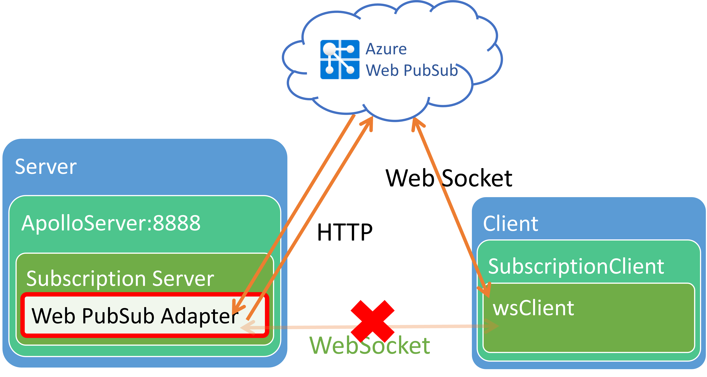

# Use Web PubSub to host WebSocket connections for GraphQL subscription

## Introduction
[GraphQL Subscription](https://graphql.org/blog/subscriptions-in-graphql-and-relay/) is a GraphQL supported long-lasting operation. When a GraphQL client defines a `subscription` operation, the client gets real-time update pushes from the server. The client maintains a persistent connection to the GraphQL server so that the server can push the subscription's result to the client. The most commonly used technology is via WebSocket. Azure Web PubSub helps to host and manage WebSocket connections for you and sounds perfect fit into this GraphQL Subscription scenario. In this article, we show how to enable Azure Web PubSub in the popular open-source GraphQL platform [Apollo](https://www.apollographql.com/) to host the WebSocket clients. We start from the [subscription demo](./demos/client-websockets/demo-without-awps.ts) which is a fork from the [subscription sample](https://github.com/apollographql/docs-examples/tree/50808f11c5cfeaf029422dee3a3b324a6e93783e/apollo-server/v3/subscriptions) provided by Apollo.

## Architecture

The default implementation for [apollo-subscription] uses [subscriptions-transport-ws] package. When the GraphQL server starts, it also starts a WebSocket server. When the GraphQL client starts a subscription operation, it starts a WebSocket connection to the server. The below diagram describes the code structure of `subscription-transport-ws`:


When using Azure Web PubSub, the clients starts the WebSocket connections with the Azure Web PubSub, and Azure Web PubSub turns the lifecycle of the client connection into events, and invoke the upstream GraphQL server through HTTP invokes. The below diagram describes the updated code structure when using Azure Web PubSub:



## Implementation

As the code structure shows, what we need to do is to replace the transport layer of the GraphQL subscription server. Instead of receiving and sending messages directly through the WebSocket server, we now override the logic to receive from the HTTP event handler listen and send messages through Azure Web PubSub SDK. [WebPubSubServerAdapter.ts](./src/WebPubSubServerAdapter.ts) contains the complete code for the replaced transport layer. 

Inside this [WebPubSubServerAdapter.ts](./src/WebPubSubServerAdapter.ts):

1. `ClientConnectionContext` class: A logical `ClientConnectionContext` that stands for a GraphQL client connection, every connection has a unique `connectionId`. It overrides method `send` and send messages back to its connection through Azure Web PubSub using `WebPubSubServiceClient`. 
1. `WebPubSubServerAdapter` class: It replaces original `WebSocket.Server` to communicate between the GraphQL server and the Azure Web PubSub service. It listens to the incoming Azure Web PubSub events using `WebPubSubEventHandler` provided by the Azure Web PubSub SDK and dispatches message to different `ClientConnectionContext` using the `connectionId` of each client.

## Using `WebPubSubServerAdapter`

Let's update the [subscription demo](./demos/client-websockets/demo-without-awps.ts) to use `WebPubSubServerAdapter`. The usage is pretty straight forward, simply create a `WebPubSubServerAdapter` object and use this `WebPubSubServerAdapter` when creating `SubscriptionServer`:

```typescript
const serverAdapter = new WebPubSubServerAdapter(
{
    connectionString: process.env.WebPubSubConnectionString,
    hub: "graphql_subscription",
    path: "/graphql_subscription",
},
app
);
server.applyMiddleware({ app });
SubscriptionServer.create({ schema, execute, subscribe }, serverAdapter);

```

Compare [subscription demo using Azure Web PubSub](./demos/client-websockets/demo-awps.ts) with the [original subscription demo](./demos/client-websockets/demo-without-awps.ts) to see the complete code changes.

## Run the demo locally and use Azure Web PubSub

### 1. Create a Azure Web PubSub service

Follow the [instruction](https://docs.microsoft.com/en-us/azure/azure-web-pubsub/quickstart-cli-create) to create an Azure Web PubSub service.

Get the ConnectionString of the service for later use:

```azurecli
az webpubsub key show --name "<your-unique-resource-name>" --resource-group "myResourceGroup" --query primaryConnectionString
```

Copy the fetched ConnectionString and it will be used later in this article as the value of `<connection_string>`.

### 2. Run the local demo

Run the below command with `<connection_string>` replaced by the value fetched in the above step:

Linux:

```bash
export WebPubSubConnectionString="<connection_string>"
npm install
npm run demo:client
```

Windows:

```cmd
SET WebPubSubConnectionString=<connection_string>
npm install
npm run demo:client
```

The console log shows that the exposed endpoint for Azure Web PubSub event handlers is `http://localhost:4000/graphql_subscription/`.

### Use `awps-tunnel` to tunnel traffic from Web PubSub service to your localhost

```bash
npm install -g @azure/web-pubsub-tunnel-tool
export WebPubSubConnectionString="<connection_string>"
awps-tunnel run --hub graphql_subscription --upstream http://localhost:4000
```

### Configure event handlers

Since GraphQL has its own Authentication logic, `graphql_subscription` hub can allow anonymous connect and delegate all the event handling to the upstream. Setting the event handler through Azure CLI with below command (don't forget to replace `<your-unique-resource-name>` with your own one):

```azurecli
az webpubsub hub create --hub-name graphql_subscription --name "<your-unique-resource-name>" --resource-group "myResourceGroup" --allow-anonymous --event-handler url-template=tunnel:///{hub}/{event} user-event-pattern=* system-event=connect system-event=disconnected system-event=connected
```

### Open GraphQL Explorer and update the subscription URL

1. Open http://localhost:4000/graphql and click **Query your server**, click the top settings gear, and update the subscription URL to the Web PubSub endpoint `wss://<your-unique-resource-name>.webpubsub.azure.com/client/hubs/graphql_subscription`. 


2. Update the operations to query the incremental number and run:

```graphql
subscription IncrementingNumber {
  numberIncremented
}
```

You can see that the subscription updates are consistently pushed to the GraphQL clients through the WebSocket connection.


<!-- TODO: Add PubSub part
## Next step

In this article, we show how to use Azure Web PubSub to host and manage GraphQL Subscription WebSocket connections. Actually Web PubSub can also be used as a Pub/Sub backend engine to sync data between GraphQL servers. [Use Azure Web PubSub for GraphQL Pub/Sub]() describes how to.

 -->