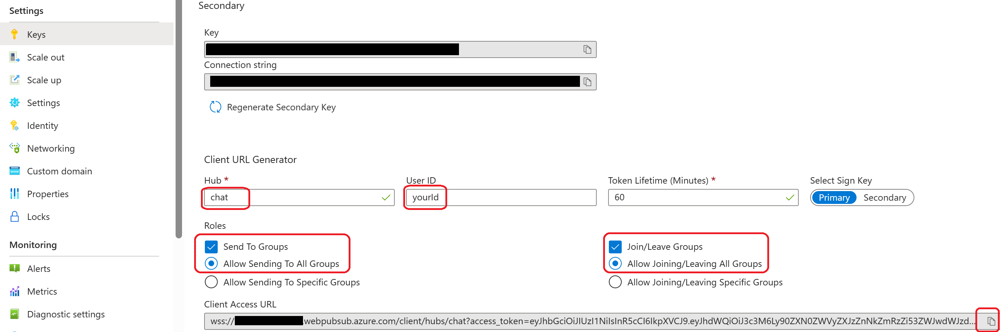
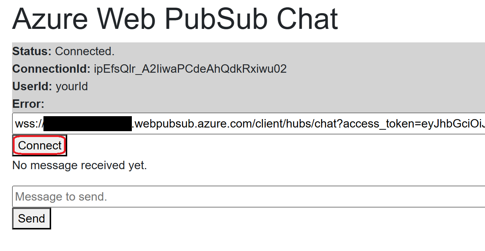

# Create a chat app by Blazor WebAssembly

This sample is to help you create a chat app by Blazor WebAssembly.

## Prerequisites

1. [Asp.Net Core 6.0 or above](https://docs.microsoft.com/aspnet/core).
1. Create an [Azure Web PubSub](https://ms.portal.azure.com/#blade/HubsExtension/BrowseResource/resourceType/Microsoft.SignalRService%2FWebPubSub) resource on Azure Portal

## Getting started

1. Compile and run your project.
   ```
   dotnet run --urls http://localhost:8080
   ```
1. [Open page](http://localhost:8080) in your browser.
1. Get the url in your Azure Web PubSub service.
   
1. Copy it to app, then click connect button.
   
