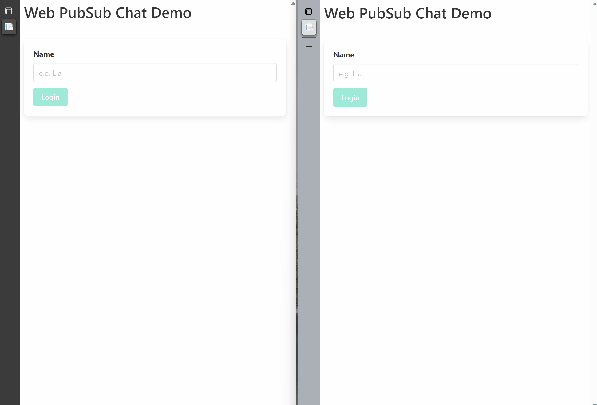

# Create a Chat app with storage

## Overview
This demo shows how to work with storage to create a chat sample having chat history and states.

## Prerequisites

1. [ASP.NET Core 6.0 or above](https://docs.microsoft.com/aspnet/core)
2. Create an [Azure Web PubSub](https://ms.portal.azure.com/#blade/HubsExtension/BrowseResource/resourceType/Microsoft.SignalRService%2FWebPubSub) resource on Azure Portal
3. [localtunnel](https://github.com/localtunnel/localtunnel) to expose our localhost to internet

## Provision storage service for data

We support the dependency injection (DI) software design pattern for the storage of messages and sessions.

### Store the data in memory

Sometimes we don't need to store data in a real database (For example, in a dev/test environment.)
Register [InMemoryChatStorage](./ChatStorage/InMemory/InMemoryChatStorage.cs) when DI services.

```cs
services.AddSingleton<IChatHandler, InMemoryChatStorage>();
```

### Store the data in Azure Table

> If you don't have an Azure Storage Account, **[start now](https://azure.microsoft.com/en-us/services/storage/tables/)** to create one for your project.

Use [AzureTableChatStorage](./ChatStorage/AzureTable/AzureTablChatStorage.cs) with Azure Table connection string when DI services.

```cs
builder.Services.AddSingleton<IChatHandler, AzureTableChatStorage>();
```

## Start the server
Now set the connection string in the [Secret Manager](https://docs.microsoft.com/en-us/aspnet/core/security/app-secrets?view=aspnetcore-2.1&tabs=visual-studio#secret-manager) tool for .NET Core, and run this app.

> Get Azure Web PubSub connection string from **Kyes** tab of the Azure Web PubSub service

```
dotnet restore
dotnet user-secrets set Azure:Storage:ConnectionString "<Your Azure Storage's connection string>"
dotnet user-secrets set Azure:WebPubSub:ConnectionString "<Your Azure Web PubSub's connection string>"
dotnet run --urls http://localhost:8080
```

The server is then started:
* The web page is http://localhost:8080/index.html
* The web app is listening to event handler requests at http://localhost:8080/eventhandler

## Use localtunnel to expose localhost

[localtunnel](https://github.com/localtunnel/localtunnel) is an open-source project that help expose your localhost to public. [Install the tool](https://github.com/localtunnel/localtunnel#installation) and run:

```bash
lt --port 8080 --print-requests
```

localtunnel will print out an url (`https://<domain-name>.loca.lt`) that can be accessed from internet, e.g. `https://xxx.loca.lt`.

> Tip:
> There is one known issue that [localtunnel goes offline when the server restarts](https://github.com/localtunnel/localtunnel/issues/466) and [here is the workaround](https://github.com/localtunnel/localtunnel/issues/466#issuecomment-1030599216)  

There are also other tools to choose when debugging the webhook locally, for example, [ngrok](​https://ngrok.com/), [loophole](https://loophole.cloud/docs/), [TunnelRelay](https://github.com/OfficeDev/microsoft-teams-tunnelrelay) or so. Some tools might have issue returning response headers correctly. Try the following command to see if the tool is working properly:

```bash
curl https://<domain-name>.loca.lt/eventhandler -X OPTIONS -H "WebHook-Request-Origin: *" -H "ce-awpsversion: 1.0" --ssl-no-revoke -i
```

Check if the response header contains `webhook-allowed-origin: *`. This curl command actually checks if the WebHook [abuse protection request](https://docs.microsoft.com/azure/azure-web-pubsub/reference-cloud-events#webhook-validation) can response with the expected header.

## Configure the event handler

Event handler can be set from portal or through Azure CLI, here contains the detailed [instructions](https://docs.microsoft.com/azure/azure-web-pubsub/howto-develop-eventhandler) for how to.

Go to the **Settings** tab to configure the event handler for this `Sample_ChatApp` hub:

1. Click **Add** to add setting for hub `Sample_ChatWithStorageHub`.

2. Set:
    * Url template: `https://<domain-name>.loca.lt/eventhandler`
    * System event: check `connected` and `disconnected` 
    * User event: select `All`.

## Start the chat

Open http://localhost:8080/index.html, input your user name, and send messages.

You can see in the localtunnel command window that there are requests coming in with every message sent from the page.



	
### Use your own database

If you want to use your own database to store the messages and sessions, you should create a class which implements [IChatHandler](./ChatStorage/IChatHandler.cs).

Then, register your services in `Startup.ConfigureServices` like above and run the app

When you open http://localhost:8080, you can see the application using the configured storage services.