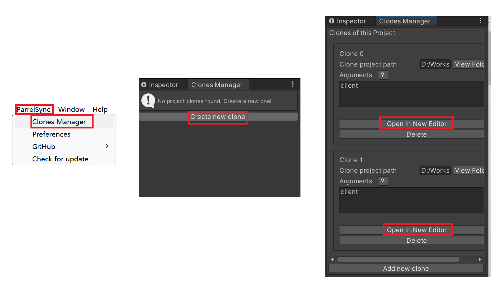

# Unity Multiplayer Sample

This sample show off how to use [Azure Realtime Transport for Unity](https://github.com/wanlwanl/multiplayer-community-contributions/tree/wanl/transport/Transports/com.community.netcode.transport.azure-realtime) and use Live Trace tool to monitor events in real time. The underlying connection of the network replication is via Websockets. This is useful especially for WebGL platform since UDP is not available on it.

## Demo

You'll get a demo one server and two clients synchronizing locations via Azure Web PubSub service in the end. And view live events in real time in live trace tool

## Prerequisite

* Git
* Unity Editor 2022.2.2f1c1
* Dotnet 6.0
* Windows terminal

## Quick Start

1. Start sample in Unity Editor:
   1. Clone this repo `git clone https://github.com/Azure/azure-webpubsub`
   2. Open `<ROOT>/samples/csharp/unity-multiplayer-sample` from Unity Hub (todo: change folder name)
2. Create project clones to run games in editor:
   1. Click `ParrelSync` in menu bar
   2. Click `Clone Manager`, it will open `Clone Manager` panel
   3. Click `Create new clone`, and create 2 clones, they will be use as clients
   4. Click `Open in New Editor` to open the clones

3. Prepare Azure Web PubSub service:
   1. Create Azure Web Pub in [Azure portal](https://learn.microsoft.com/azure/azure-web-pubsub/howto-develop-create-instance) or via [Azure CLI](https://learn.microsoft.com/azure/azure-web-pubsub/quickstart-cli-create)
   2. [Launch Live trace tool](https://learn.microsoft.com/azure/azure-web-pubsub/howto-troubleshoot-resource-logs#launch-the-live-trace-tool) for monitoring live events later
   3. [Copy connection string](https://learn.microsoft.com/azure/azure-web-pubsub/tutorial-pub-sub-messages?tabs=csharp%2CLocalBash#get-the-connection-string) for negotiate server in the next step
4. Start Negotiate Server:
   1. Right click `Packages/Azure Realtime Transport for Netcode for GameObjects/Common` in `Project view`
   2. Click `Show in Explorer`
   3. Go to `NegotiateServer~`
   4. Rename `appsettings.sample.json` to `appsettings.json`
   5. Replace `<connection-string>` by your connection string
   6. Run `dotnet run` in Windows terminal

1. Run 1 server and 2 clients and see the locations of balls are sybchorinizing in real time:
   1. Click `Run` button in all editors

   1. Click `Server` for in one eidtor, then click `Client` in the remaining editors

   1. Click `Random Teleport` to move balls in clients

## TODO: add more details

Create an github issue if you want details soon
