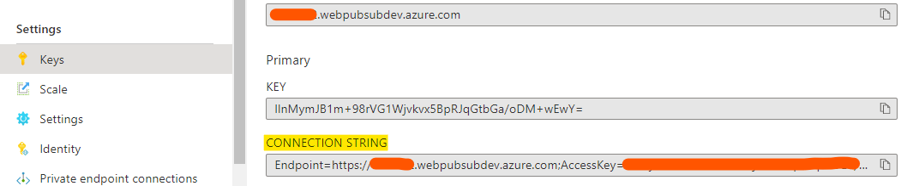

# Notifications

## Prerequisites
1. [Azure Function Core Tools(v3)](https://www.npmjs.com/package/azure-functions-core-tools)
2. [Azure Storage Emulator](https://go.microsoft.com/fwlink/?linkid=717179&clcid=0x409) or valid Azure Storage connection string.

## Setup Azure Functions publisher

1. Copy **Connection String** from **Keys** tab of the created Azure Web PubSub service, and replace the `<connection-string>` below with the value of your **Connection String** in `local.settings.json`.



2. Install function extensions

```bash
func extensions install
```

3. Start app

```bash
func start
```

## Start subscriber

Navigate to [SimpleCSharpClient](./../../client/SimpleCSharpClient/) and run command below to start the client. Follow the command prompt messages. Go to `notification` mode and then you can listen to the messages coming from Azure Functions publisher.

```bash
dotnet run
```