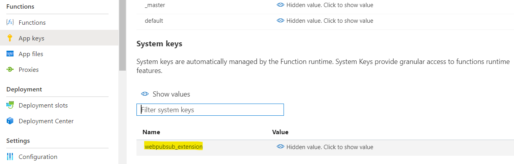

# Simple Chat

## Prerequisites
1. [Azure Function Core Tools(v3)](https://www.npmjs.com/package/azure-functions-core-tools)
2. [Azure Storage Emulator](https://go.microsoft.com/fwlink/?linkid=717179&clcid=0x409) or valid Azure Storage connection string.
3. [localtunnel](https://github.com/localtunnel/localtunnel) to expose our localhost to internet

## Setup and Run

1. Copy **Connection String** from **Keys** tab of the created Azure Web PubSub service, and replace the `<connection-string>` below with the value of your **Connection String** in `local.settings.json`.


2. Install function extensions

```bash
func extensions install
```

3. Start app

```bash
func start
```

4. Use localtunnel to expose localhost

[localtunnel](https://github.com/localtunnel/localtunnel) is an open-source project that help expose your localhost to public. [Install the tool](https://github.com/localtunnel/localtunnel#installation) and run:

```bash
lt --port 7071 --print-requests
```

localtunnel will print out an url (`https://<domain-name>.loca.lt`) that can be accessed from internet, e.g. `https://xxx.loca.lt`.

> Tip:
> There is one known issue that [localtunnel goes offline when the server restarts](https://github.com/localtunnel/localtunnel/issues/466) and [here is the workaround](https://github.com/localtunnel/localtunnel/issues/466#issuecomment-1030599216)  

There are also other tools to choose when debugging the webhook locally, for example, [ngrok](​https://ngrok.com/), [loophole](https://loophole.cloud/docs/), [TunnelRelay](https://github.com/OfficeDev/microsoft-teams-tunnelrelay) or so. Some tools might have issue returning response headers correctly. Try the following command to see if the tool is working properly:

```bash
curl https://<domain-name>.loca.lt/runtime/webhooks/webpubsub -X OPTIONS -H "WebHook-Request-Origin: *" -H "ce-awpsversion: 1.0" --ssl-no-revoke -i
```

Check if the response header contains `webhook-allowed-origin: *`. This curl command actually checks if the WebHook [abuse protection request](https://docs.microsoft.com/azure/azure-web-pubsub/reference-cloud-events#webhook-validation) can response with the expected header.


5. Update event handler settings in **Azure Portal** -> **Settings** to enable service route events to current function app.

Property|Value
--|--
`HubName`| sample_funcchat
`URL Template`| https://*{random-id}*.loca.lt/runtime/webhooks/webpubsub
`User Event Pattern`| *
`System Events`| connect, connected, disconnected


6. Open function hosted page `http://localhost:7071/api/index` to start chat.


## Deploy Functions to Azure

Now you've been able to run with Web PubSub service in local function. And next you can deploy the function to Azure for a complete cloud environment.

1. Open the VS Code command palette(`F1`) and search and find: **Azure Functions: Deploy to Function App**. Ensure you've installed extensions: [**Azure Functions**](https://marketplace.visualstudio.com/items?itemName=ms-azuretools.vscode-azurefunctions).

2. When prompted, select/create resource accordingly.

3. Different from local functions, Azure Function App requires to access with valid keys when using webhook. So the event handler settings need an additional query part. 

    First navigate to **Azure Portal** and find the function app you just created. Then go to **Functions** -> **App keys** -> **System keys**. Copy out the `API_KEY` value for webpubsub_extension.

    

    Update event handler settings for your Web PubSub service in **Azure Portal** -> **Settings**, and replace function app name and `API_KEY` following below pattern.

    ```
    https://{function-app}.azurewebsites.net/runtime/webhooks/webpubsub?Code={API_KEY}
    ```