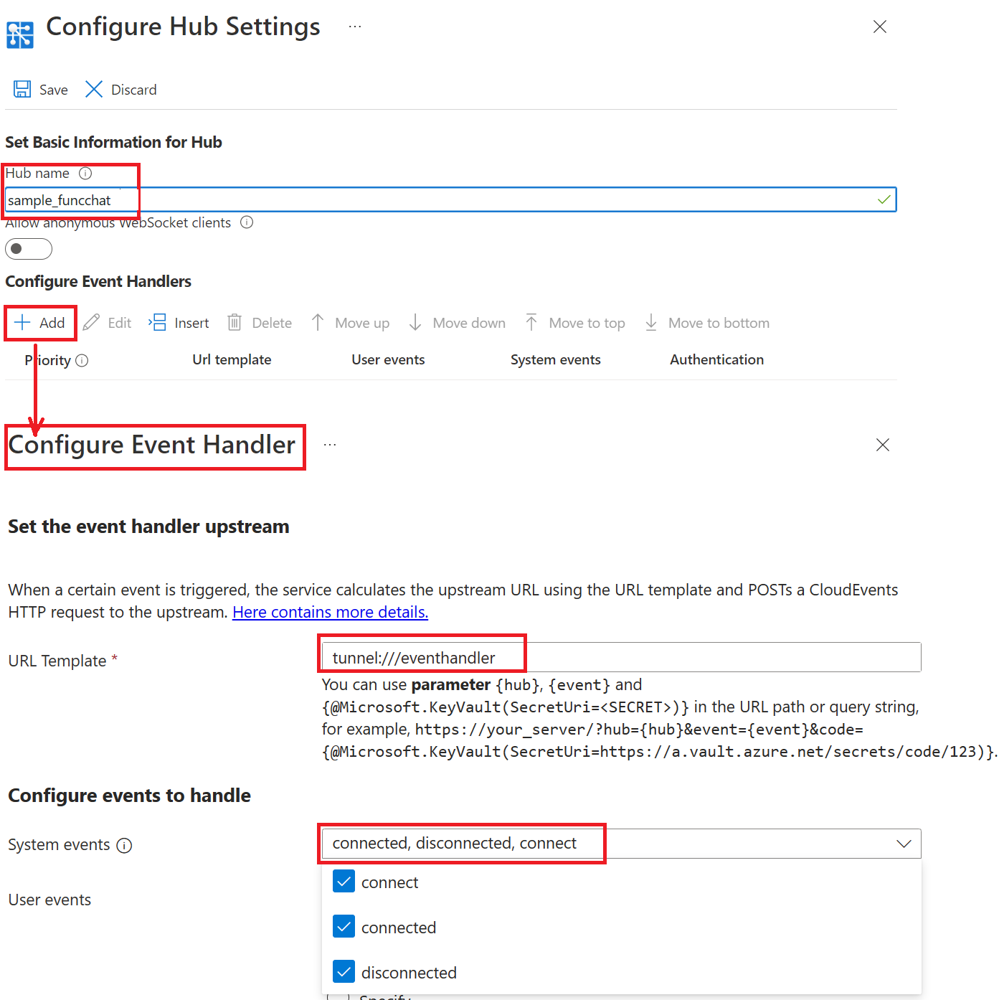

# Simple Chat

## Prerequisites
1. [Node.js(v18.0 or above)](https://nodejs.org/)
2. [Azure Function Core Tools(v4)](https://www.npmjs.com/package/azure-functions-core-tools)
3. [Azure Storage Emulator](https://go.microsoft.com/fwlink/?linkid=717179&clcid=0x409) or valid Azure Storage connection string.
4. [awps-tunnel](https://learn.microsoft.com/azure/azure-web-pubsub/howto-web-pubsub-tunnel-tool) to tunnel traffic from Web PubSub to your localhost

## Setup and Run

1. Copy **Connection String** from **Keys** tab of the created Azure Web PubSub service, and replace the `<connection-string>` below with the value of your **Connection String** in `local.settings.json`.


1. Start app

```bash
func start
```

4. Use `awps-tunnel` to tunnel traffic from Web PubSub service to your localhost

    ```bash
    npm install -g @azure/web-pubsub-tunnel-tool
    export WebPubSubConnectionString="<connection_string>"
    awps-tunnel run --hub sample_funcchat --upstream http://localhost:7071
    ```

5. Update event handler settings in **Azure Portal** -> **Settings** to enable service route events to current function app.
    
    Property|Value
    --|--
    `HubName`| sample_funcchat
    `URL Template`| tunnel:///runtime/webhooks/webpubsub
    `User Event Pattern`| *
    `System Events`| connect, connected, disconnected
    
    

6. Open function hosted page `http://localhost:7071/api/index` to start chat.


## Deploy Functions to Azure

Now you've been able to run with Web PubSub service in local function. And next you can deploy the function to Azure for a complete cloud environment.

1. Open the VS Code command palette(`F1`) and search and find: **Azure Functions: Deploy to Function App**. Ensure you've installed extensions: [**Azure Functions**](https://marketplace.visualstudio.com/items?itemName=ms-azuretools.vscode-azurefunctions).

2. When prompted, select/create resource accordingly.

3. Different from local functions, Azure Function App requires to access with valid keys when using webhook. So the event handler settings need an additional query part. 

    First navigate to **Azure Portal** and find the function app you just created. Then go to **Functions** -> **App keys** -> **System keys**. Copy out the `API_KEY` value for webpubsub_extension.

    

    Update event handler settings for your Web PubSub service in **Azure Portal** -> **Settings**, and replace function app name and `API_KEY` following below pattern.

    ```
    https://{function-app}.azurewebsites.net/runtime/webhooks/webpubsub?Code={API_KEY}
    ```