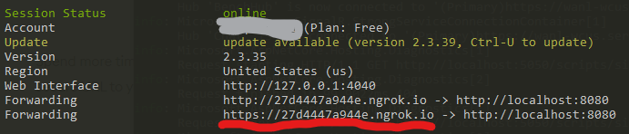
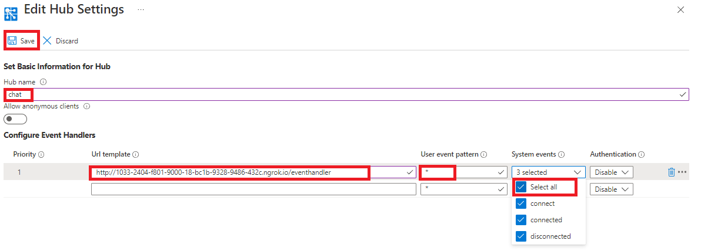
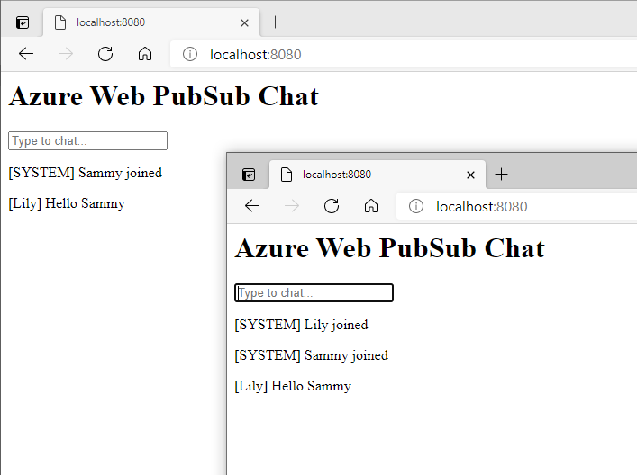

# Publish and subscribe messages

## Prerequisites

1. [IntelliJ IDEA](https://www.jetbrains.com/idea/)
2. [ngrok](https://ngrok.com/)
3. Create an Azure Web PubSub resource

## Use ngrok to make the local server publicly available
Run the script `ngrok http 8080`, then copy the URL above the red line.

## Setup event handler settings
1. Navigate to `settings` in portal.
2. Make a new hub setting for `chat`.
3. Fill in the URL copied from the previous step to `URL template`.
4. Fill in `*` to `User Event Pattern` and select all the system events.
5. Click `Save` button to update the settings, wait until the settings are updated successfully.

## Start server

1. Copy **Connection String** from **Keys** tab of the created Azure Web PubSub service, and replace the `<connection-string>` (in [Server.java](src/main/java/Server.java#L15)) below with the value of your **Connection String**.

2. Run the project.

## Send Messages in chat room
1. Open a browser in and visit `http:localhost:8080`.
2. Input your user name, and click `OK` button to attend the chat.

3. You will get welcome message `[SYSTEM] <user-name> is joined`.
4. Input a message to send, press `Enter` key to publish. 
5. You will see the message in the chat room.
6. Repeat the above steps in a window, you can see messages broadcast to all the windows.

