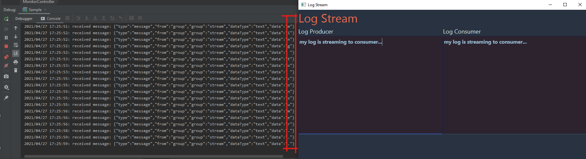

# Publish and subscribe messages

## Prerequisites

1. [IntelliJ IDEA](https://www.jetbrains.com/idea/)
3. Create an Azure Web PubSub resource

## Run PubSub sample
1. Copy **Connection String** from **Keys** blade of the created Azure Web PubSub service, and replace the `<connection-string>` (in [PubSub.java](src/main/java/PubSub.java#L7)) below with the value of your **Connection String**.

2. Run the project.
3. You can see a GUI window is pop up.
4. `Log Producer` establishes a websocket connection to Web PubSub service to publish message to a group `stream`.
5. `Log Consumer` establishes a websocket connection to Web PubSub service to listen any message from group `stream`.
6. Type anything in the `Log Producer` text box, you will see the new character in the console is sending to Web PubSub service, and almost at the same time, the `Log Consumer` received the new character and append to the words.

