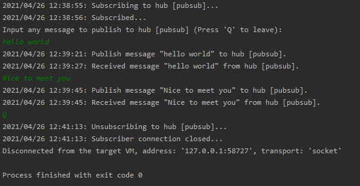

# Publish and subscribe messages

## Prerequisites

1. [IntelliJ IDEA](https://www.jetbrains.com/idea/)
3. Create an Azure Web PubSub resource

## Run PubSub sample
1. Copy **Connection String** from **Keys** blade of the created Azure Web PubSub service, and replace the `<connection-string>` (in [PubSub.java](src/main/java/PubSub.java#L7)) below with the value of your **Connection String**.

2. Run the project.
3. Input anything to publish the message.
4. You will see the message is published, e.g. `2021/04/26 12:43:03: Publish message "message" to hub [pubsub].`.
4. Later you will see the message get received, e.g. `2021/04/26 12:43:09: Received message "message" from hub [pubsub]`.
6. Press `Q` to leave.

