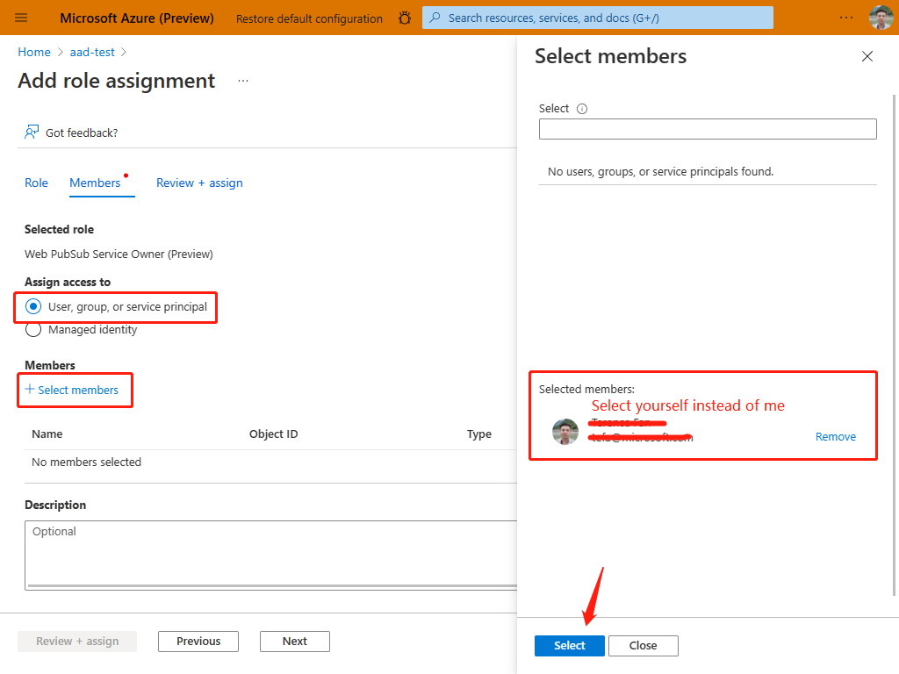

# Create a chat app with Microsoft Entra ID

This sample is to help you create a chat app using Microsoft Entra authentication.

## Prerequisites

1. [Node.js](https://nodejs.org)
2. Create an [Azure Web PubSub](https://ms.portal.azure.com/#blade/HubsExtension/BrowseResource/resourceType/Microsoft.SignalRService%2FWebPubSub) resource on Azure Portal
3. [awps-tunnel](https://learn.microsoft.com/azure/azure-web-pubsub/howto-web-pubsub-tunnel-tool) to tunnel traffic from Web PubSub to your localhost
4. [Azure CLI](https://docs.microsoft.com/cli/azure/) or [Azure Powershell](https://docs.microsoft.com/powershell/azure/)

## Getting started
   
### 1. Get your Node.JS environment prepared

```bash
npm install
```

### 2. Login Azure account in your terminal

```bash
az login
```

### 3. Configure an event handler on Azure portal.

1. Open [Azure Portal](https://ms.portal.azure.com/), search for and select your `Azure Web PubSub` resource.
2. Under **Settings** section, click **Settings**.
3. Click **Add**.
4. Enter `sample_chat` as **Hub name**.
5. Set **URL template** to `tunnel:///eventhandler`
6. Click **System events**, then select **connected** to let the service sends `connected` events to your upstream server.
    
7. Click **Save** to confirm the change.

### 4. Configure Role-Based Access Control (RBAC)
1. Open [Azure Portal](https://ms.portal.azure.com/), search for and select your `Azure Web PubSub` resource.
1. Select **Access control (IAM)**.
1. Click **Add > Add role assignment**.
1. On **Role** tab, select **Web PubSub Service Owner**.
1. Click **Next**.
   
1. On **Members** tab, select **User, group, or service principal**, then click **Select members**.
1. Search for and select yourself. Don't forget to click **Select** to confirm selection.
1. Click **Next**.
   
1. On **Review + assign** tab, click **Review + assign** to confirm the assignment.

> Azure role assignments may take up to 30 minutes to propagate.

### 5. Use `awps-tunnel` to tunnel traffic from your Web PubSub service

`awps-tunnel` also leverages the Microsoft Entra ID and RBAC role to login.

```bash
npm install -g @azure/web-pubsub-tunnel-tool
awps-tunnel run --endpoint "<endpoint>" --hub sample_chat --upstream http://localhost:8080 
```

### 6. Start your server

```bash
node server <endpoint> # endpoint is the value of Endpoint=<value> in the connection string
```

Open http://localhost:8080/index.html, input your user name, and send messages.

You could open the webview of the tunnel tool http://127.0.0.1:9080/ to see the requests coming in with every message sent from the page.
