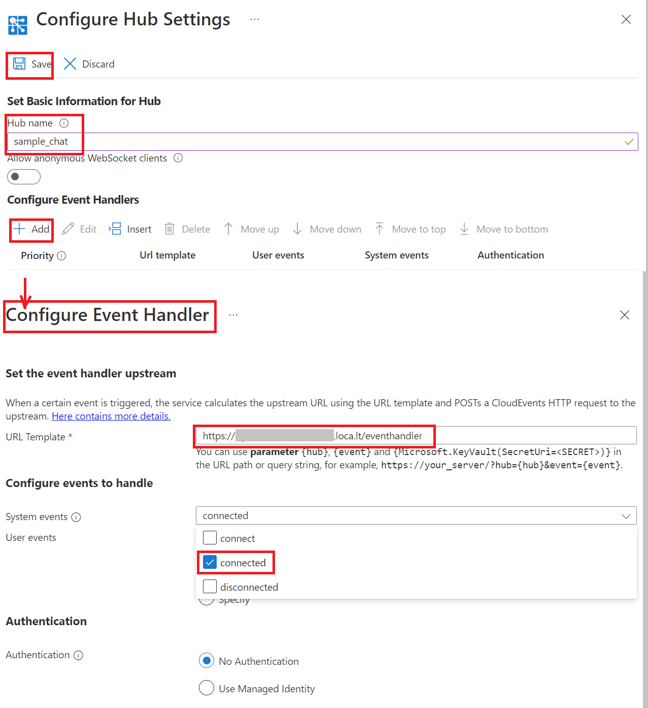

# Create a Chat app with client SDK

## Prerequisites

1. [Node.js](https://nodejs.org)
2. Create an Azure Web PubSub resource
3. [ngrok](https://ngrok.com/) to expose our localhost to the Internet

## Overview
The sample demonstrates a chat app on a webpage with the Web PubSub client SDK.

The functionality of the following files:

* `/server.js` Host a server exposing endpoints for returning `Client Access URI` for clients and handling events from clients.
* `/src` The structure is generated from `npx create-react-app my-app` and modified `/src/App.js` to contains a Web PubSub client receiving messages from the server and sending events to the server.

## Setup

```bash
npm install
npm run release
```

## Start the app

Copy **Connection String** from **Keys** tab of the created Azure Web PubSub service, and replace the `<connection-string>` below with the value of your **Connection String**.


```bash
npm run start -- "<connection_string>"
```

The web app is listening to event handler requests at `http://localhost:8080/eventhandler`.

## Expose localhost to the Internet

Your server has listened to the local host and then you need to expose it to the Internet. There are many tools you can choose when debugging the webhook locally, for example, [ngrok](​https://ngrok.com/), [localtunnel](https://github.com/localtunnel/localtunnel), [loophole](https://loophole.cloud/docs/), [TunnelRelay](https://github.com/OfficeDev/microsoft-teams-tunnelrelay) or so.

We use ngrok as an example:

Before starting, you need to connect to your ngrok account, please follow [the document](https://dashboard.ngrok.com/get-started/setup):

```bash
ngrok config add-authtoken <token>
```

And then start the ngrok:

```bash
ngrok http 80
```

ngrok will print out an url: `Forwarding   https://<domain>.ap.ngrok.io -> http://localhost:8080` that can be accessed from the internet.

> Tip:
> Some tools might have issue returning response headers correctly. Try the following command to see if the tool is working properly:

```bash
curl https://<domain>.ap.ngrok.io/eventhandler -X OPTIONS -H "WebHook-Request-Origin: *" -H "ce-awpsversion: 1.0" --ssl-no-revoke -i
```

Check if the response header contains `webhook-allowed-origin: *`. This curl command actually checks if the WebHook [abuse protection [request](https://docs.microsoft.com/azure/azure-web-pubsub/reference-cloud-events#webhook-validation) can respond with the expected header.

## Configure the event handler

Event handler can be set from portal or through Azure CLI, here contains the detailed [instructions](https://docs.microsoft.com/azure/azure-web-pubsub/howto-develop-eventhandler) for how to.

Go to the **Settings** tab to configure the event handler for this `chat` hub:

1. Click "Add" to add settings for hub `sample_chat`.

2. Set URL Pattern to `https://<domain>.ap.ngrok.io/eventhandler` and check `connected` in System Event Pattern, click "Save".

    

## Start the chat

Open http://localhost:8080/index.html, input your user name, and send messages.

You can see in the ngrok command window that there are requests coming in with every message sent from the page.
