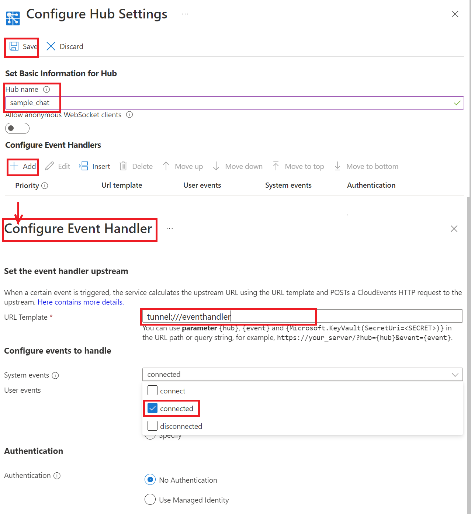

# Create a Chat app with client SDK

## Prerequisites

1. [Node.js](https://nodejs.org)
2. Create an Azure Web PubSub resource
3. [awps-tunnel](https://learn.microsoft.com/azure/azure-web-pubsub/howto-web-pubsub-tunnel-tool) to tunnel traffic from Web PubSub to your localhost

## Overview
The sample demonstrates a chat app on a webpage with the Web PubSub client SDK.

The functionality of the following files:

* `/server.js` Host a server exposing endpoints for returning `Client Access URI` for clients and handling events from clients.
* `/src` The structure is generated from `npx create-react-app my-app` and modified `/src/App.js` to contains a Web PubSub client receiving messages from the server and sending events to the server.

## Setup

```bash
npm install
npm run release
```

## Start the app

Copy **Connection String** from **Keys** tab of the created Azure Web PubSub service, and replace the `<connection-string>` below with the value of your **Connection String**.


```bash
npm run start -- "<connection_string>"
```

The web app is listening to event handler requests at `http://localhost:8080/eventhandler`.

## Use `awps-tunnel` to tunnel traffic from Web PubSub service to your localhost

```bash
npm install -g @azure/web-pubsub-tunnel-tool
export WebPubSubConnectionString="<connection_string>"
awps-tunnel run --hub sample_chat --upstream http://localhost:8080
```

## Configure the event handler

Event handler can be set from portal or through Azure CLI, here contains the detailed [instructions](https://docs.microsoft.com/azure/azure-web-pubsub/howto-develop-eventhandler) for how to.

Go to the **Settings** tab to configure the event handler for this `chat` hub:

1. Click "Add" to add settings for hub `sample_chat`.

2. Set URL Pattern to `tunnel:///eventhandler` and check `connected` in System Event Pattern, click "Save".

    

## Start the chat

Open http://localhost:8080/index.html, input your user name, and send messages.

You could open the webview of the tunnel tool http://127.0.0.1:9080/ to see the requests coming in with every message sent from the page.
