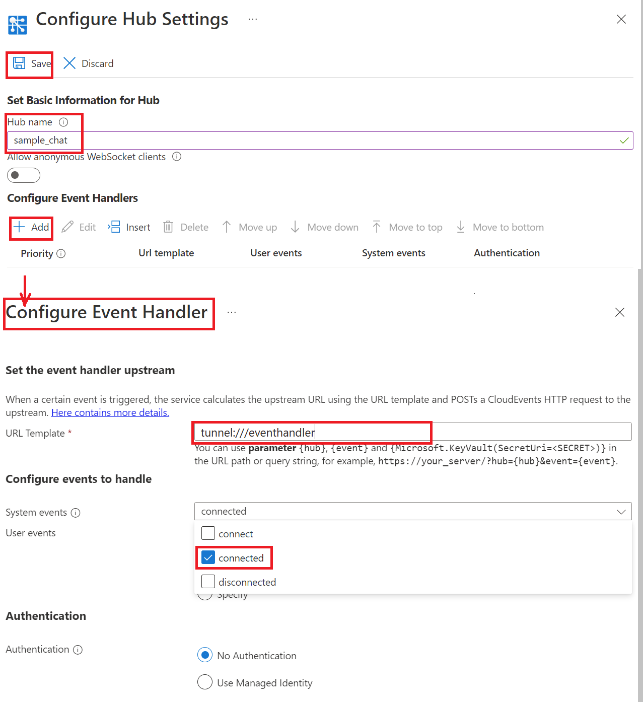

# Create a Chat app with client SDK

The sample demonstrates browser chat using the Web PubSub client SDK. Run it with the local
emulator or an Azure Web PubSub resource.

- `server.js` serves the app, negotiates client access URLs, and receives events at `/eventhandler`.
- `src/index.js` connects clients, receives messages, and sends `broadcast` events.

## Prerequisites

- [Node.js](https://nodejs.org).
- **Local:** the [Web PubSub emulator](../../../../tools/emulator/README.md#quick-start) and its .NET prerequisites.
  No Azure resource, Azure CLI, tunnel, or certificate setup is needed.
- **Azure:** an Azure Web PubSub resource and
  [awps-tunnel](https://learn.microsoft.com/azure/azure-web-pubsub/howto-web-pubsub-tunnel-tool).

## Setup

Run from this sample directory (`samples/javascript/chatapp/sdk`):

```bash
npm install
npm run release
```

## Run with the local emulator

1. [Install the emulator](../../../../tools/emulator/README.md#quick-start). In the folder where you
   will run it, create `appsettings.json`:

   ```json
   {
     "WebPubSub": {
       "Hubs": {
         "sample_chat": {
           "EventHandlers": [{
             "UrlTemplate": "http://localhost:8080/eventhandler",
             "SystemEvents": ["connected"],
             "EventPattern": "broadcast"
           }]
         }
       }
     }
   }
   ```

2. From that same folder, launch your installed emulator on **8081**, leaving **8080** for this app:

   ```powershell
   .\tool\awps-emulator --urls http://localhost:8081
   ```

   Use your executable's path if installed elsewhere. The installed emulator reads `appsettings.json`
   from its **current working directory**, not the executable's folder.

3. In another terminal, from this sample directory, start the app with the emulator connection string:

   ```bash
   npm run start -- "Endpoint=http://localhost:8081;AccessKey=ABCDEFGHIJKLMNOPQRSTUVWXYZ0123456789ABCDEFGH;Version=1.0;"
   ```

   If you customized the access key, use the string printed by the emulator. Changing the connection
   string is enough: the sample opts into HTTP only when the parsed endpoint hostname is `localhost`,
   `127.0.0.1`, or `[::1]`. HTTPS and certificate checks remain unchanged for Azure and other hosts.

4. Open <http://localhost:8080/index.html> in two tabs, choose different names, and send messages.

If port 8080 is busy, set `PORT` before starting the sample (PowerShell: `$env:PORT = "8090"`).
Change the emulator handler URL to `http://localhost:8090/eventhandler` and open
`http://localhost:8090/index.html` instead. The emulator stays on port 8081.

The emulator calls your configured HTTP handler directly (`http://localhost:8080/eventhandler`
with the default sample port); do **not** use `tunnel:///eventhandler` for local runs. `connected` announces joins, and `broadcast` forwards chat messages to the app.
Skip the Azure steps below.

With a build that supports [hot reload](../../../../tools/emulator/README.md#hot-reload), saving
`EventHandlers` changes in `appsettings.json` applies them to subsequent events without disconnecting
clients. Invalid edits retain the last valid handlers and log a warning. Older installed packages
must be updated to a new build first; other settings and environment-variable changes require restart.

## Run with Azure Web PubSub

### Start the app

Copy **Connection String** from **Keys** tab of the created Azure Web PubSub service, and replace the `<connection-string>` below with the value of your **Connection String**.


```bash
npm run start -- "<connection_string>"
```

The web app is listening to event handler requests at `http://localhost:8080/eventhandler`.

### Use `awps-tunnel` to tunnel traffic from Web PubSub service to your localhost

```bash
npm install -g @azure/web-pubsub-tunnel-tool
export WebPubSubConnectionString="<connection_string>"
awps-tunnel run --hub sample_chat --upstream http://localhost:8080
```

### Configure the event handler

Event handler can be set from portal or through Azure CLI, here contains the detailed [instructions](https://docs.microsoft.com/azure/azure-web-pubsub/howto-develop-eventhandler) for how to.

Go to the **Settings** tab to configure the event handler for this `sample_chat` hub:

1. Click "Add" to add settings for hub `sample_chat`.

2. Set URL Pattern to `tunnel:///eventhandler`, check `connected` in System Event Pattern,
   and set User Event Pattern to `broadcast`. Click "Save".

    

### Start the chat

Open http://localhost:8080/index.html, input your user name, and send messages.

You could open the webview of the tunnel tool http://127.0.0.1:9080/ to see the requests coming in with every message sent from the page.
