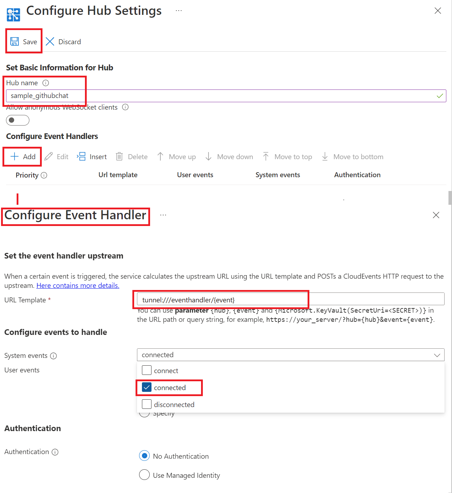

# Create a Chat app

## Prerequisites

1. [Node.js](https://nodejs.org)
2. Create an Azure Web PubSub resource
3. [awps-tunnel](https://learn.microsoft.com/azure/azure-web-pubsub/howto-web-pubsub-tunnel-tool) to tunnel traffic from Web PubSub to your localhost

## Setup

```bash
npm install
```

## Get Github ClientID

1. Go to https://www.github.com, open your profile -> Settings -> Developer settings
2. Go to OAuth Apps, click "New OAuth App"
3. Fill in application name, homepage URL (can be anything you like), and set Authorization callback URL to `http://localhost:8080/auth/github/callback` (which matches the callback API you exposed in the server)
4. After the application is registered, copy the **Client ID** and click "Generate a new client secret" to generate a new **client secret**

## Start the app
Copy **Connection String** from **Keys** tab of the created Azure Web PubSub service, and replace the `<connection-string>` below with the value of your **Connection String**.


Linux:

```bash
export WebPubSubConnectionString="<connection_string>"
export GitHubClientId="<client-id>"
export GitHubClientSecret="<client-secret>"
node server
```

Windows:

```cmd
SET WebPubSubConnectionString=<connection_string>
SET GitHubClientId=<client-id>
SET GitHubClientSecret=<client-secret>
node server
```

The web app is listening to request at `http://localhost:8080/eventhandler/`.

## Use `awps-tunnel` to tunnel traffic from Web PubSub service to your localhost

```bash
npm install -g @azure/web-pubsub-tunnel-tool
export WebPubSubConnectionString="<connection_string>"
awps-tunnel run --hub sample_githubchat --upstream http://localhost:8080
```

## Configure the event handler

Go to the **Settings** tab to configure the event handler for this `sample_githubchat` hub:

1. Type the hub name (chat) and click "Add".

2. Set URL Pattern to `tunnel:///eventhandler/{event}` and check `connected` in System Event Pattern, click "Save".



## Start the chat

Open http://localhost:8080, input your user name, and send messages.

You could open the webview of the tunnel tool http://127.0.0.1:9080/ to see the requests coming in with every message sent from the page.
