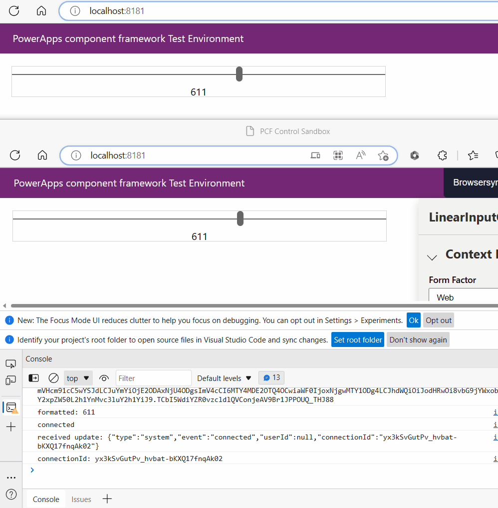

# pcf-web-pubsub-sample

## Steps

1. Check [Create your first component](https://learn.microsoft.com/power-apps/developer/component-framework/implementing-controls-using-typescript?tabs=before) to set up the environment and run the app locally.

2. Update the [`index.ts`](/Functions/negotiate/index.ts#L6) under project __Functions__ to set the Web PubSub connection string. Replace the placeholder `<webpubsub-connection-string>` with your resource value.

3. Run `npm install` under project __Functions__ to install functions required dependent packages.
   
4. Run `func start` under project __Functions__ to start the function app which helps negotiate and build the web pubsub websocket url.

5. Run `npm start watch` under project __PowerAppLinerInput__ to start the power app.

> Update the switch value in file [`PowerAppLinerInput\LinerInputControl\index.ts`](/PowerAppLinerInput/LinearInputControl/index.ts#L42) to turn on/off the Web PubSub connection. You'll be able to see the instance updates when the value is `true` in 2 different local app windows.

