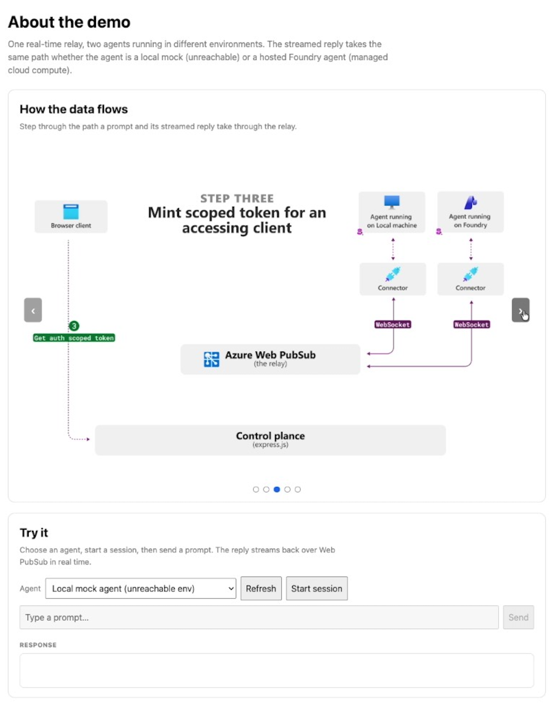

# Agent Relay — Azure Web PubSub + Microsoft Foundry

A runnable companion to the case study _Real-Time Infrastructure for AI Agents in
diverse environments_. It demonstrates one idea:

> A managed real-time relay lets a control plane and clients talk to **every** agent
> through one uniform contract — regardless of where or how the agent runs. Adding a
> new kind of agent requires **no change** to the relay or the control plane.

To prove it, two very different agents run behind the **same** relay and the **same**
control plane, plugged in through one identical contract:

| Agent       | Runs where                                                                                                                         | Stands for                                                                                                                                   |
| ----------- | ---------------------------------------------------------------------------------------------------------------------------------- | -------------------------------------------------------------------------------------------------------------------------------------------- |
| **Mock**    | A local process you start                                                                                                          | An agent in an environment you can't dial directly — a NAT'd laptop, an on-prem box, a sandbox. **This is where the relay is load-bearing.** |
| **Foundry** | Microsoft Foundry's managed compute (a [hosted agent](https://learn.microsoft.com/azure/ai-foundry/agents/concepts/hosted-agents)) | A managed agent platform plugged into the same plane.                                                                                        |

## The pattern

```
   Browser client                                Connector (mock | foundry)
      |   |                                               |   |
      │   4                                               2   |
      │   │ outbound WS                       outbound WS │   │
      │   ▼                                               ▼   │
      │  ┌─────────────────────────────────────────────────┐  │
      |  │           Azure Web PubSub  —  the relay        │  │
      3  └─────────────────────────────────────────────────┘  1
      │                          ▲                            │
      │ HTTPS:                   │ dispatch (sendToGroup)     │ HTTPS:
      │ get token                5                            │ register,
      │ create session           │                            │ get token
      |  ┌───────────────────────┴─────────────────────────┐  |
      └─▶│                 Control plane                   │◀─┘
         │                   (Express)                     │
         └─────────────────────────────────────────────────┘

   Round trip:  prompt → control plane (HTTPS) → relay → connector;
                connector → relay → browser (streamed response).
   handleTask() resolves to: local reply (mock)  OR  hosted Foundry agent (Responses).
```

The numbered connections:

1. **Connector → Control plane (HTTPS).** On startup, each connector registers itself
   and gets a short-lived Web PubSub token. Setup only.
2. **Connector → Web PubSub (outbound WS).** The connector dials _out_ to the relay and
   joins its agent group — no inbound endpoint required. This is the connection that lets
   an otherwise-unreachable agent participate.
3. **Browser client → Control plane (HTTPS).** The client creates a session (binding it to
   a chosen agent) and gets its own scoped token. Setup only.
4. **Browser client → Web PubSub (outbound WS).** The client dials _out_ to the relay and
   joins the session group to receive the streamed response.
5. **Control plane → Web PubSub (dispatch).** When the client sends a prompt (HTTPS to the
   control plane), the control plane publishes the task to the agent's group via the relay
   (`sendToGroup`). The connector receives it over **2**, runs `handleTask()`, and streams
   the reply back to the client over **4**.

- **Everything connects outbound.** Connectors and clients dial _out_ to Web PubSub;
  nothing needs an inbound endpoint. That's what makes the mock (unreachable) agent work.
- **One contract.** Every agent is a [`Connector`](src/connector/connector.ts) wrapping an
  [`AgentBackend`](src/shared/protocol.ts). The relay-facing code is identical; only
  `handleTask()` differs. That single substitution _is_ the demonstration.

## What you need

- **Node.js 20+**
- **An Azure Web PubSub resource** (Free tier is fine).
  - Default auth is **AAD** (`az login` / `azd auth login`; your identity needs the
    **Web PubSub Service Owner** role). Key-based auth is supported via
    `WEBPUBSUB_AUTH_MODE=key` for environments that require it.
- _(Foundry agent only)_ an Azure subscription for Foundry — see
  [`foundry-agent/README.md`](foundry-agent/README.md).

## Run it (mock agent — no cloud agent required)

```bash
npm install
cp .env.example .env        # set WEBPUBSUB_ENDPOINT (and `az login`)

# terminal 1 — control plane + web client
npm run control-plane

# terminal 2 — the local mock agent
npm run connector:mock
```

Open <http://localhost:8080>, pick **Local mock agent**, **Start session**, and send a
prompt. The reply streams back over Web PubSub.



## Add the Foundry agent

1. Deploy the hosted agent: see [`foundry-agent/README.md`](foundry-agent/README.md).
2. Set `FOUNDRY_PROJECT_ENDPOINT` and `FOUNDRY_AGENT_NAME` in `.env`.
3. Start a second connector:

   ```bash
   npm run connector:foundry
   ```

Refresh the web client — now there are **two** agents. Same relay, same control plane,
same client. The only thing that changed is which `AgentBackend` the connector loaded.

## "But why not just call the Foundry agent directly?"

A fair question — and the honest answer is in the case study. A Foundry hosted agent
_is_ directly reachable: it has a managed endpoint the control plane could call. For
that one agent, the connector is redundant.

The relay isn't there for reachability. It's there for **uniformity across a
heterogeneous fleet.** Routing Foundry through the relay too — instead of special-casing
it — is what buys you these, _uniformly_, for every agent:

1. **One client path for every backend.** The browser streams from the mock and the
   Foundry agent over one connection with one auth model. Direct calls would mean the
   client needs Foundry credentials and Foundry-specific endpoint logic, _plus_ a
   separate path for the unreachable mock agent.
2. **Fan-out to multiple clients.** Many clients can join one session group and watch the
   same response. A direct endpoint streams to a single caller.
3. **Uniform per-session auth + revocation.** Scoped, short-lived tokens for every
   connection, the same way regardless of backend.
4. **Control-plane decoupling.** The control plane publishes to a group; it never tracks
   each agent's endpoint, protocol, or region. Adding a Foundry agent looks identical to
   adding a local one.

So: Foundry is the _easy_, reachable case; the relay earns its keep on the
local/on-prem/NAT'd case. Fronting Foundry with a connector is a deliberate choice to
keep **one** plane — not a necessity for that agent.

## Auth at a glance

| Component           | Talks to                           | Auth                                            |
| ------------------- | ---------------------------------- | ----------------------------------------------- |
| Control plane       | Web PubSub (mint tokens, dispatch) | **AAD** (default) or key                        |
| Connector           | Web PubSub                         | short-lived client token from the control plane |
| Connector (foundry) | Foundry Responses endpoint         | **AAD** (`DefaultAzureCredential`)              |
| Browser client      | Web PubSub                         | short-lived client token from the control plane |

Only the control plane ever holds Web PubSub credentials.

## Layout

```
src/
  shared/protocol.ts     # wire messages + the AgentBackend contract
  shared/config.ts       # env + Web PubSub client (AAD default, key optional)
  control-plane/server.ts# tokens, registry, dispatch, serves the web client
  connector/connector.ts # shared outbound relay client (identical for every agent)
  connector/backends/
    mock.ts              # local reply (unreachable-agent stand-in)
    foundry.ts           # invokes a hosted Foundry agent's Responses endpoint
  connector/main.ts      # picks the backend: `mock` | `foundry`
  web/                   # dependency-free browser client (native WebSocket)
foundry-agent/           # provision + deploy the hosted Foundry agent
```

## Notes & limits

- In-memory registry (agents/sessions reset on restart) — it's a sample.
- The client→agent _prompt_ goes over HTTPS to the control plane (which dispatches);
  the real-time _response_ streams over Web PubSub. This mirrors the case study (HTTPS
  for setup, the relay for real-time).
- Foundry hosted agents are in **preview**; the connector's invocation knobs are
  env-configurable so you can adjust as the API evolves. See
  [`foundry-agent/README.md`](foundry-agent/README.md).
