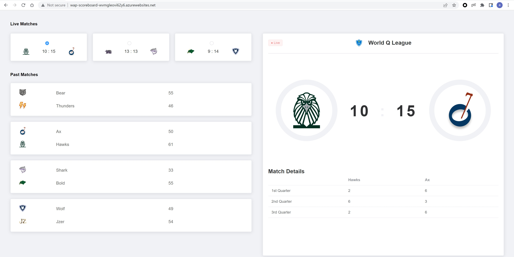
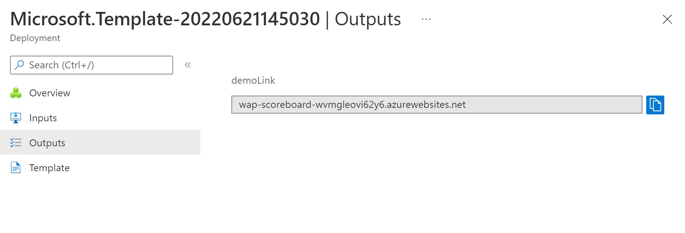

# Real-time Scoreboard



## Prerequisites

1. [Node.js](https://nodejs.org)
2. Create an Azure Web PubSub resource
3. [awps-tunnel](https://learn.microsoft.com/azure/azure-web-pubsub/howto-web-pubsub-tunnel-tool) to tunnel traffic from Web PubSub to your localhost

## Install npm packages

```
npm install
```

## Start demo

Copy **Connection String** from **Keys** tab of the created Azure Web PubSub service, and replace the `<connection-string>` below with the value of your **Connection String**.


Linux:

```bash
export WebPubSubConnectionString="<connection_string>"
npm run dev:all
```

Windows:

```cmd
SET WebPubSubConnectionString=<connection_string>
npm run dev:all
```


## Configure event handlers

Local development uses hub `sample_<your-demo-name>`, so let's set the event handler through Azure CLI with below command (don't forget to replace `<your-unique-resource-name>` and `<your-demo-name>` with your own one):

```azurecli
az webpubsub hub create --hub-name sample_<your-demo-name> --name "<your-unique-resource-name>" --resource-group "myResourceGroup" --event-handler url-template=tunnel:///eventhandler/{event} user-event-pattern=* system-event=connect system-event=disconnected system-event=connected
```

## Use `awps-tunnel` to tunnel traffic from Web PubSub service to your localhost

```bash
npm install -g @azure/web-pubsub-tunnel-tool
export WebPubSubConnectionString="<connection_string>"
awps-tunnel run --hub sample_<your-demo-name> --upstream http://localhost:5050
```

## Deploy to Azure

You can deploy to Azure by using the `Deploy to Azure` button or Bicep file with Azure CLI.

### Deploy all with one click

[](https://portal.azure.com/#create/Microsoft.Template/uri/https%3A%2F%2Flivedemopackages.blob.core.windows.net%2Ftemplate%2Fscoreboard-deploy.json)

#### Visit your live demo

1. When the deployment completes, you will get the following blade.

    

2. Click **Outputs** on the left, you will get your demo link.
   

3. Visit the demo link in browser to play with your live demo.

### Deploy Azure resources with Bicep

If you want to customize Azure resources to be created or demo code, you can deploy to Azure in the following steps:

1. Deploy resources to Azure

```bash
az group create -n <group-name> -l <location>
az deployment group create --resource-group <resource-group-name> --template-file ./deploy/deploy.bicep
```

1. Deploy demo package to your App Service

```bash
# build and pack the demo to scoreboard_0.1.0.zip if you modify the code
npm run pack:zip

# deploy demo with scoreboard_0.1.0.zip
az webapp deploy --resource-group <resource-group>  --name <webapp-resource-name>  --src-path  ./scoreboard_0.1.0.zip --type zip
```
