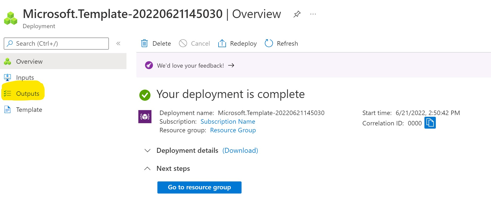

# Real-time Scoreboard


## Install npm packages

```
npm install
```

## Start demo

Copy **Connection String** from **Keys** tab of the created Azure Web PubSub service, and replace the `<connection-string>` below with the value of your **Connection String**.


Linux:

```bash
export WebPubSubConnectionString="<connection_string>"
npm run dev:all
```

Windows:

```cmd
SET WebPubSubConnectionString=<connection_string>
npm run dev:all
```

## Expose localhost for local development

See [documentation](../../../docs/references/samples/expose-localhost.md).

## Configure event handlers

See [documentation](../../../docs/references/samples/configure-event-handler.md).

## Deploy to Azure

You can deploy to Azure by using the `Deploy to Azure` button or Bicep file with Azure CLI.

### Deploy all with one click

[](https://portal.azure.com/#create/Microsoft.Template/uri/https%3A%2F%2Flivedemopackages.blob.core.windows.net%2Ftemplate%2Fscoreboard-deploy.json)

#### Visit your live demo

1. When the deployment completes, you will get the following blade.

    

2. Click **Outputs** on the left, you will get your demo link.
   

3. Visit the demo link in browser to play with your live demo.

### Deploy Azure resources with Bicep

If you want to customize Azure resources to be created or demo code, you can deploy to Azure in the following steps:

1. Deploy resources to Azure

```bash
az group create -n <group-name> -l <location>
az deployment group create --resource-group <resource-group-name> --template-file ./deploy/deploy.bicep
```

1. Deploy demo package to your App Service

```bash
# build and pack the demo to scoreboard_0.1.0.zip if you modify the code
npm run pack:zip

# deploy demo with scoreboard_0.1.0.zip
az webapp deploy --resource-group <resource-group>  --name <webapp-resource-name>  --src-path  ./scoreboard_0.1.0.zip --type zip
```
