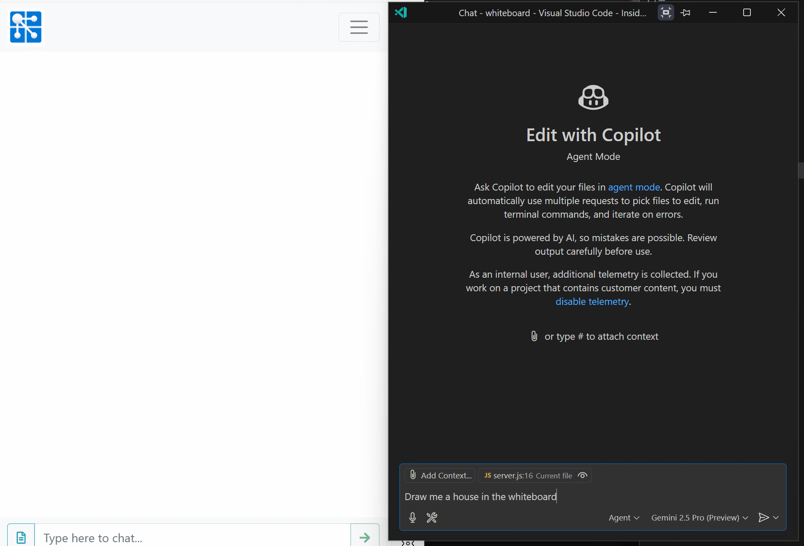

# Whiteboard: Real Time Collaboration using Azure Web PubSub

This is a sample project to demonstrate how to build a web application for real time collaboration using Azure, Node.js and other related technologies. This sample application includes the following features:

- A whiteboard that anyone can paint on it and others can see you painting in real time
- Painting features:
  1. Basic paint tools (freehand, line, rectangle, circle, ellipse), color and stroke thickness
  2. Upload a background image
  3. Pan and zoom canvas
  4. Undo and redo
  5. Touch support for mobile devices
- Real time chat

This application is based on the following technologies:

- For frontend: HTML5/javascript, bootstrap and vue.js
- For backend: node.js + express.js
- For realtime communication: Azure Web PubSub

## Build and run locally

1. Build

   ```bash
   npm install
   npm run build
   ```

2. Run

   ```bash
   npm start "<azure-web-pubsub-connection-string>"
   ```

   You can also set connection string as an environment variable:

   Linux:

   ```bash
   export Web_PubSub_ConnectionString="<connection_string>"
   npm start
   ```

   Windows:

   ```cmd
   SET Web_PubSub_ConnectionString=<connection_string>
   npm start
   ```

3. Use `awps-tunnel` to tunnel traffic from Web PubSub service to your localhost

   ```bash
   npm install -g @azure/web-pubsub-tunnel-tool
   export WebPubSubConnectionString="<connection_string>"
   awps-tunnel run --hub sample_draw --upstream http://localhost:8080
   ```

4. Go to your Azure Web PubSub resource in Azure portal, open settings tab, create a new hub called `sample_draw`, set the following:

   - URL Template: `tunnel:///eventhandler/{event}`
   - User Event Pattern: `message`
   - System Events: `connect`, `connected`, `disconnected`

Now open http://localhost:8080 in your browser to use the whiteboard.

## Deploy to Azure

To deploy the application to Azure Web App, first package it into a zip file:

```
npm install
npm run build
zip -r app.zip *
```

Then use the following command to deploy it to Azure Web App:

```
az webapp deployment source config-zip --src app.zip -n <app-name> -g <resource-group-name>
```

Set Azure Web PubSub connection string in the application settings. You can do it through portal or using Azure CLI:

```
az webapp config appsettings set --resource-group <resource-group-name> --name <app-name> \
   --setting Web_PubSub_ConnectionString="<connection-string>"
```

Also update corresponding URL template in settings tab in Azure portal.

Now your whiteboard is running in Azure at `https://<app-name>.azurewebsites.net`. Enjoy!

## Interact with Large Language Model

[Model Context Protocol](https://github.com/modelcontextprotocol) (MCP) is an open protocol that enables seamless integration between LLM applications and external data sources and tools. With MCP we can expose the painting capability of whiteboard to LLM so it can draw the picture for you!



[MCPServer](mcpserver/) shows how Whiteboard can be a MCP server that allow LLM to directly operate on the whiteboard, connecting as a Web PubSub client.

To install the MCP server:

1. Install dependencies

   ```
   npm install
   ```

2. The MCP server will by default connect to local server (http://localhost:8080). If your whiteboard is not running locally, set the endpoint in `WHITEBOARD_ENDPOINT` environment variable or `.env` file

3. Configure the MCP server in your LLM app (like Claude Desktop or GitHub Copilot in VS Code):

   ```json
   "mcpServers": {
     "whiteboard": {
       "command": "node",
         "args": [
           "<path-to-MCPServer-project>/index.js"
         ]
      }
    }
   ```

   > Change `mcpServers` to `"mcp":{"servers": ...}` if you're using VS Code

4. Start the server if it's not automatically started (like in VS Code)

5. Now open your favorite LLM app and ask it to paint something on whiteboard, you'll see it paint in real time.
