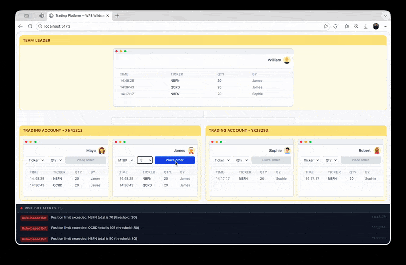

# Trading Platform — Azure Web PubSub Wildcard Demo

A sample application demonstrating **wildcard group roles** in Azure Web PubSub. It simulates a financial trading platform where a team leader and two risk bots monitor all trading accounts in real time, while individual traders only see their own account's orders.



## Architecture

```
┌─────────────┐       ┌──────────────────────┐       ┌──────────────┐
│  web-client  │◄─────►│  Azure Web PubSub     │◄─────►│   backend    │
│  (React)     │  WS   │  (wildcard roles)     │  REST │  (Express)   │
└─────────────┘       └──────────────────────┘       └──────────────┘
                              ▲       ▲
                     ┌────────┘       └────────┐
                 ┌───┴────┐             ┌──────┴──┐
                 │Rule Bot│             │ AI Bot  │
                 │(client)│             │(client) │
                 └────────┘             └─────────┘
                   wildcard               wildcard
```

- **Team leader (William)** — gets a wildcard role (`webpubsub.joinLeaveGroups.oak.**`) and automatically receives events from all account groups.
- **Traders** — get literal roles for their specific account group only.
- **Risk bots** — also get wildcard roles, auto-join all account groups, and evaluate every order for risk.

## Prerequisites

- [Node.js](https://nodejs.org/) 18+
- An [Azure Web PubSub](https://learn.microsoft.com/azure/azure-web-pubsub/overview) resource

## Setup

### 1. Configure Azure Web PubSub hub settings

In the [Azure portal](https://portal.azure.com), go to your Web PubSub resource → **Settings** → add a hub called `trading` with:

- **URL template**: `tunnel:///event-handler`
- **System events**: select `connected`
- **User events**: select `All`

This tells the service to route events through the [local tunnel tool](https://learn.microsoft.com/azure/azure-web-pubsub/howto-web-pubsub-tunnel-tool) to your local backend.

### 2. Configure environment

Edit `backend/.env` with your Web PubSub endpoint:

```
WPS_ENDPOINT="https://<your-resource>.webpubsub.azure.com"
WPS_HUB_NAME="trading"
USE_WILDCARD="true"
```

Make sure you're logged in with Azure CLI (`az login`) and your identity has the **Web PubSub Service Owner** role on the resource. Both the server and tunnel use `DefaultAzureCredential` / Azure Identity.

### 3. Install and run

```bash
npm install
npm run dev
```

This single command starts three processes:

| Process    | Description                          | URL                    |
|------------|--------------------------------------|------------------------|
| **backend**  | Express server (watch mode) + bots   | `http://localhost:8080` |
| **tunnel**   | `awps-tunnel` connecting to Azure    | Tunnel dashboard at `http://127.0.0.1:4000` |
| **frontend** | Vite dev server (React)              | `http://localhost:5173` |

## Running the Demo

Open `http://localhost:5173`. You'll see the trading dashboard with:

- **Top**: William (team leader) — sees orders from ALL accounts
- **Bottom left**: Account XN41212 with traders Maya and James
- **Bottom right**: Account YK38293 with traders Sophie and Robert
- **Bottom panel**: Real-time alert feed from the risk bots

### Things to try

1. **Place an order** — Pick a ticker and quantity from any trader's dropdown, then click **Place order**. The order appears in that trader's table AND in the team leader's table (delivered via the account group).

2. **Cross-account visibility** — Place orders from traders on different accounts. Notice the team leader sees all orders from both accounts, while each trader only sees orders for their own account.

3. **Trigger the Rule Bot** — Place multiple orders with the **same ticker** until the cumulative quantity exceeds 30 (e.g., three orders of APXC × 15). A **critical** alert appears in the bottom panel from the Rule Bot.

4. **Watch the AI Bot** — The AI Bot randomly flags ~30% of orders after a 1–3 second delay. Keep placing orders and watch for **warning** alerts with mock analysis messages.

5. **Toggle wildcard off** — Stop the server, set `USE_WILDCARD=false` in `backend/.env`, and restart. The leader now receives explicit per-account roles instead of a single wildcard pattern. The behavior is identical — but compare the token size and complexity.

## How It Works

### Team structure

| Role    | User    | Accounts  | Permission model |
|---------|---------|-----------|------------------|
| Leader  | William | All       | **Wildcard**: `oak.**` |
| Trader  | Maya    | XN41212   | **Literal**: `oak.account.XN41212` |
| Trader  | James   | XN41212   | **Literal**: `oak.account.XN41212` |
| Trader  | Sophie  | YK38293   | **Literal**: `oak.account.YK38293` |
| Trader  | Robert  | YK38293   | **Literal**: `oak.account.YK38293` |
| Bot     | Rule Bot | All      | **Wildcard**: `oak.**` |
| Bot     | AI Bot   | All      | **Wildcard**: `oak.**` |

### Group naming

Groups use `.` as the hierarchy separator, matching the Web PubSub wildcard syntax:

```
oak.account.XN41212
oak.account.YK38293
```

### Wildcard vs Literal roles

When `USE_WILDCARD=true` (default), the team leader and bots receive:

```js
roles: [
  "webpubsub.joinLeaveGroups.oak.**",
  "webpubsub.sendToGroups.oak.**"
]
```

This single pattern covers all account groups under `oak.` — including any new accounts added later.

When `USE_WILDCARD=false`, the team leader instead receives explicit roles for each account:

```js
roles: [
  "webpubsub.joinLeaveGroup.oak.account.XN41212",
  "webpubsub.joinLeaveGroup.oak.account.YK38293",
  "webpubsub.sendToGroup.oak.account.XN41212",
  "webpubsub.sendToGroup.oak.account.YK38293"
]
```

### Data flow

**Placing an order:**

1. Trader clicks **Place Order** → client calls `sendEvent("order", ...)` over WebSocket
2. Azure Web PubSub forwards the event through the tunnel to the backend's event handler
3. Backend creates the order and publishes it to the account's group (e.g., `oak.account.XN41212`)
4. All clients subscribed to that group receive the order in real time — including the team leader and bots (via wildcard)

**Risk alert:**

1. A risk bot receives the order (via wildcard group subscription)
2. The bot evaluates the order (Rule Bot: threshold check; AI Bot: mock analysis)
3. If risk is detected, the bot publishes an alert to all connected clients
4. The alert appears in the bottom panel of the dashboard
