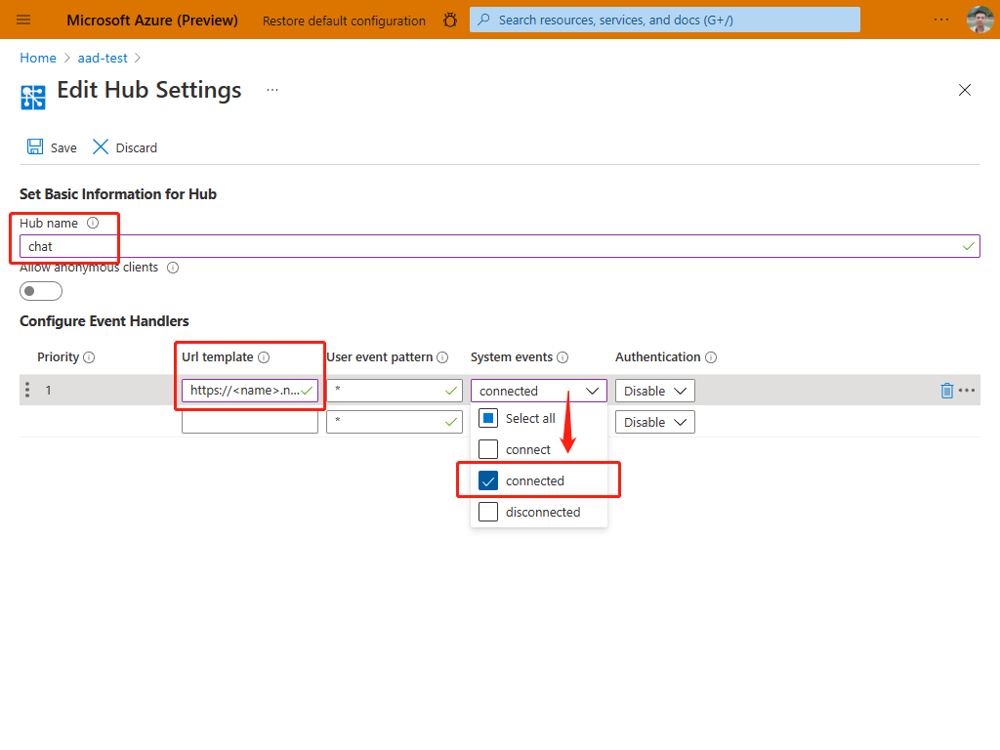

# Create a chat app with aad auth

This sample is to help you create a chat app with aad auth method.

## Prerequisites

1. [Python](https://www.python.org/)
2. Create an [Azure Web PubSub](https://ms.portal.azure.com/#blade/HubsExtension/BrowseResource/resourceType/Microsoft.SignalRService%2FWebPubSub) resource on Azure Portal
3. [ngrok](https://ngrok.com/download) to expose our localhost to internet
4. [Azure CLI](https://docs.microsoft.com/cli/azure/) or [Azure Powershell](https://docs.microsoft.com/powershell/azure/)

## Getting started
   
### 1. Get your python envronment prepared

```bash
# Create venv
python -m venv .venv

# Active venv
source ./env/bin/activate

# pip install
pip install -r requirements.txt
```

### 2. Login Azure account in your terminal

```bash
az login
```

### 3. Use ngrok to expose your localhost to internet

```bash
ngrok http 8080
```

This is a sample echo results from `ngrok`

```bash
ngrok by @inconshreveable
                                                                                                                                                                                           
Session Status                online                                                                                                                                                       
Session Expires               57 minutes                                                                                                                                                   
Version                       2.3.40                                                                                                                                                       
Region                        United States (us)                                                                                                                                           
Web Interface                 http://127.0.0.1:4040                                                                                                                                        
Forwarding                    http://***********.ngrok.io -> http://localhost:8080                                                                                                 
Forwarding                    https://**********.ngrok.io -> http://localhost:8080     
```

Copy the URL `http://<name>.ngrok.io` in one of the **Forwarding** row.

### 4. Configure an event handler on Azure portal.

1. Open [Azure Portal](https://ms.portal.azure.com/), search for and select your `Azure Web PubSub` resource.
2. Under **Settings** section, click **Settings**.
3. Click **Add**.
3. Enter `chat` as **Hub name**.
4. Set **URL template** to `https://<name>.ngrok.io/eventhandler`
5. Click **System events**, then select **connected** to let AWPS send connected events.
   
1. Click **Save** to confirm the change.

### 5. Configure Role-Based Access Control (RBAC)
1. Open [Azure Portal](https://ms.portal.azure.com/), search for and select your `Azure Web PubSub` resource.
1. Select **Access control (IAM)**.
1. Click **Add > Add role assignment**.
1. On **Role** tab, select **Web PubSubServiceOwner**.
1. Click **Next**.
   
1. On **Members** tab, select **User, group, or service principal**, then click **Select members**.
1. Search for and select yourself. Don't forget to click **Select** to confirm selection.
1. Click **Next**.
   
1. On **Review + assign** tab, click **Review + assign** to confirm the assignment.

> Azure role assignments may take up to 30 minutes to propagate.

### 6. Start your server

```python
python server.py <endpoint> # endpoint is the value of Endpoint=<value> in the connection string
```

Open http://localhost:8080/index.html, input your user name, and send messages.

## Next steps

TODO