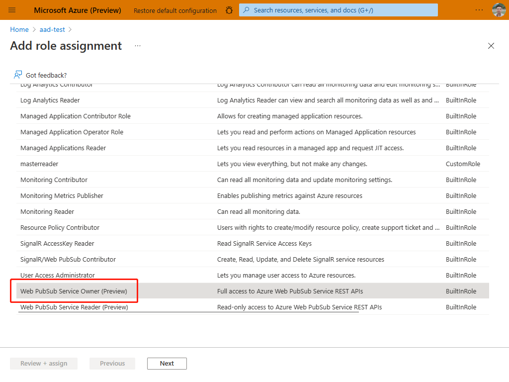
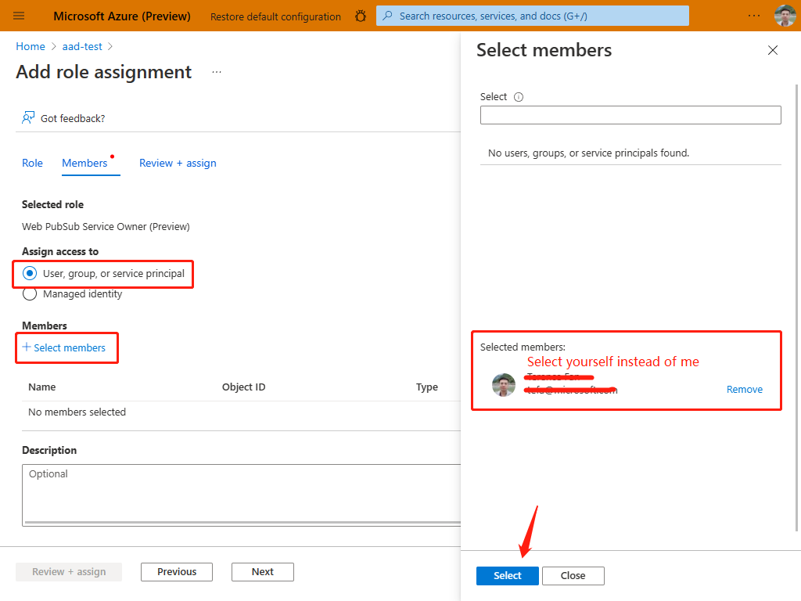

# Create a chat app with Microsoft Entra ID

This sample is to help you create a chat app using Microsoft Entra authentication.

## Prerequisites

1. [Python](https://www.python.org/)
2. Create an [Azure Web PubSub](https://ms.portal.azure.com/#blade/HubsExtension/BrowseResource/resourceType/Microsoft.SignalRService%2FWebPubSub) resource on Azure Portal
3. [localtunnel](https://github.com/localtunnel/localtunnel) to expose our localhost to internet
4. [Azure CLI](https://docs.microsoft.com/cli/azure/) or [Azure Powershell](https://docs.microsoft.com/powershell/azure/)

## Getting started

### 1. Get your python environment prepared

```bash
# Create venv
python -m venv .venv

# Active venv
source ./env/bin/activate

# pip install
pip install -r requirements.txt
```

### 2. Login Azure account in your terminal

```bash
az login
```

### 3. Use localtunnel to expose localhost

[localtunnel](https://github.com/localtunnel/localtunnel) is an open-source project that help expose your localhost to public. [Install the tool](https://github.com/localtunnel/localtunnel#installation) and run:

```bash
lt --port 8080 --print-requests
```

localtunnel will print out an url (`https://<domain-name>.loca.lt`) that can be accessed from internet, e.g. `https://xxx.loca.lt`.

> Tip:
> There is one known issue that [localtunnel goes offline when the server restarts](https://github.com/localtunnel/localtunnel/issues/466) and [here is the workaround](https://github.com/localtunnel/localtunnel/issues/466#issuecomment-1030599216)

There are also other tools to choose when debugging the webhook locally, for example, [ngrok](​https://ngrok.com/), [loophole](https://loophole.cloud/docs/), [TunnelRelay](https://github.com/OfficeDev/microsoft-teams-tunnelrelay) or so. Some tools might have issue returning response headers correctly. Try the following command to see if the tool is working properly:

```bash
curl https://<domain-name>.loca.lt/eventhandler -X OPTIONS -H "WebHook-Request-Origin: *" -H "ce-awpsversion: 1.0" --ssl-no-revoke -i
```

Check if the response header contains `webhook-allowed-origin: *`. This curl command actually checks if the WebHook [abuse protection request](https://docs.microsoft.com/azure/azure-web-pubsub/reference-cloud-events#webhook-validation) can response with the expected header.

### 4. Configure an event handler on Azure portal.

1. Open [Azure Portal](https://ms.portal.azure.com/), search for and select your `Azure Web PubSub` resource.
2. Under **Settings** section, click **Settings**.
3. Click **Add**.
4. Enter `sample_chat` as **Hub name**.
5. Set **URL template** to `https://<name>.loca.lt/eventhandler`
6. Click **System events**, then select **connected** to let the service send `connected` events to the upstream server.
   
7. Click **Save** to confirm the change.

### 5. Configure Role-Based Access Control (RBAC)

1. Open [Azure Portal](https://ms.portal.azure.com/), search for and select your `Azure Web PubSub` resource.
2. Select **Access control (IAM)**.
3. Click **Add > Add role assignment**.
4. On **Role** tab, select **Web PubSubServiceOwner**.
5. Click **Next**.
   
6. On **Members** tab, select **User, group, or service principal**, then click **Select members**.
7. Search for and select yourself. Don't forget to click **Select** to confirm selection.
8. Click **Next**.
   
9. On **Review + assign** tab, click **Review + assign** to confirm the assignment.

> Azure role assignments may take up to 30 minutes to propagate.

### 6. Start your server

```python
python server.py <endpoint> # endpoint is the value of Endpoint=<value> in the connection string
```
