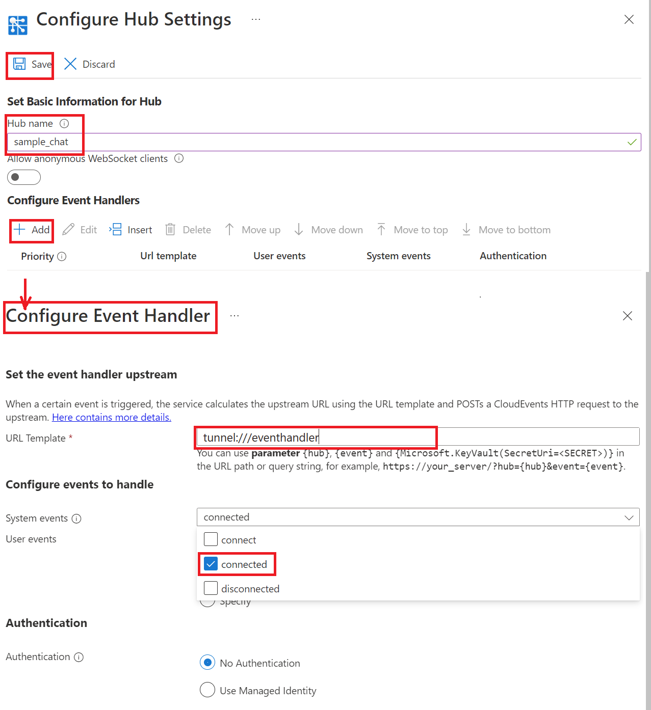

# Create a Chat app

## Prerequisites

1. [python](https://www.python.org/)
2. Create an Azure Web PubSub resource
3. [awps-tunnel](https://learn.microsoft.com/azure/azure-web-pubsub/howto-web-pubsub-tunnel-tool) to tunnel traffic from Web PubSub to your localhost

## Setup

```bash
# Create venv
python -m venv env

# Active venv
source ./env/bin/activate

# pip install
pip install -r requirements.txt
```

## Start the app

Copy **Connection String** from **Keys** tab of the created Azure Web PubSub service, and replace the `<connection-string>` below with the value of your **Connection String**.


```bash
python ./server.py "<connection-string>"
```

The web app is listening to request at `http://localhost:8080/eventhandler`.

## Use `awps-tunnel` to tunnel traffic from Web PubSub service to your localhost

```bash
npm install -g @azure/web-pubsub-tunnel-tool
export WebPubSubConnectionString="<connection_string>"
awps-tunnel run --hub sample_chat --upstream http://localhost:8080
```

## Configure the event handler

Go to the **Settings** blade to configure the event handler for this `sample_chat` hub:

1. Type the hub name `sample_chat` and click "Add".

2. Set URL Pattern to `tunnel:///eventhandler` and check `connected` in System Event Pattern, click "Save".



## Start the chat

Open http://localhost:8080, input your user name, and send messages.

You could open the webview of the tunnel tool http://127.0.0.1:9080/ to see the requests coming in with every message sent from the page.

## Client using `json.webpubsub.azure.v1` subprotocol
Besides the simple WebSocket client we show in [index.html](./public/index.html), [fancy.html](./public/fancy.html) shows a client using `json.webpubsub.azure.v1` achieving the same by sending `message` event to the service. With the help of the subprotocol, the client can get `connected` and `disconnected` messages containing some metadata of the connection.

You can open both http://localhost:8080/index.html and http://localhost:8080/fancy.html to see messages received by both clients.
