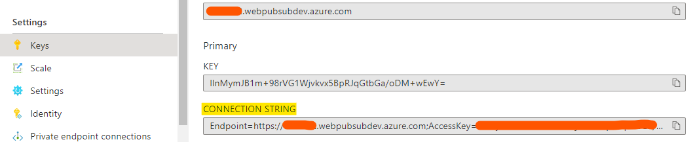

# Streaming logs using `protobuf.webpubsub.azure.v1`subprotocol

## Prerequisites

1. [Python](https://www.python.org/) 3.11 or later
1. A checkout of this repository (generation reads the shared protocol source)
1. An Azure Web PubSub resource to run the application; not needed for generation or codec tests

## Setup

```bash
# Create venv
python -m venv env

# Activate venv (Windows PowerShell: .\env\Scripts\Activate.ps1)
source ./env/bin/activate

# Install runtime and pinned generation dependencies
python -m pip install --index-url https://packagefeedproxy.microsoft.io/pypi/simple -r requirements.txt

# Required before starting the log streamer on a clean checkout
python generate_proto.py

# Offline codec verification (also regenerates the bindings)
python -m unittest -v test_codec
```

Service types come only from the canonical
[Web PubSub schema](../../../protocols/protobuf.webpubsub.azure.v1/webpubsub.v1.proto),
with package `azure.webpubsub`. The pinned `grpcio-tools` compiler generates the Python
module and type stubs under `generated/webpubsub/`; [stream.py](stream.py) imports
`generated.webpubsub.v1_pb2` directly. No system `protoc` or mypy plugin is needed.

Generated files are ignored by Git. Re-run `python generate_proto.py` after updating
the canonical schema; do not edit or copy the generated bindings. Python integers retain
the full uint64 ID range. Tests cover join/ack IDs, optional presence, metadata, JSON,
`Any` payloads and current stream/group-state fields without connecting to a service.

CI and packaging must install [requirements.txt](requirements.txt) and run
`python generate_proto.py` before importing the streamer. Both `unittest` and the
existing sample CI's `pytest` discovery run generation automatically through the codec
test setup; no workflow edit is needed for these tests.

## Start the server

Copy **Connection String** from **Keys** tab of the created Azure Web PubSub service, and replace the `<connection-string>` below with the value of your **Connection String**.



```bash
python server.py "<connection-string>"
```

The server is then started. Open `http://localhost:8080` in browser. If you use F12 to view the Network you can see the WebSocket connection is established.

## Start the log streamer

Run:

```bash
source ./env/bin/activate
python stream.py
```

Start typing messages and you can see these messages are transferred to the browser in real-time.
