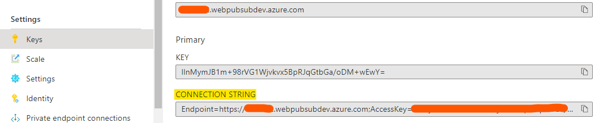

# Streaming logs using `json.webpubsub.azure.v1` subprotocol

## Prerequisites

1. [python](https://www.python.org/)
2. Create an Azure Web PubSub resource

## Setup

```bash
# Create venv
python -m venv env
# Active venv
source ./env/bin/activate
# pip install
pip install -r requirements.txt
```

## Start the server

Copy **Connection String** from **Keys** tab of the created Azure Web PubSub service, and replace the `<connection-string>` below with the value of your **Connection String**.



```bash
python server.py "<connection-string>"
```

The server is then started. Open `http://localhost:8080` in browser. If you use F12 to view the Network you can see the WebSocket connection is established.

## Start the log streamer

Run:

```bash
source ./env/bin/activate
python stream.py
```

Start typing messages and you can see these messages are transferred to the browser in real-time.