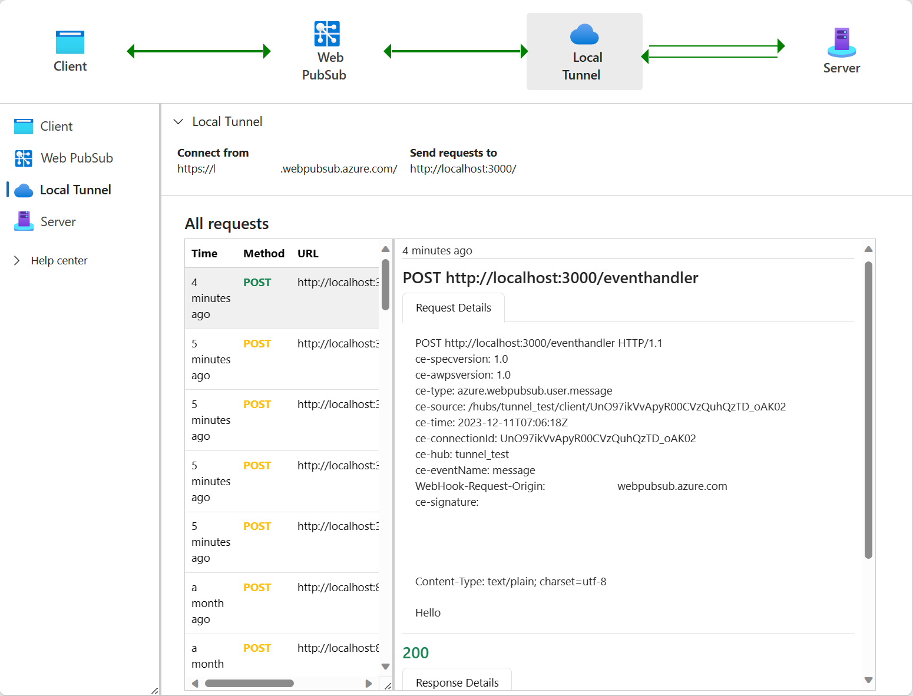
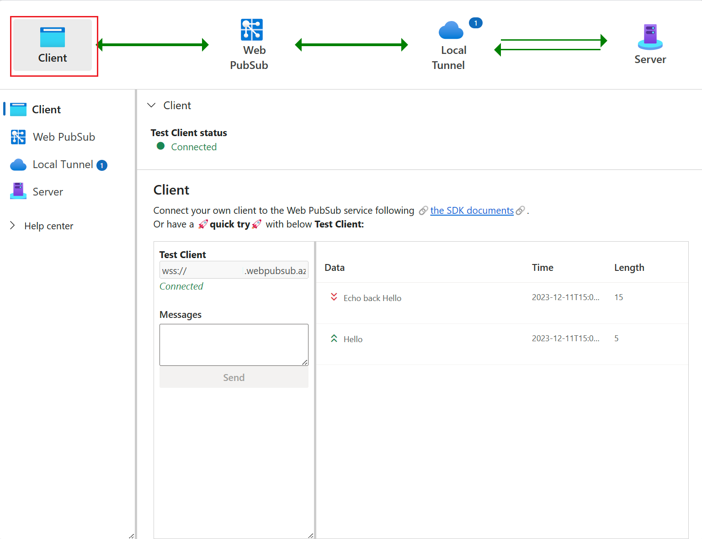

# The awps-tunnel tool

## Install

```
npm i -g @azure/web-pubsub-tunnel-tool
```

## Usage
```
Usage: awps-tunnel [options] [command]

A local tool to help tunnel Azure Web PubSub traffic to local web app and provide a vivid view to the end to end
workflow.

Options:
  -V, --version   output the version number
  -h, --help      display help for command

Commands:
  status
  bind [options]
  run [options]
  help [command]  display help for command
```

## Prepare the credential
### Using connection string

1. In your Web PubSub service portal, copy your connection string from your Web PubSub service portal 

1. Set the connection string to your local environment variable. Currently only environment variable is supported if you are using connection string

    ```bash
    export WebPubSubConnectionString="<your connection string>"
    ```

### Using Azure Identity

1. In your Web PubSub service portal, go to Access control tab, and add role `Web PubSub Service Owner` to your identity.

1. In your local terminal, use `az login` to login to your identity.

## Run
1. In your Web PubSub service portal, go to Settings tab, specify the event handler URL to start with `tunnel:///` to allow tunnel connection.

    

1. Start your upstream server, for example, this sample [upstream server](./samples/upstream/), when it starts, the upstream serves requests to http://localhost:3000/eventhandler/.

    ```bash
    cd samples/upstream
    npm install
    node server.js
    ```

1. Run the tool with the hub you set before, for example, `chat`:
    ```bash
    awps-tunnel run --hub chat --upstream http://localhost:3000 --endpoint <your service endpoint>
    ```

    You could also use `awps-tunnel bind --hub chat --upstream http://localhost:3000 --endpoint <your service endpoint>` to save the configuration and then `awps-tunnel run`.

1. You will see output like `Open webview at: http://localhost:4000`, open the link in your browser and you could see the tunnel status and the traffic.

    

1. In `Client` tab, click `Connect` to start a test WebSocket connection to the Azure Web PubSub service. You would see the traffic goes through Web PubSub to Local Tunnel and finnally reaches your upstream server. The tunnel tab provides the details of the request and responses, providing you a vivid view of what is requesting your upstream server and what is reponding from the upstream server.

    

    

