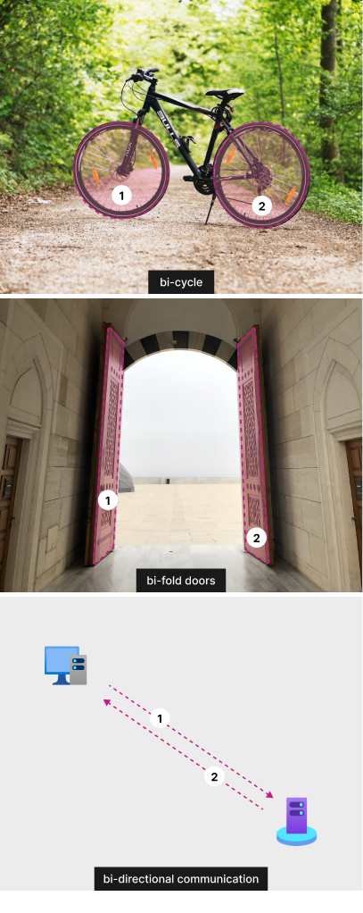
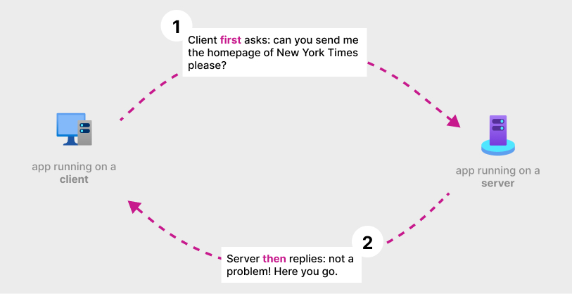
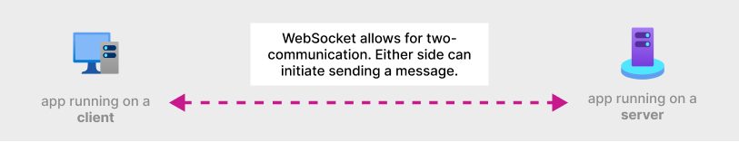

## **Summary**  
This article is the first of a two-part series that describes the values of WebSocket on a high-level.

## **Quick links**
Explore a few live apps built with __[Web PubSub](https://learn.microsoft.com/en-us/azure/azure-web-pubsub/overview)__, a fully managed WebSocket service from Azure.  

1.[ A simple chat app](https://azure.github.io/azure-webpubsub/demos/chat)   
2.[ A collaborative whiteboard app](https://azure.github.io/azure-webpubsub/demos/whiteboard)

> **Definition**
> 
> WebSocket gives developers a **_bidirectional_**, **_full-duplex_** communication channels over HTTP through a single TCP connection.  

-

Let us unpack this loaded sentence together and try to understand the italicized words (technical jargon). 

## **Bidirectional**
The prefix “bi-“ means two of something. We have bicycles, two wheels. We have bifold doors, the fancy doors with two folds. In the context of computer networking, no surprise here, bidirectional means two directions.

However, to truly understand the significance of it, we will need to talk about the interaction between applications running on different computers on a network.  In a typical client and server model, the client sends an HTTP request. Once the server receives the request, it does some processing and returns an HTTP response. Most of the activities on the web can be simplified to this request and response interaction. For example, when we visit [www.nytimes.com](https://www.nytimes.com/), the browser sends an HTTP request on the user’s behalf and waits for an HTTP response from its server.

What is relevant to our discussion here is that the client **ALWAYS** initiates the communication, in other words, the client always _asks_ before the server _responds_. We can call this form of communication one-directional because the server cannot send data to clients that is not requested. This is the decision made by the designer of HTTP protocol, and this simple design is the technological backbone of the internet. 

As the web welcomes more and more users, they are increasingly demanding more dynamic and interactive web experience. They want to track their ridesharing car without closing and reopening the app; they want to see the latest financial data, bid in an auction, collaborate on a document all without refreshing the browser all the time. A one-directional communication becomes inadequate in these scenarios. To enable these experiences, the web needs a way for server to send data to clients without client asking. Until WebSocket was standardized in 2008 and quickly supported by modern browsers, the web was unapologetically one-directional. With a bit of uneasiness and feeling cheating, software developers came up with workarounds to mimic bidirectional communication. Hacks no more! WebSocket brings native bi-directional communication to the web.

In the second part, we will explore the idea of “full-duplex”.

---
**Credits:**  
The bicycle photograph is taken by __[Philipp M](https://www.pexels.com/@luftschnitzel/)__.  
The bi-fold door photograph is taken by __[sena](https://www.pexels.com/@sena-124356903/)__.

