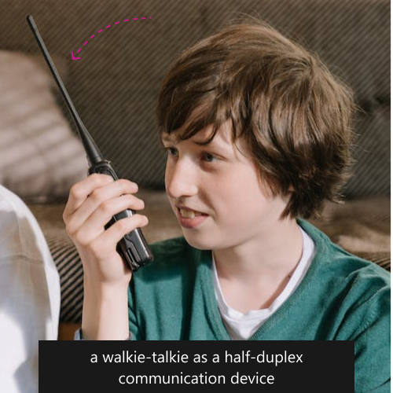
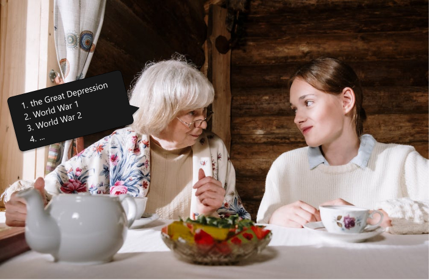
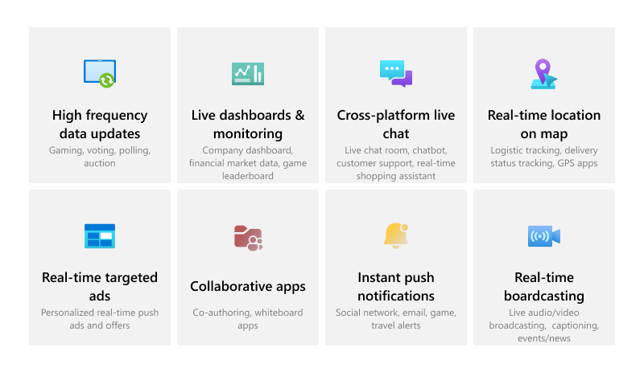

<main>

## **Summary**  
This article is the second of a two-part series that describes the values of WebSocket on a high-level.

## **Quick links**
Explore a few live apps built with __[:link: Web PubSub](https://learn.microsoft.com/en-us/azure/azure-web-pubsub/overview)__, a fully managed WebSocket service from Azure.  

[:link: A simple chat app](https://azure.github.io/azure-webpubsub/demos/chat)  
[:link: A collaborative whiteboard app](https://azure.github.io/azure-webpubsub/demos/whiteboard) 

> **Definition**
> 
> WebSocket gives developers a **_bidirectional_**, **_full-duplex_** communication channels over HTTP through a single TCP connection 

-

## **Full-duplex**
To put it simply, “full-duplex” means that data can be transmitted at the same time in both directions. Like “bidirectional” we just talked about, full-duplex is also about two things, two entities, but full-duplex is more about the **TIMING** of sending data. 

A phone call is considered full-duplex because both the caller and the receiver can send voice data to each other at the same time. 

A walkie-talkie is considered half-duplex because at one time only one person can send voice data. The participants take turns to speak. 

The web before WebSocket was largely half-duplex. The client opens a communication channel and requests a resource through this channel from a remote server. It waits for the server to return the requested resource. While the client waits, it cannot send data through the same channel. Also, while the server is sending data, the client cannot request resource through the same channel, much like how we communicate with a walkie-talkie. 

Imagine if you are talking with your grandma using a walkie-talkie and you ask “Grandma, what’s like when you were growing up in the countryside?” Grandma presses the “Talk button” and she starts from the Great Depression, World War 1 and on with World War 2… While grandma paints the scene of her storied life, teasing grandma by completing the stories for her is not an option. Your only option? Listen on. (No grandmas were hurt in telling this joke.) 

The walkie-talkie style of the early web was fine when communication was largely infrequent requests for resources from client to server. For web applications with interactive experience, like a collaborative document or a collaborative design application, users could be making changes at the same time and to have a smooth real-time editing experience, the changes need to be reflected on users’ screens as soon as they are made. The trusty HTTP protocol, being an inherently half-duplex communication model, cannot meet the new requirements without resorting to some workarounds. Hacks no more! WebSocket brings native full-duplex communication to the web.

## **To conclude**
“Bidirectional” and “full-duplex” are the two value propositions WebSocket offers to developers and it has enabled a myriad of new interesting experience on the web, multi-player gaming, online auction, real-time collaborative apps and online chatting, to name a few. And the best of it all, it does not take much to add these real-time capabilities to your applications. 

**Credits:**  
The walkie-talkie and the grandma photographs were taken by __[:link: cottonbro studio](https://www.pexels.com/@cottonbro/)__.  

</main>