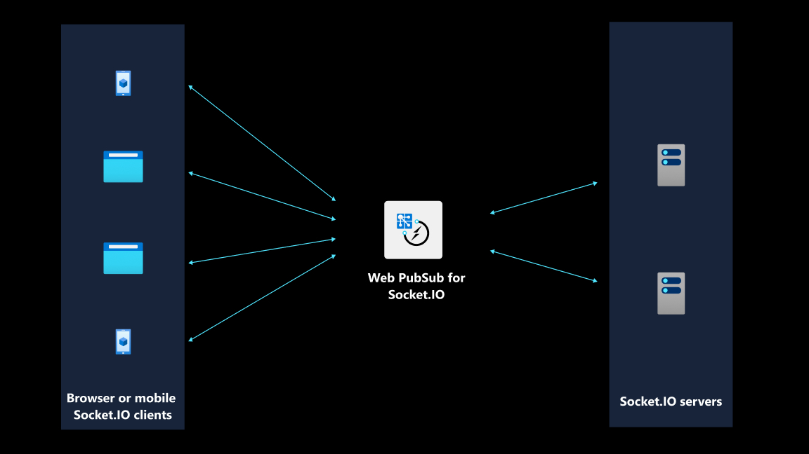

## **TL;DR**  
Socket.IO library is natively supported on Azure. 

Since we public previewed this feature, we received positive feedback from users. Now we are happy to share that Web PubSub for Socket.IO is generally available, which means that Azure customers can expect stable APIs, SLAs customer support and it’s suitable for use in production.

[:link: Follow this quickstarts guide to try out the feature.](https://learn.microsoft.com/azure/azure-web-pubsub/socketio-quickstart)

[:link: Check out the repo of a collaborative whiteboard app that showcases the use of Socket.IO APIs and how Azure handles scalability challenges.](https://github.com/Azure-Samples/socket.io-webapp-integration) 

## **Solve scalability issue without code rewrite**
When we interviewed Socket.IO users, the challenge of scaling out Socket.IO servers came up repeatedly. It’s a challenge that can be met uniquely by Azure. With the input from Socket.IO users, it’s a challenge we aimed to solve when we public previewed the support for Socket.IO on Azure two months ago. 

Developers can continue using the Socket.IO APIs they know and love and migrate to Azure seamless without code rewrite. The following shows what’s needed in the server-side and the client-side code to get a Socket.IO app running on Azure and instantly reap the benefits of Azure’s massive scale (million+ concurrent users).

## **Introduce additional benefits to enterprise-level applications**
Web PubSub for Socket.IO aims to address the scalability challenge Socket.IO developers face. Additionally, it offers enterprise-focused features. 
- Cross-region replication to make your application more resilient by running in independent Azure regions
- Custom domain to add an extra layer of security 
- Auto-scaling to dynamically scale up and down based on usage

## **An example showing how easy it is to migrate a Socket.IO app to Azure**
### **Server-side code**
Developers only need to call `useAzureSocketIO()` to set up the communication between this server and the cloud service. To Socket.IO users, the rest of the code should familiar as they are the APIs of Socket.IO library. These lines are included here for completeness of a working program. 
```js title="server.js"
const { Server } = require("socket.io");
// highlight-next-line
const { useAzureSocketIO } = require("@azure/web-pubsub-socket.io");

let io = new Server(3000);

// highlight-start
// Use the following line to integrate with Web PubSub for Socket.IO
useAzureSocketIO(io, {
    hub: "Hub", // The hub name can be any valid string.
    connectionString: "<connection-string>"
});
// highlight-end

io.on("connection", (socket) => {
    // Sends a message to the client
    socket.emit("hello", "world");

    // Receives a message from the client
    socket.on("howdy", (arg) => {
        console.log(arg);   // Prints "stranger"
    })
```
### **Client-side code**
The change to the client-side code is also minimal. Notice that we are using `socket.io-client` package and when initializing socket object, we set it up so that the Socket.IO client connects with the cloud service. The rest of the code is included for completeness of a working program.

```js title="client.js"
// highlight-next-line
const io = require("socket.io-client");

// highlight-start
const socket = io("<web-pubsub-socketio-endpoint>", {
    path: "/clients/socketio/hubs/Hub",
});
// highlight-end

// Receives a message from the server
socket.on("hello", (arg) => {
    console.log(arg);
});

// Sends a message to the server
socket.emit("howdy", "stranger")

```

## **How does it work?**
As you can see from the code snippets, both the Socket.IO client and Socket.IO server establish a connection with a cloud service. The benefit of having a cloud service to facilitate the communication between the two is that it reduces the load on your Socket.IO server and removes to the need to worry about what if “I need to send messages to 1000+ clients”. All that’s required is the same `socket.emit()`` call. The cloud service, which maintains persistent connections with your Socket.IO clients, fans out the message to all the clients. Graphically, it looks like this.



You can read more about how it works behind the scenes [:link: by reading the article](https://learn.microsoft.com/azure/azure-web-pubsub/socketio-service-internal).

## **Now generally available.**
Since public preview, we received positive feedback from developers and now we are happy to share that this feature is generally available and suitable for use in production. Besides stable APIs and SLA guarantees, developers can have full support through Azure’s ticket system.

## **Resources and references**
- [:link: Socket.IO library documentation](https://socket.io/)
- [:link: Quickstarts to migrate an existing Socket.IO app on Azure](https://learn.microsoft.com/azure/azure-web-pubsub/socketio-quickstart)
- [:link: Internal: how does Azure solve the scalability challenge for Socket.IO developers](https://learn.microsoft.com/azure/azure-web-pubsub/socketio-service-internal)