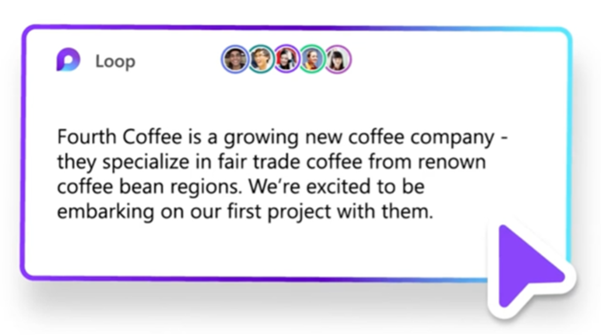
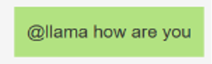

## **TL;DR**  
This article explores an app scenario where Large Language Models are used in collaboration apps to further facilitate real-time teamwork. Llama2 is used for inferencing and SignalR Service is used to provide scalable real-time communication channel between the server and web clients.

- [:link: Complete repo on GitHub](https://github.com/aspnet/AzureSignalR-samples/tree/main/samples/Llama2)
- [:link: Llama2 from Facebook](https://ai.meta.com/llama/) 
- [:link: Azure SignalR Service](https://dotnet.microsoft.com/apps/aspnet/signalr/service) for building scalable real-time web apps


## **Further facilitate teamwork in collaboration apps with Large Language Models**
Apps like Microsoft Loop, Figma, Notion, Miro, Framer are redefining remote collaboration. 

Beyond hosting the newest and latest version of a file, these modern collaboration apps allow users to make edits to the same file at the same time as if they were physically next to each other.



With the rise of large language models (LLMs) and their increasingly sophisticated capabilities, we’d like to explore how AI can further facilitate teamwork using the aforementioned collaboration applications.

## **AI agent as another human collaborator **
The mainstream way of interacting with a language model is through a familiar chat interface. One characteristic about this interaction that’s relevant to our discussion is that it’s one-on-one, i.e. a private chat session between one end user and the language model. This is of little benefit in a collaboration app. A collaboration app, by its very design, mimics and encourages transparent and real-time teamwork towards a goal. If we simply plugged in a ChatGPT like chatbot interface in these collaboration apps, it defeats the purpose of working together. 

What if an AI agent is just like another online user. All human users can interact with the AI agent and the AI agent can respond to any human users all in this same chat session, sharing the same context.  Essentially, we would like to transition from a one-on-one chat experience to a group chat experience. While we haven’t come across LLMs being used like this in a collaboration app at the time of writing, it’s an interesting use case of LLMs.

## **High level design**
### **Run Llama2 locally on a modest machine**
The large language model we use for this exploration is Llama2, which is an open-source model from Facebook. Compared with Azure Open AI Service, which runs on Azure and offers the capabilities of large language models in the form of easily consumable APIs, Llama2 requires us to host the model ourselves. In the spirit of exploration, we don’t mind the added complexity associated with hosting.

Typically, a language model is hosted on a machine with a GPU attached to speed up getting a response back. Getting a hot and scare commodity like GPU is anything but easy these days. Llama.cpp project is here to help. It allows us to run Llama2 even on a modest machine. Another nice feature about Llama.cpp is that it provides bindings for all the mainstream programming languages. Our language of choice for the server implementation is C# and the runtime will be provided by LLamaSharp.

### **Need a group chat server**
Besides interacting with Llama2, the server has the responsibility of handing a group of web clients. When a web client sends a prompt to the server, the server interacts with LLama2 and gets a response back. This response, then, needs to be sent to all the web clients in the group. In other words, the response needs to be broadcasted. The flow we just described is a typical chat server. 

When building a chat server, one of the crucial tasks, if not the most, is to have a communication channel that’s bi-directional and low latency. The widely supported WebSocket API seems to fit the bill perfectly. However, instead of using low-level WebSocket APIs, we use SignalR. SignalR uses WebSocket as the default transport mechanism and falls back to Server Sent Events (SSE) and long-polling if WebSocket is not available. Besides handling transport, SignalR provides APIs to manage web clients as a group - precisely what we need for a chat server. We’ve only scratched the surface of the features provided by SignalR library; you can learn more how [SignalR helps developers build a variety of real-time web apps here](https://dotnet.microsoft.com/apps/aspnet/signalr).

We could self-host SignalR library on our backend, but eventually when the number of web clients increases, we need to spin up multiple servers. [Azure SignalR Service](https://dotnet.microsoft.com/apps/aspnet/signalr/service) lets us keep the infrastructure simple and scalable to serve hundreds of thousands of concurrent users. 

## **Implementation**
The complete repo is available on GitHub. Key data flow is described below. 
### Set up connection with Azure SignalR Service
A client does negotiation with server to get a client URL with token and then use it to connect to Azure SignalR Service. 
```js title="wwwroot/index.html"
var connection = new signalR.HubConnectionBuilder().withUrl('/chat').build();
bindConnectionMessage(connection);
connection.start()
```

### End user sends a prompt to Llama2
An end user prefixes a chat message with “@llama” to request a response from Llamas. 


Invoke `inference()` on SignalR server when the message starts with “@llama”
```js title="wwwroot/index.html"
if (messageInput.value.startsWith("@llama ")) {
   let promptContent = messageInput.value.substring(7);
   connection.send('broadcastMessage', username, messageInput.value);
   // Invokes `inference` on SignalR server
   connection.send('inference', username, promptContent);
}
```

### The server uses SignalR to stream tokens in a response to clients
It takes time for Llama2 to generate a full response after receiving the prompt. Our strategy is to push the responded tokens from Llama2 to the clients as soon as they become available.
```cs title="src/hub/ChatSampleHub.cs"
await foreach (var token in executor.InferAsync(prompt, inferenceParams, cts.Token))
{
     await _context.Clients.All.SendAsync("broadcastMessage", "LLAMA", id, token);
}
```
Note that in each sent token, the server includes the id of the interaction with Llama2, which is generated when the server’s `Inference()` is invoked. The purpose of the id is explained in the next point.
```cs title="src/hub/ChatSampleHub.cs"
var id = Guid.NewGuid().ToString();
```

### End user gets a streamed response from Llama2
Upon receiving `broadcastMessage` event, `messageCallback` is invoked on the client side. `messageCallback` uses id to determine whether it should render a new message or append to an existing one.
```js title="wwwroot/index.html"
connection.on('broadcastMessage', messageCallback);
```
## How does Llama2 keep the context of the conversation?
The C# binding provided by LlamaSharp maintains the context of the full conversation.

## **Resources and references**
- [:link: Complete repo on GitHub](https://github.com/aspnet/AzureSignalR-samples/tree/main/samples/Llama2)
- [:link: Llama2 from Facebook](https://ai.meta.com/llama/) 
- [:link: Azure SignalR Service](https://dotnet.microsoft.com/apps/aspnet/signalr/service) for building scalable real-time web apps